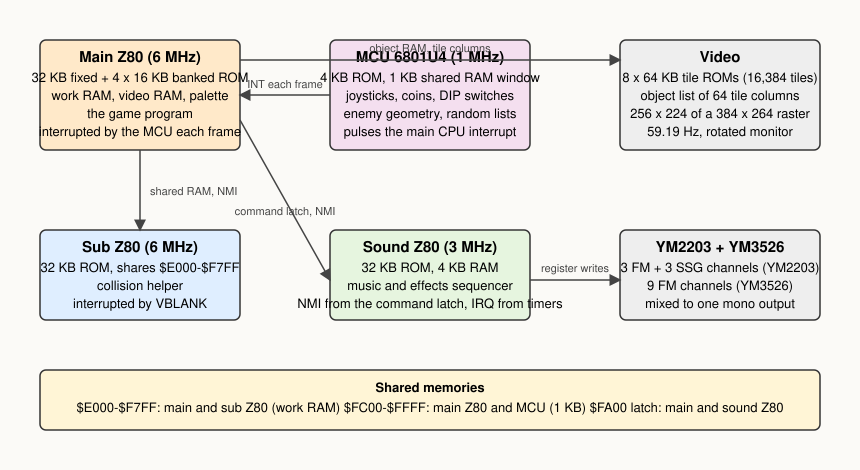
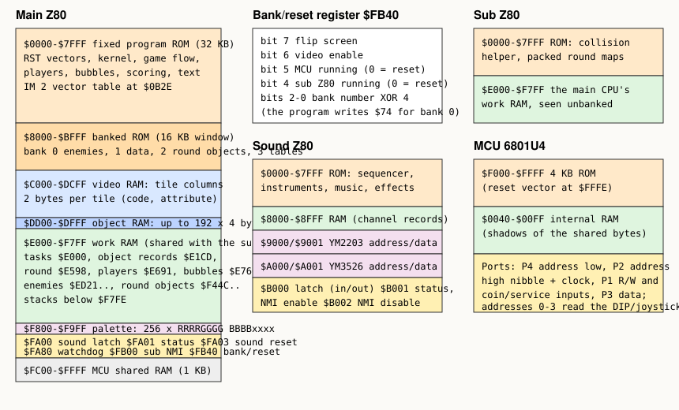

# 2. The hardware

The Bubble Bobble board (Taito's A78 set) is a mid-1980s design with an unusual amount of silicon for a game
that shows one static screen at a time. This chapter walks around the board once: which chips are there, what
each one can see, and how they talk to each other. Everything later in the article refers back to this map.

## The processors

| Processor | Clock | Program | What it does |
| --- | --- | --- | --- |
| Main Z80 | 6 MHz | 32 KB fixed + 64 KB in four 16 KB banks | The game: kernel, flow, players, bubbles, enemies, items, text, everything the player sees |
| Sub Z80 | 6 MHz | 32 KB | Collision helper. Shares the main CPU's work RAM and checks players, bubbles and enemies against each other once per frame |
| Sound Z80 | 3 MHz | 32 KB, 4 KB RAM | Music and sound effects on a YM2203 and a YM3526, driven by a sequencer with its own byte code |
| MCU 6801U4 | 1 MHz (4 MHz crystal) | 4 KB internal ROM | Reads the joysticks, buttons, coin slots and DIP switches; computes the enemy-to-player geometry; pulses the main CPU's interrupt |

The clocks all derive from one 24 MHz crystal. The video pixel clock is 6 MHz (24/4), the two game Z80s run at
that same 6 MHz, the sound Z80 and both sound chips at 3 MHz, and the MCU's internal clock is 1 MHz. This matters
later, when the article counts cycles: one frame is 264 raster lines of 384 pixels, so 101,376 main-CPU cycles, 50,688
sound-CPU cycles and 16,896 MCU cycles.

## The ROMs

| Chip | Contents | Size |
| --- | --- | --- |
| a78-25 / a78-24 (this set: US version 5.1) | Main program: 32 KB fixed, then 64 KB of banked code and data | 96 KB |
| a78-08 | Sub Z80 program (plus the packed collision maps of the 100 rounds) | 32 KB |
| a78-07 | Sound Z80 program, instruments and music | 32 KB |
| a78-01 | MCU program (inside the 6801U4) | 4 KB |
| a78-09 .. a78-20 | Graphics: twelve 32 KB ROMs, eight positions used, in two halves (planes 0-1 and planes 2-3) | 512 KB |
| a71-25 | Video timing PROM (which tile cells of an object column are drawn) | 256 bytes |

The main program's 96 KB is the interesting number. A Z80 addresses 64 KB, and half of that is RAM and I/O on
this board, so the program lives in a 32 KB fixed part plus a 16 KB window at `$8000-$BFFF` through which one of
four banks is visible at a time. Bank 0 holds the enemy drivers, bank 1 the round data, the demo recordings and the
title tiles, bank 2 the round objects, sequences and the test mode, bank 3 tables. The fixed part holds everything
that must be reachable at any time: the kernel, the players, the bubbles, text printing, scoring. Chapter 9
shows how the tasks that run banked code select their bank every time they are scheduled.

## The main CPU's memory map

From the main Z80's point of view:

| Range | What is there |
| --- | --- |
| `$0000-$7FFF` | Fixed program ROM. The eight `RST` vectors at the bottom are the kernel's entry points; `$0B2E` holds the interrupt vector (see chapter 9) |
| `$8000-$BFFF` | The banked window: one of four 16 KB banks |
| `$C000-$DCFF` | Video RAM: the tile columns. Two bytes per tile, a code and an attribute (chapter 5) |
| `$DD00-$DFFF` | Object RAM: up to 192 entries of 4 bytes, each an object (a column of tiles) on screen; the program keeps a list of 90 |
| `$E000-$F7FF` | Work RAM, 6 KB, shared with the sub Z80. Task states and stacks, the object records, the round record, the players, the bubbles, the enemies, the round objects, and the scores |
| `$F800-$F9FF` | Palette: 256 entries of 2 bytes, RRRRGGGG BBBBxxxx |
| `$FA00` | Sound latch: write a command byte for the sound CPU, read its reply |
| `$FA01` | Sound status: bit 1 = command not yet read by the sound CPU, bit 0 = reply not yet read by the main CPU |
| `$FA03` | Sound CPU reset (bit 0) |
| `$FA80` | Watchdog: any write resets it; the program writes here in every VBLANK and in every long loop |
| `$FB00` | Any write raises the sub CPU's NMI (never used by the released game) |
| `$FB40` | The bank and reset register |
| `$FC00-$FFFF` | The MCU's 1 KB of shared RAM |

The bank register `$FB40` is written with a byte whose low three bits are the bank number XORed with 4 (the
program writes `$74` for bank 0, `$75` for bank 1), bit 4 releases the sub Z80 from reset, bit 5 releases the
MCU, bit 6 enables the video output and bit 7 flips the screen for cocktail cabinets. The program keeps a copy of
the last value in `$E1CB` so that `bank_select` can change the bank bits without disturbing the others.

The shared 6 KB at `$E000-$F7FF` is real dual-ported memory between the two Z80s; both can read and write any
byte at any time. The program is careful about which side owns which byte, and chapter 11 lays that out. The 1 KB
at `$FC00-$FFFF` is different: the MCU reaches it through a slow parallel interface (about 50 of its cycles per
byte), and the main CPU reads it like RAM. There is no locking. The two sides agree on who writes what, and the
MCU's work runs in a fixed order every frame so that its results are ready when the main program looks.

## The sub CPU's view

The sub Z80 has its own 32 KB ROM at `$0000-$7FFF` and sees the shared work RAM at `$E000-$F7FF`, the same
addresses the main CPU uses. It has no other memory: its stack is in the shared RAM (at `$F7CE`), and its
interrupt is the VBLANK signal itself, held for the duration of the blanking, which is why its handler runs
several times per frame (chapter 11). The main CPU can raise its NMI through `$FB00`, but the released program
never does.

## The sound CPU's view

| Range | What is there |
| --- | --- |
| `$0000-$7FFF` | Program, instruments, music and effect data |
| `$8000-$8FFF` | 4 KB RAM: the channel records of the sequencer, the command queue, the variables |
| `$9000 / $9001` | YM2203 address and data registers |
| `$A000 / $A001` | YM3526 address and data registers |
| `$B000` | The latch: read the command from the main CPU, write the reply |
| `$B001` | Read: the two latch status bits. Write: enable the command NMI |
| `$B002` | Write: disable the command NMI |
| `$E000` | An empty socket for a diagnostic ROM; the program checks for a `JP` there and finds none |

A command byte written by the main CPU into `$FA00` appears at `$B000` and raises the sound CPU's NMI. The sound
CPU's timers, on the two chips, raise its IRQ. Chapter 8 follows a command from the queue to the chip registers.

## The MCU's view

The 6801U4 has 4 KB of ROM and 192 bytes of RAM inside the chip, and four 8-bit ports. Taito wired the ports to a
small address latch: port 4 carries the low address byte, port 2 the high nibble and a clock bit, port 1 a
read/write line (plus the coin and service switches on its other bits), and port 3 the data. Every access to the
shared RAM is a subroutine of about 50 cycles. Addresses `$0000-$0003` on that bus are not RAM at all: they read
the two DIP switch banks and the two joystick ports. The MCU keeps private copies of the bytes it manages in its
internal RAM and pushes the results into the shared 1 KB every frame (chapter 10).

## The video system

There is no tile map. The picture is built entirely from an object list: up to 192 entries (the program uses 90), each of which is a
column two tiles wide and up to 32 tiles high, placed anywhere on the 256 x 256 pixel plane of which 224 lines
are shown. The tiles are 8 x 8 pixels in 16 colours, 16,384 of them in the graphics ROMs, with a 4-bit colour
group per tile and horizontal and vertical flips. A 256-byte PROM tells the video generator, for each of the 32
tile rows of an object column, whether to draw it and whether to reload the x position from the object entry —
which is how a single object entry can draw several separately placed pieces. Chapters 4 and 5 take this apart.

The picture is 256 pixels wide and 224 lines tall in the ordinary orientation; the object columns are vertical
strips, so the playfield is built from sixteen strips side by side. One oddity for the reader of the code: the
program calls the vertical coordinate `x` and the horizontal one `y`, the reverse of the hardware's names.
Chapter 5 sorts this out.

## Sound

The YM2203 (OPN) provides three four-operator FM channels and a three-channel SSG (the AY-3-8910 square-wave
generator) on one chip; the YM3526 (OPL) provides nine two-operator FM channels. Bubble Bobble plays its music on
the nine YM3526 channels, each of which has two "voices" in the sound program so that an effect can borrow a
channel and hand it back, and its most frequent effects — the jump, the bubble — on the YM2203's FM channels, with
the SSG for a few more. Both chips have programmable timers, and the sound program runs its whole sequencer from
their interrupts: timer A of the YM2203 paces the YM3526 channels, timer B the YM2203's own.

## Inputs

Two eight-way joysticks with two buttons each (jump and bubble), two start buttons, two coin slots, a service
switch and a tilt switch, all read by the MCU. Two banks of eight DIP switches: bank A selects the cabinet type,
the attract-mode sound, the test mode, the coinage of both slots and the text language (bit 0: English or
Japanese); bank B selects the difficulty (bits 0-1), the extra-life thresholds (bits 2-3), the number of lives
(bits 4-5) and two service bits, one of which (bit 6) disables the synchronisation commands the main CPU sends to
the sub CPU. The main program reads the switches from the copies the MCU leaves in `$FC20` and `$FC21`.
