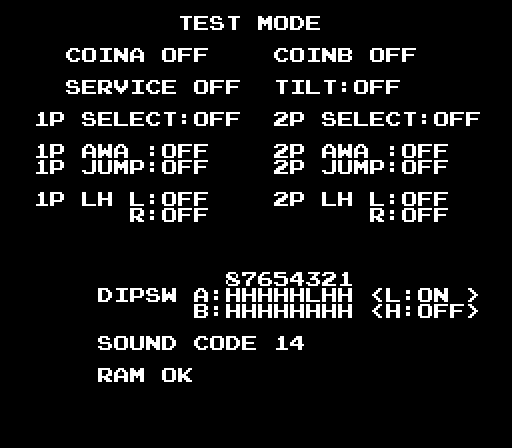

# 3. Power-on

Switch the cabinet on and four programs start at once, but not independently: the main CPU holds the other two Z80s
and the MCU in reset until it has checked its own memory, and then waits for the MCU to report that it is ready.
This chapter follows that first second, then the initialisation that leads to the attract mode, and ends with the
two test screens a technician can select with the DIP switches.

## The main CPU's first instructions

The Z80 starts at `$0000`, where a `JP` leads to `boot` at `$00B9`. The routine is short enough to quote almost
whole. Its first two writes set the bank register to `$04` (bank 0, everything else held in reset, video off) and
kick the watchdog:

```asm
boot:
00B9  LD A,$04
00BB  LD (IO_bank_ctrl),A     ; $FB40: bank 0, sub CPU and MCU in reset, video off
00BE  LD (IO_watchdog),A      ; $FA80
00C1  LD HL,task_state        ; $E000: the start of work RAM
00C4  LD DE,$17FE             ; 6142 bytes: $E000-$F7FD
loc_00C7:
00C7  LD A,$FF
00C9  LD (HL),A
00CA  CP (HL)
00CB  JP NZ,loc_01EF          ; -> "WORK RAM ERROR"
00CE  LD A,$AA
00D0  LD (HL),A
00D1  CP (HL)
00D2  JP NZ,loc_01EF
00D5  LD A,$55
      ...                     ; the same with $55 and $00
00E2  INC HL
00E3  DEC DE
00E4  LD A,E
00E5  OR D
00E6  JR NZ,loc_00C7
```

Every byte of the work RAM is written and read back with four patterns. The loop runs with no stack (the
stack pointer is only set at `$00EB`, after the test, because the stack lives in the memory being tested) and
with interrupts disabled — the MCU, which would generate them, is still in reset. A failure jumps to `$01EF`,
which prints `WORK RAM ERROR` and halts with the video on. The same test then runs over the MCU's 1 KB at
`$FC01-$FFFF` (skipping `$FC00`, which will hold the interrupt vector), reporting `COMMON RAM ERROR`. The two
messages are stored as text records right after the code, at `$0234` and `$0244`, together with two more that
the later checks can print: `PS4 SUM ERROR` and `I/O ERROR`.

Then the video RAM is cleared (`$C000-$DFFF`, 8 KB, by `mem_clear`), the MCU is given its first command before
it even runs (`$FF94 = 1`, the coin-lockout command), and the interrupt vector is prepared:

```asm
0129  LD HL,$0B2E
012C  LD A,H
012D  LD I,A                  ; I = $0B
012F  LD A,L
0130  LD (mcu_irq_vector),A   ; $FC00 = $2E
```

The main CPU runs in interrupt mode 2. When the MCU pulses the interrupt line it does not supply a vector byte
(there is no hardware for that), so the data bus floats and the CPU reads whatever the last transfer left
there. The board's design guarantees that this is the byte at `$FC00` — the MCU's shared RAM, which the CPU has
just written with `$2E` — so the vector is `I:$2E = $0B2E`, and the word stored at `$0B2E` in ROM is `$044D`, the
address of the frame handler. This detail is worth remembering: the value `$0B2E` is checked again and again
by the copy-protection code in chapter 20, because a bootleg that replaced the MCU with a plain interrupt
generator would also have had to reproduce this trick.

## Releasing the other processors

```asm
0133  LD A,$44
0135  LD (IO_bank_ctrl),A     ; video on, still bank 0, others in reset
0138  LD HL,$4000
loc_013B:
013B  LD (IO_watchdog),A
013E  DEC HL                  ; 16384 iterations: about 106 ms
      ...
0143  LD A,$74
0145  LD (IO_bank_ctrl),A     ; sub CPU and MCU released
0148  LD (bank_ctrl_shadow),A ; $E1CB keeps the register's value
014B  LD HL,IO_sound_reset
014E  LD (HL),$FF             ; sound CPU reset...
0150  LD HL,IO_sound_reset
0153  LD (HL),$00             ; ...and released
0155  LD (IO_watchdog),A
loc_0158:
0158  LD A,(mcu_ready)        ; $FC85
015B  CP $37
015D  JR NZ,loc_0158          ; wait for the MCU
```

Three things happen in a few microseconds: the sub Z80 starts at its `$0000`, the MCU starts at its reset
vector, and the sound Z80 is reset and restarted. What each does while the main CPU waits:

* **The sub Z80** disables interrupts, selects interrupt mode 1, sets its stack to `$F7CE` (in the shared RAM,
  just below the main CPU's own stack area), sums its whole 32 KB ROM (a quarter of a second of work; a wrong
  sum hangs the CPU in a two-byte loop at `$018D`), enables interrupts and sits in a two-byte idle loop at
  `$000A`. From then on it only runs when the VBLANK signal interrupts it (chapter 11).
* **The sound Z80** disables the command NMI, reads the latch once to clear it, clears its 4 KB of RAM,
  programs the YM2203's two timers (the periods `$0150 << 6` and `$D5`, then the mode register `$3F` which
  starts both), writes and reads back the SSG's mixer register as a test of the chip (a mismatch resets the
  CPU), programs the YM3526's timers the same way, replies `$E0` on the latch, enables the NMI and enters its
  main loop. Its interrupt handler will start playing whatever the main CPU asks for (chapter 8).
* **The MCU** initialises its ports and its private copies of the shared bytes, checksums its own ROM, and
  writes `$37` into `$FC85`. This is the byte the main CPU is polling at `$0158`. The MCU also leaves the
  16-bit sum of its own ROM in `$FC82/$FC83` — it must come out as zero; `PS4` is what the error message calls
  this check — and notes at `$FC7D` whether a coin switch was already closed at power-on.

## Test mode or game

```asm
015F  CALL flip_screen_from_dip
0162  LD A,(mcu_dswa)         ; $FC20: DIP switch A, as copied by the MCU
0165  BIT 2,A
0167  JR NZ,loc_0171          ; bit 2 set: normal game
0169  LD A,$02
016B  CALL bank_select
016E  JP $8000                ; bank 2: the test mode
```

DIP switch A bit 2 selects the test mode, which lives at the start of bank 2 (the same address that holds the
enemy code in bank 0). It is described at the end of this chapter. The game continues at `$0171`.

## Initialising the game

```asm
0171  CALL round_table_copy   ; 16 bytes from bank 3 $BFDF + 16 x ($BFFF) -> $E36A
0174  LD A,$EF
0176  LD (IO_sound_latch),A   ; sound command $EF: all sound on
0179  CALL video_disable
017C  CALL sub_3448           ; the default high-score table
017F  CALL init_high_score    ; the high score = the first extend threshold
0182  CALL init_slots_031c
0185  CALL init_object_list
0188  LD A,$03
018A  CALL bank_select
018D  CALL walker_expectations ; the 23 checksum expectations from bank 3 $9380
0190  CALL bank_restore
0193  LD A,$00
0195  LD (IO_sound_latch),A   ; sound command 0
0198  LD HL,objram_shadow     ; $E1CD
019B  LD DE,$DD00
019E  LD BC,$0168
01A1  LDIR                    ; the (empty) object list into object RAM
01A3  LD HL,frame_done
01A6  LD (HL),$01             ; $E194: the previous frame is "done"
01A8  LD A,$2D
01AA  LD (IO_sound_latch),A   ; sound command $2D
01AD  CALL video_enable
```

Three of these calls fill tables that the rest of the game reads:

* `round_table_copy` takes one of several 16-byte tables from the end of bank 3 (selected by the last byte of
  the bank) into `$E36A`. These are per-version constants of the round sequence.
* `sub_3448` writes the default high-score table at `$E654`: five entries of seven bytes, each with a score, a
  best round and a three-letter name. The names are `I.F`, `MTJ`, `NSO`, `KIM` and `YSH` — the initials of the
  team, with `MTJ` for Fukio Mitsuji in second place — and the scores are taken from the extend-threshold table
  selected by DIP switch B (chapter 12), so that the default table always sits just above the first extra life.
  The best-round bytes are set to 31, 31 and 19.
* `walker_expectations` copies 23 expected checksums from a table in bank 3 into work RAM. Twenty-three
  routines scattered through the program add up parts of the ROM a few bytes at a time during play; when a sum
  comes out wrong they do not stop the game but corrupt the stack in ways that fail later and elsewhere
  (chapter 20).

## The two checks that can still stop the game

```asm
01B0  LD HL,(mcu_checksum)    ; $FC82/$FC83, written by the MCU
01B3  LD A,H
01B4  OR L
01B5  JR Z,loc_01C4
01B7  LD HL,$0254             ; "PS4 SUM ERROR"
      ...
01C4  LD A,(mcu_coin_at_boot) ; $FC7D
01C7  AND A
01C8  JR Z,loc_01D7
01CA  LD HL,$0262             ; "I/O ERROR"
```

A non-zero checksum word from the MCU, or a coin switch closed at power-on, prints the message and halts with
the MCU disabled (`$FF98 = 0`, the key the MCU needs to keep interrupting). Both messages are ROM-quoted in the
listing and neither appears in normal operation.

## The main CPU's last instructions

```asm
01D7  LD A,$00
01D9  RST $30                 ; start task 0: the game flow
01DA  LD HL,mcu_enable_key
01DD  LD (HL),$47             ; $FF98: the MCU may now pulse the interrupt
01DF  LD A,$AA
01E1  CALL start_sync         ; hand $AA to the sub CPU (unless DIP B bit 6)
01E4  LD (IO_watchdog),A
01E7  LD HL,mcu_port1_copy
01EA  SET 0,(HL)              ; $FC1F bit 0
01EC  EI
loc_01ED:
01ED  JR loc_01ED             ; forever
```

The last line is the whole "main loop" of the main CPU: a jump to itself. Everything from now on happens in the
interrupt handler that the MCU triggers sixty times a second (chapter 9). Task 0 has been created but has not
run yet; the first interrupt will schedule it, and it will start the attract mode. `start_sync` is one of a
family of routines that pass a byte to the sub CPU through `$F7FE`, the last word of the shared RAM, unless DIP
switch B bit 6 says the sub CPU should not be synchronised — a factory option that the released game never
needs.

The timeline of the first second, measured on the emulated machine:

| Time | Event |
| --- | --- |
| 0 ms | Main CPU starts. The sound CPU also starts and boots once, but is reset again below |
| 0-157 ms | The four-pattern test of the work RAM (6142 bytes) |
| 157-185 ms | The same test of the MCU area |
| 185-242 ms | Video RAM cleared, vector set, video enabled |
| 242-348 ms | The 16,384-iteration delay loop |
| 348 ms | Sub CPU, MCU and sound CPU released. The sound CPU clears its RAM and reaches its main loop 40 ms later; the sub CPU sums its 32 KB ROM, which takes it until 605 ms |
| 394 ms | The MCU has finished its own setup and checksum and writes `$37`; the main CPU stops polling |
| 395 ms | The first sound command (`$EF`) reaches the sound CPU: its first NMI |
| 398 ms | Tables initialised, task 0 created, interrupts enabled, and the first VBLANK interrupt arrives; the frame handler runs task 0 for the first time, which starts the attract mode |
| 605 ms | The sub CPU enters its idle loop and takes its first VBLANK interrupt |
| 2.5 s | The title logo is complete and starts cycling its colours (chapter 12) |

The numbers come from the emulated machine, which counts every cycle of every processor; the RAM tests dominate
because each byte costs about 24 cycles per pattern, and the sub CPU's checksum reads its whole ROM byte by byte.

## Test mode

With DIP switch A bit 2 clear the boot jumps into bank 2 at `$8000` with interrupts still disabled; the test
program never enables them and drives the hardware directly.


The first screen is a palette and tile test: the palette is filled with a red, green, blue and white ramp, a
grid of tile cells is drawn, and four sprite quads are placed over it. The program then waits for the 2P start
button. The second screen prints 22 text records — the state of every input, the two DIP switch banks as
`H`/`L` letters, a sound-test counter and a RAM verdict — and then loops forever over three routines: the input
display (`$82CB`, reading the MCU's copies of the inputs), the DIP display (`$83B3`) and the sound test
(`$8360`), in which the joystick selects a sound number and the bubble button sends it to the sound CPU.



With bits 0 and 2 of DIP A both clear the boot runs the burn-in test (`$BB7E`) instead. It is the only program
on the board that enables interrupts inside the test mode: it pulses the MCU's reset through the bank register,
and then writes and reads the video RAM and the palette with five patterns, forever, while the frame handler's
colour-test branch (`$04D8`) paints palette entry 0 from the joystick and button state so that a technician can
see the inputs change the border colour. The main handler at `$044D` tests DIP A for this case on every interrupt
before doing anything else.


