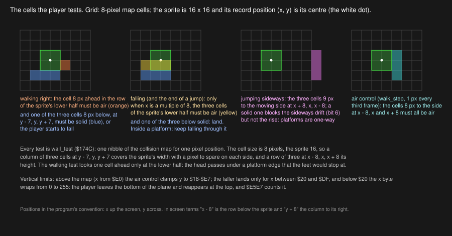
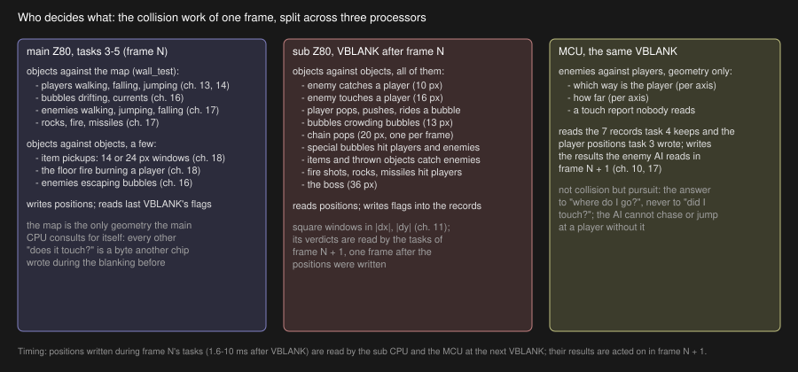

# 15. Collision

Three processors answer three different questions about what touches what, and none of them asks the
others. The main CPU asks the map: is this pixel inside a wall? The sub CPU asks the records: are these two
objects within so many pixels of each other? The MCU asks, for the enemies only, which way and how far to
the player. This chapter is the first question in detail — the wall tests every mover uses — and the
division of the other two.

## The wall test and its family

Chapter 6 printed `wall_test` (`$174C`): given `x` in A and `y` in H it returns the nibble of the collision map
for the cell containing that pixel, zero for solid. Every object test in the main program is built from it,
through a family of helpers that take the position from the record in IX and offset it by a cell or a
half-sprite:

| Routine | Cells tested | Asks |
| --- | --- | --- |
| `wall_test_left3` (`$1676`) | `(x - 8; y - 7, y, y + 7)` | Is there a floor under the sprite? (Z = one of the three is solid) |
| `wall_test_here3` (`$169F`) | `(x; y - 7, y, y + 7)` | Is the sprite's own lower row clear? |
| `wall_test_below` (`$15E9`) | `(x + 8, y + 8)` and `(x, y + 8)` | Is the column to the right clear at the sprite's height? |
| `wall_test_above` (`$1604`) | `(x + 8, y - 8)` and `(x, y - 8)` | ... and to the left? |
| `wall_test_right` (`$161F`) | `(x + 8, y)`, unless `x + 8` is in `$D8-$DF` | Is the cell above solid? |
| `wall_test_left` (`$166B`) | `(x - 8, y)` | Is the cell below solid? |

The names come from the disassembly, and they are wrong in an instructive way: they were given by someone
reading `IX+1` as a horizontal coordinate, as it would be in almost any other program. In Bubble Bobble
`IX+1` is `x`, the vertical coordinate that grows upward, and `IX+2` is `y`, the horizontal one (chapter 5).
So `wall_test_below` looks to the *right*, `wall_test_left3` looks *down*, and the helper the walking
code calls to find the floor is the one named for the left. The names are kept in this article because they
are the names in the listings; the table above says what each one does.

The geometry is the sprite's. A player or a monster is sixteen pixels square with its record position at its
centre. Three cells at `y - 7`, `y` and `y + 7` cover its width; three rows at `x - 8`, `x` and `x + 8` cover
its height; the cell at `x - 8` is the row under its feet, and the cell at `x` is the row of its lower half.



## What each movement asks

Put together from chapters 13 and 14, the rules a player lives by:

* **Walking**: for each pixel of this frame's step, the cell one cell ahead of the sprite's lower half must be
  air (a wall stops the step), and one of the three cells under the feet must be solid (no floor starts a
  fall). The upper half of the sprite is not tested: the dragon's head passes under an overhang that its feet
  would stop at, and this is why the platforms can be stacked with only two cells of clearance.
* **Falling**: at every step where `x` is a multiple of eight, the sprite's lower row must be clear and the
  row beneath solid to land. Inside a platform, fall on. Outside the map's rows (`x` below `$20` or from
  `$E0` up) there is nothing to land on.
* **Jumping**: on the moving side, the three cells at `y ± 9` and `x - 8`, `x`, `x + 8` are tested each step;
  a solid one sets the blocked bit and the drift stops for the rest of the arc, but the rise continues. On the
  way down the falling rule applies.
* **Air control**: `walk_step`'s sideways pixel is refused if any of the three cells at `y ± 8` is solid, and at
  the top of the plane (`x` at or above `$E0`, where the map has no rows) `y` is clamped to `$18-$E7` instead.

The enemies use the same family with their own offsets, and the bubbles use `wall_test` directly to read the
currents (chapter 16). One function and one map, read a few hundred times a frame, is the whole of the
geometry the main CPU keeps for itself.

## Who decides what



The main CPU never compares two objects' positions to decide a touch — with one family of exceptions. The
item pickups of bank 2 (`special_item_pickup`, `bonus_item_pickup`, `big_item_pickup`, `power_item_pickup`)
test the player against an item with a fourteen- or twenty-four-pixel window, because items are few, appear
one at a time, and are handled in the same task as the player that collects them. Everything else — every
enemy against every player, every bubble against every player and every other bubble, every projectile —
is the sub CPU's, and the enemy AI's "where is the player" is the MCU's.

The reason is arithmetic. The sub CPU's bubble pass alone runs to fifty thousand cycles on a busy frame
(chapter 11), half of the main CPU's whole frame budget; the main CPU with the same work would have had
nothing left for the game. The reason it *could* be moved is the shape of the data: the tests need only
positions and flags, both of which live in shared RAM, and their results are a byte per object that the
owner acts on later. Taito's designers drew the line where it cost nothing to cross.

## Which frame

The cost of the division is a frame of latency, and the game is built around it:

1. During frame N, the main CPU's tasks move everything and write the positions into the records and the
   object slots.
2. At the VBLANK that ends frame N, the sub CPU reads those positions and writes its flags; the MCU reads the
   enemy records and the player positions and writes its geometry.
3. During frame N + 1, task 3 finds a player's state at `$10` and starts the death, task 4's enemies read the
   MCU's direction bytes and the touch bytes, task 5's bubbles find their push fields and the pop event.

So a monster that walks into a player during frame N kills it during frame N + 1, and the game shows the
touch one picture before the death. Nobody notices, because a sixtieth of a second is below what a player
can see, and because every other latency in the machine is the same: the joystick read at one VBLANK moves
the dragon in the next frame, the sound sent in one frame plays in the next. The one place where the
latency is visible in the design is the sub CPU's landing window of twelve to twenty-one pixels above a
bubble (chapter 11): wide, because the player falls one or two pixels per step and the test is a frame old
when the main CPU acts on it.

## The hit that the main CPU makes itself

There is one touch test on the player that bank 2 performs directly, and it shows what the others would
have looked like. `fire_vs_player` (`2:$BAB5`) tests a player against the floor fire of a fire bubble
(chapter 18) with an eight-pixel window through `find_player_near`, and on a hit calls `player1_burn`
(`$4B50`). The traced sessions never reached it — the fire is the player's own weapon and the players kept
out of it — but the routine is there:

```asm
player1_burn:
4B50  LD HL,$E6AC              ; [+$1B] of player 1
loc_4B53:
4B53  BIT 0,(HL)
4B55  RET NZ                   ; already burning
4B56  SET 0,(HL)
4B58  INC HL
4B59  LD (HL),$1E              ; 30 frames
4B5B  RET
```

Thirty frames of the burnt animation with no control, and no death: the floor fire stuns. The fire *shots* of
the fire-breathing monsters, and the rocks, are the sub CPU's: its `player1_burnt` writes the state `$10`
and the burnt flag `[+$19]`, and the death that follows uses the second of the two death tables — the
scorched dragon rather than the spinning one. Two routines with almost the same name, on two processors,
with two different outcomes, are the clearest sign in the program of where the collision work was split and
where a little of it stayed behind.
