# Inside Bubble Bobble

# 1. Introduction

Bubble Bobble arrived in arcades in 1986. Taito's Fukio Mitsuji designed it, and it became one of the most
copied games of its decade: two small dragons, Bub and Bob, blow bubbles at monsters, trap them, and burst the
bubbles to turn the monsters into fruit. A hundred single-screen rounds, a secret code that changes the rules, a
song that everybody who played it can still hum, and an ending that most players never saw because it needs two
players to reach it.

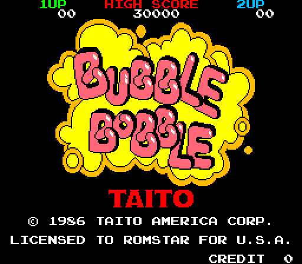

This article is about the machine underneath. Not the history, not the sequels, but the program: what is in the ROM
chips, how the data is laid out, what the processors do every sixtieth of a second, and how the things a player
feels — the arc of a jump, the way a bubble drifts along the ceiling, the moment an enemy decides to jump at
you — come out of a few thousand lines of Z80 code.

## Why this game

Most arcade games of 1986 are one processor and a video chip. Bubble Bobble has four processors, and each of them
matters to how the game plays:

* A **main Z80** runs the game. It has 96 KB of program, more than three times its address space, and pages it
  in 16 KB banks.
* A **second Z80** shares 6 KB of memory with the first and does nothing but collision work: it checks every
  bubble against both players, every enemy against both players, every bubble against every other bubble, once
  per frame.
* A **third Z80** drives two sound chips with a sequencer that has its own little byte-code language for music
  and sound effects.
* A **Motorola 6801 microcontroller** is the only chip wired to the joysticks, the coin slots and the option
  switches. It also computes, for every enemy, where each player is relative to it. The main program reads those
  results and the enemies use them to chase. Take the microcontroller away and the game has no inputs, no coins,
  and monsters that never jump — which is exactly the point: the MCU is the copy protection, and Taito made it
  indispensable by giving it real work.

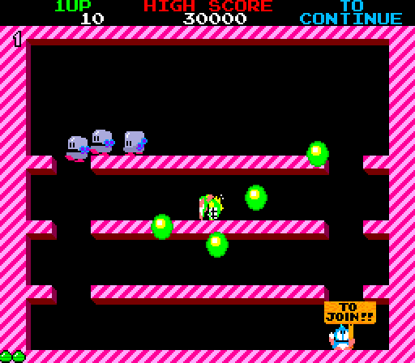

The design is also small. The whole thing — kernel, game flow, a hundred rounds, six enemy types with their
scripts, the bubble engine, the bonus items, a boss fight, the endings, an attract mode with demos, a test mode
and a copy-protection scheme with twenty-three checksum routines hidden in ordinary code — fits into 96 KB for the
main program, 32 KB each for the two helpers, and 4 KB for the microcontroller. Every trick used to make it fit is
visible in the ROM, and this article tries to show them all.

## How the article was made

The source of everything here is the ROM set itself, read through three layers of tooling built for this
project:

1. An **emulator** of the board — the four processors, the video generator, the two sound chips, the shared
   memories and the timing between them — accurate enough that the real program runs on it exactly as on the
   hardware.
2. An **annotated disassembly** of all four programs, with the names of routines and variables recovered by
   reading the code and by recording which routines read and write which bytes of RAM during play
   (`docs/disasm/`, `docs/symbols/`, `docs/analysis/ram-map.md` in the project).
3. A **re-implementation in TypeScript** of every routine of all four programs, verified against the emulator
   in lockstep: the re-implemented routine runs in place of the original, and after each one the machine's
   registers, memory and cycle count must be identical to what the original produces. Every routine described in
   this article has passed that test over hours of simulated play. When the text says "the enemy jumps when the MCU
   reports the player is beyond it", it is because the code that does so has been rewritten, run, and compared —
   not because it looks that way in a listing.

The figures are rendered from the running machine: screenshots at chosen frames, tile sheets decoded straight
from the graphics ROMs with the game's own palette, maps decoded from the level data, and diagrams drawn from the
record layouts.

## How to read it

Part I describes the machine and what happens when it is switched on. Part II is about data: how graphics,
screens, rounds, text and music are stored. Part III is the engine: the frame, the scheduler, and the three
helper processors. Part IV is the gameplay proper: the players, the collision system, bubbles, enemies, items and
the boss. Part V collects the odd corners — randomness, secrets, protection — and walks through one frame of round
1 instruction by instruction.

Some conventions:

* Hexadecimal numbers are written with a dollar sign: `$044D`. Byte offsets inside a record are written in
  brackets: `[$0B]`.
* The main program's banked region is written with the bank number in front: `1:$A73A` is address `$A73A` with
  bank 1 selected. The fixed 32 KB and the other processors' programs need no prefix.
* A **frame** is one vertical blanking period, 1/59.19 of a second. Timers in the game count frames, so "180
  frames" is about three seconds.
* The program names its coordinates the other way round from the video hardware: what the code calls `x` is the
  **vertical** position, measured upwards from the bottom of the 256-line plane, and `y` is the **horizontal** one.
  Chapter 5 explains this once; after that the text says "up", "down", "left" and "right" in the player's sense and
  uses the program's `x` and `y` only when quoting code.
* Routine names in fixed-width type (`bubble_catch`) are the names given during the disassembly. They are not
  Taito's names — no source code survives — but they are used consistently in the listings and in the code that
  accompanies this article.

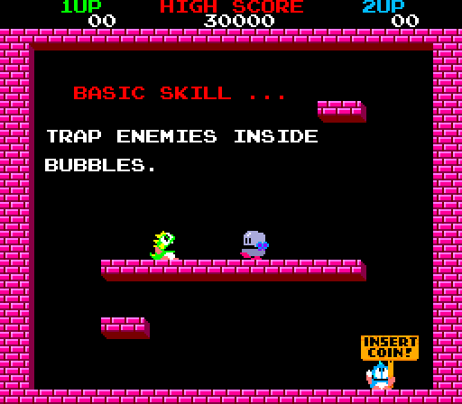

# 2. The hardware

The Bubble Bobble board (Taito's A78 set) is a mid-1980s design with an unusual amount of silicon for a game
that shows one static screen at a time. This chapter walks around the board once: which chips are there, what
each one can see, and how they talk to each other. Everything later in the article refers back to this map.


## The processors

| Processor | Clock | Program | What it does |
| --- | --- | --- | --- |
| Main Z80 | 6 MHz | 32 KB fixed + 64 KB in four 16 KB banks | The game: kernel, flow, players, bubbles, enemies, items, text, everything the player sees |
| Sub Z80 | 6 MHz | 32 KB | Collision helper. Shares the main CPU's work RAM and checks players, bubbles and enemies against each other once per frame |
| Sound Z80 | 3 MHz | 32 KB, 4 KB RAM | Music and sound effects on a YM2203 and a YM3526, driven by a sequencer with its own byte code |
| MCU 6801U4 | 1 MHz (4 MHz crystal) | 4 KB internal ROM | Reads the joysticks, buttons, coin slots and DIP switches; computes the enemy-to-player geometry; pulses the main CPU's interrupt |

The clocks all derive from one 24 MHz crystal. The video pixel clock is 6 MHz (24/4), the two game Z80s run at
that same 6 MHz, the sound Z80 and both sound chips at 3 MHz, and the MCU's internal clock is 1 MHz. This matters
later, when the article counts cycles: one frame is 264 raster lines of 384 pixels, so 101,376 main-CPU cycles, 50,688
sound-CPU cycles and 16,896 MCU cycles.

## The ROMs

| Chip | Contents | Size |
| --- | --- | --- |
| a78-25 / a78-24 (this set: US version 5.1) | Main program: 32 KB fixed, then 64 KB of banked code and data | 96 KB |
| a78-08 | Sub Z80 program (plus the packed collision maps of the 100 rounds) | 32 KB |
| a78-07 | Sound Z80 program, instruments and music | 32 KB |
| a78-01 | MCU program (inside the 6801U4) | 4 KB |
| a78-09 .. a78-20 | Graphics: twelve 32 KB ROMs, eight positions used, in two halves (planes 0-1 and planes 2-3) | 512 KB |
| a71-25 | Video timing PROM (which tile cells of an object column are drawn) | 256 bytes |

The main program's 96 KB is the interesting number. A Z80 addresses 64 KB, and half of that is RAM and I/O on
this board, so the program lives in a 32 KB fixed part plus a 16 KB window at `$8000-$BFFF` through which one of
four banks is visible at a time. Bank 0 holds the enemy drivers, bank 1 the round data, the demo recordings and the
title tiles, bank 2 the round objects, sequences and the test mode, bank 3 tables. The fixed part holds everything
that must be reachable at any time: the kernel, the players, the bubbles, text printing, scoring. Chapter 9
shows how the tasks that run banked code select their bank every time they are scheduled.

## The main CPU's memory map


From the main Z80's point of view:

| Range | What is there |
| --- | --- |
| `$0000-$7FFF` | Fixed program ROM. The eight `RST` vectors at the bottom are the kernel's entry points; `$0B2E` holds the interrupt vector (see chapter 9) |
| `$8000-$BFFF` | The banked window: one of four 16 KB banks |
| `$C000-$DCFF` | Video RAM: the tile columns. Two bytes per tile, a code and an attribute (chapter 5) |
| `$DD00-$DFFF` | Object RAM: up to 192 entries of 4 bytes, each an object (a column of tiles) on screen; the program keeps a list of 90 |
| `$E000-$F7FF` | Work RAM, 6 KB, shared with the sub Z80. Task states and stacks, the object records, the round record, the players, the bubbles, the enemies, the round objects, and the scores |
| `$F800-$F9FF` | Palette: 256 entries of 2 bytes, RRRRGGGG BBBBxxxx |
| `$FA00` | Sound latch: write a command byte for the sound CPU, read its reply |
| `$FA01` | Sound status: bit 1 = command not yet read by the sound CPU, bit 0 = reply not yet read by the main CPU |
| `$FA03` | Sound CPU reset (bit 0) |
| `$FA80` | Watchdog: any write resets it; the program writes here in every VBLANK and in every long loop |
| `$FB00` | Any write raises the sub CPU's NMI (never used by the released game) |
| `$FB40` | The bank and reset register |
| `$FC00-$FFFF` | The MCU's 1 KB of shared RAM |

The bank register `$FB40` is written with a byte whose low three bits are the bank number XORed with 4 (the
program writes `$74` for bank 0, `$75` for bank 1), bit 4 releases the sub Z80 from reset, bit 5 releases the
MCU, bit 6 enables the video output and bit 7 flips the screen for cocktail cabinets. The program keeps a copy of
the last value in `$E1CB` so that `bank_select` can change the bank bits without disturbing the others.

The shared 6 KB at `$E000-$F7FF` is real dual-ported memory between the two Z80s; both can read and write any
byte at any time. The program is careful about which side owns which byte, and chapter 11 lays that out. The 1 KB
at `$FC00-$FFFF` is different: the MCU reaches it through a slow parallel interface (about 50 of its cycles per
byte), and the main CPU reads it like RAM. There is no locking. The two sides agree on who writes what, and the
MCU's work runs in a fixed order every frame so that its results are ready when the main program looks.

## The sub CPU's view

The sub Z80 has its own 32 KB ROM at `$0000-$7FFF` and sees the shared work RAM at `$E000-$F7FF`, the same
addresses the main CPU uses. It has no other memory: its stack is in the shared RAM (at `$F7CE`), and its
interrupt is the VBLANK signal itself, held for the duration of the blanking, which is why its handler runs
several times per frame (chapter 11). The main CPU can raise its NMI through `$FB00`, but the released program
never does.

## The sound CPU's view

| Range | What is there |
| --- | --- |
| `$0000-$7FFF` | Program, instruments, music and effect data |
| `$8000-$8FFF` | 4 KB RAM: the channel records of the sequencer, the command queue, the variables |
| `$9000 / $9001` | YM2203 address and data registers |
| `$A000 / $A001` | YM3526 address and data registers |
| `$B000` | The latch: read the command from the main CPU, write the reply |
| `$B001` | Read: the two latch status bits. Write: enable the command NMI |
| `$B002` | Write: disable the command NMI |
| `$E000` | An empty socket for a diagnostic ROM; the program checks for a `JP` there and finds none |

A command byte written by the main CPU into `$FA00` appears at `$B000` and raises the sound CPU's NMI. The sound
CPU's timers, on the two chips, raise its IRQ. Chapter 8 follows a command from the queue to the chip registers.

## The MCU's view

The 6801U4 has 4 KB of ROM and 192 bytes of RAM inside the chip, and four 8-bit ports. Taito wired the ports to a
small address latch: port 4 carries the low address byte, port 2 the high nibble and a clock bit, port 1 a
read/write line (plus the coin and service switches on its other bits), and port 3 the data. Every access to the
shared RAM is a subroutine of about 50 cycles. Addresses `$0000-$0003` on that bus are not RAM at all: they read
the two DIP switch banks and the two joystick ports. The MCU keeps private copies of the bytes it manages in its
internal RAM and pushes the results into the shared 1 KB every frame (chapter 10).

## The video system

There is no tile map. The picture is built entirely from an object list: up to 192 entries (the program uses 90), each of which is a
column two tiles wide and up to 32 tiles high, placed anywhere on the 256 x 256 pixel plane of which 224 lines
are shown. The tiles are 8 x 8 pixels in 16 colours, 16,384 of them in the graphics ROMs, with a 4-bit colour
group per tile and horizontal and vertical flips. A 256-byte PROM tells the video generator, for each of the 32
tile rows of an object column, whether to draw it and whether to reload the x position from the object entry —
which is how a single object entry can draw several separately placed pieces. Chapters 4 and 5 take this apart.

The picture is 256 pixels wide and 224 lines tall in the ordinary orientation; the object columns are vertical
strips, so the playfield is built from sixteen strips side by side. One oddity for the reader of the code: the
program calls the vertical coordinate `x` and the horizontal one `y`, the reverse of the hardware's names.
Chapter 5 sorts this out.

## Sound

The YM2203 (OPN) provides three four-operator FM channels and a three-channel SSG (the AY-3-8910 square-wave
generator) on one chip; the YM3526 (OPL) provides nine two-operator FM channels. Bubble Bobble plays its music on
the nine YM3526 channels, each of which has two "voices" in the sound program so that an effect can borrow a
channel and hand it back, and its most frequent effects — the jump, the bubble — on the YM2203's FM channels, with
the SSG for a few more. Both chips have programmable timers, and the sound program runs its whole sequencer from
their interrupts: timer A of the YM2203 paces the YM3526 channels, timer B the YM2203's own.

## Inputs

Two eight-way joysticks with two buttons each (jump and bubble), two start buttons, two coin slots, a service
switch and a tilt switch, all read by the MCU. Two banks of eight DIP switches: bank A selects the cabinet type,
the attract-mode sound, the test mode, the coinage of both slots and the text language (bit 0: English or
Japanese); bank B selects the difficulty (bits 0-1), the extra-life thresholds (bits 2-3), the number of lives
(bits 4-5) and two service bits, one of which (bit 6) disables the synchronisation commands the main CPU sends to
the sub CPU. The main program reads the switches from the copies the MCU leaves in `$FC20` and `$FC21`.

# 3. Power-on

Switch the cabinet on and four programs start at once, but not independently: the main CPU holds the other two Z80s
and the MCU in reset until it has checked its own memory, and then waits for the MCU to report that it is ready.
This chapter follows that first second, then the initialisation that leads to the attract mode, and ends with the
two test screens a technician can select with the DIP switches.

## The main CPU's first instructions

The Z80 starts at `$0000`, where a `JP` leads to `boot` at `$00B9`. The routine is short enough to quote almost
whole. Its first two writes set the bank register to `$04` (bank 0, everything else held in reset, video off) and
kick the watchdog:

```asm
boot:
00B9  LD A,$04
00BB  LD (IO_bank_ctrl),A     ; $FB40: bank 0, sub CPU and MCU in reset, video off
00BE  LD (IO_watchdog),A      ; $FA80
00C1  LD HL,task_state        ; $E000: the start of work RAM
00C4  LD DE,$17FE             ; 6142 bytes: $E000-$F7FD
loc_00C7:
00C7  LD A,$FF
00C9  LD (HL),A
00CA  CP (HL)
00CB  JP NZ,loc_01EF          ; -> "WORK RAM ERROR"
00CE  LD A,$AA
00D0  LD (HL),A
00D1  CP (HL)
00D2  JP NZ,loc_01EF
00D5  LD A,$55
      ...                     ; the same with $55 and $00
00E2  INC HL
00E3  DEC DE
00E4  LD A,E
00E5  OR D
00E6  JR NZ,loc_00C7
```

Every byte of the work RAM is written and read back with four patterns. The loop runs with no stack (the
stack pointer is only set at `$00EB`, after the test, because the stack lives in the memory being tested) and
with interrupts disabled — the MCU, which would generate them, is still in reset. A failure jumps to `$01EF`,
which prints `WORK RAM ERROR` and halts with the video on. The same test then runs over the MCU's 1 KB at
`$FC01-$FFFF` (skipping `$FC00`, which will hold the interrupt vector), reporting `COMMON RAM ERROR`. The two
messages are stored as text records right after the code, at `$0234` and `$0244`, together with two more that
the later checks can print: `PS4 SUM ERROR` and `I/O ERROR`.

Then the video RAM is cleared (`$C000-$DFFF`, 8 KB, by `mem_clear`), the MCU is given its first command before
it even runs (`$FF94 = 1`, the coin-lockout command), and the interrupt vector is prepared:

```asm
0129  LD HL,$0B2E
012C  LD A,H
012D  LD I,A                  ; I = $0B
012F  LD A,L
0130  LD (mcu_irq_vector),A   ; $FC00 = $2E
```

The main CPU runs in interrupt mode 2. When the MCU pulses the interrupt line it does not supply a vector byte
(there is no hardware for that), so the data bus floats and the CPU reads whatever the last transfer left
there. The board's design guarantees that this is the byte at `$FC00` — the MCU's shared RAM, which the CPU has
just written with `$2E` — so the vector is `I:$2E = $0B2E`, and the word stored at `$0B2E` in ROM is `$044D`, the
address of the frame handler. This detail is worth remembering: the value `$0B2E` is checked again and again
by the copy-protection code in chapter 20, because a bootleg that replaced the MCU with a plain interrupt
generator would also have had to reproduce this trick.

## Releasing the other processors

```asm
0133  LD A,$44
0135  LD (IO_bank_ctrl),A     ; video on, still bank 0, others in reset
0138  LD HL,$4000
loc_013B:
013B  LD (IO_watchdog),A
013E  DEC HL                  ; 16384 iterations: about 106 ms
      ...
0143  LD A,$74
0145  LD (IO_bank_ctrl),A     ; sub CPU and MCU released
0148  LD (bank_ctrl_shadow),A ; $E1CB keeps the register's value
014B  LD HL,IO_sound_reset
014E  LD (HL),$FF             ; sound CPU reset...
0150  LD HL,IO_sound_reset
0153  LD (HL),$00             ; ...and released
0155  LD (IO_watchdog),A
loc_0158:
0158  LD A,(mcu_ready)        ; $FC85
015B  CP $37
015D  JR NZ,loc_0158          ; wait for the MCU
```

Three things happen in a few microseconds: the sub Z80 starts at its `$0000`, the MCU starts at its reset
vector, and the sound Z80 is reset and restarted. What each does while the main CPU waits:

* **The sub Z80** disables interrupts, selects interrupt mode 1, sets its stack to `$F7CE` (in the shared RAM,
  just below the main CPU's own stack area), sums its whole 32 KB ROM (a quarter of a second of work; a wrong
  sum hangs the CPU in a two-byte loop at `$018D`), enables interrupts and sits in a two-byte idle loop at
  `$000A`. From then on it only runs when the VBLANK signal interrupts it (chapter 11).
* **The sound Z80** disables the command NMI, reads the latch once to clear it, clears its 4 KB of RAM,
  programs the YM2203's two timers (the periods `$0150 << 6` and `$D5`, then the mode register `$3F` which
  starts both), writes and reads back the SSG's mixer register as a test of the chip (a mismatch resets the
  CPU), programs the YM3526's timers the same way, replies `$E0` on the latch, enables the NMI and enters its
  main loop. Its interrupt handler will start playing whatever the main CPU asks for (chapter 8).
* **The MCU** initialises its ports and its private copies of the shared bytes, checksums its own ROM, and
  writes `$37` into `$FC85`. This is the byte the main CPU is polling at `$0158`. The MCU also leaves the
  16-bit sum of its own ROM in `$FC82/$FC83` — it must come out as zero; `PS4` is what the error message calls
  this check — and notes at `$FC7D` whether a coin switch was already closed at power-on.

## Test mode or game

```asm
015F  CALL flip_screen_from_dip
0162  LD A,(mcu_dswa)         ; $FC20: DIP switch A, as copied by the MCU
0165  BIT 2,A
0167  JR NZ,loc_0171          ; bit 2 set: normal game
0169  LD A,$02
016B  CALL bank_select
016E  JP $8000                ; bank 2: the test mode
```

DIP switch A bit 2 selects the test mode, which lives at the start of bank 2 (the same address that holds the
enemy code in bank 0). It is described at the end of this chapter. The game continues at `$0171`.

## Initialising the game

```asm
0171  CALL round_table_copy   ; 16 bytes from bank 3 $BFDF + 16 x ($BFFF) -> $E36A
0174  LD A,$EF
0176  LD (IO_sound_latch),A   ; sound command $EF: all sound on
0179  CALL video_disable
017C  CALL sub_3448           ; the default high-score table
017F  CALL init_high_score    ; the high score = the first extend threshold
0182  CALL init_slots_031c
0185  CALL init_object_list
0188  LD A,$03
018A  CALL bank_select
018D  CALL walker_expectations ; the 23 checksum expectations from bank 3 $9380
0190  CALL bank_restore
0193  LD A,$00
0195  LD (IO_sound_latch),A   ; sound command 0
0198  LD HL,objram_shadow     ; $E1CD
019B  LD DE,$DD00
019E  LD BC,$0168
01A1  LDIR                    ; the (empty) object list into object RAM
01A3  LD HL,frame_done
01A6  LD (HL),$01             ; $E194: the previous frame is "done"
01A8  LD A,$2D
01AA  LD (IO_sound_latch),A   ; sound command $2D
01AD  CALL video_enable
```

Three of these calls fill tables that the rest of the game reads:

* `round_table_copy` takes one of several 16-byte tables from the end of bank 3 (selected by the last byte of
  the bank) into `$E36A`. These are per-version constants of the round sequence.
* `sub_3448` writes the default high-score table at `$E654`: five entries of seven bytes, each with a score, a
  best round and a three-letter name. The names are `I.F`, `MTJ`, `NSO`, `KIM` and `YSH` — the initials of the
  team, with `MTJ` for Fukio Mitsuji in second place — and the scores are taken from the extend-threshold table
  selected by DIP switch B (chapter 12), so that the default table always sits just above the first extra life.
  The best-round bytes are set to 31, 31 and 19.
* `walker_expectations` copies 23 expected checksums from a table in bank 3 into work RAM. Twenty-three
  routines scattered through the program add up parts of the ROM a few bytes at a time during play; when a sum
  comes out wrong they do not stop the game but corrupt the stack in ways that fail later and elsewhere
  (chapter 20).

## The two checks that can still stop the game

```asm
01B0  LD HL,(mcu_checksum)    ; $FC82/$FC83, written by the MCU
01B3  LD A,H
01B4  OR L
01B5  JR Z,loc_01C4
01B7  LD HL,$0254             ; "PS4 SUM ERROR"
      ...
01C4  LD A,(mcu_coin_at_boot) ; $FC7D
01C7  AND A
01C8  JR Z,loc_01D7
01CA  LD HL,$0262             ; "I/O ERROR"
```

A non-zero checksum word from the MCU, or a coin switch closed at power-on, prints the message and halts with
the MCU disabled (`$FF98 = 0`, the key the MCU needs to keep interrupting). Both messages are ROM-quoted in the
listing and neither appears in normal operation.

## The main CPU's last instructions

```asm
01D7  LD A,$00
01D9  RST $30                 ; start task 0: the game flow
01DA  LD HL,mcu_enable_key
01DD  LD (HL),$47             ; $FF98: the MCU may now pulse the interrupt
01DF  LD A,$AA
01E1  CALL start_sync         ; hand $AA to the sub CPU (unless DIP B bit 6)
01E4  LD (IO_watchdog),A
01E7  LD HL,mcu_port1_copy
01EA  SET 0,(HL)              ; $FC1F bit 0
01EC  EI
loc_01ED:
01ED  JR loc_01ED             ; forever
```

The last line is the whole "main loop" of the main CPU: a jump to itself. Everything from now on happens in the
interrupt handler that the MCU triggers sixty times a second (chapter 9). Task 0 has been created but has not
run yet; the first interrupt will schedule it, and it will start the attract mode. `start_sync` is one of a
family of routines that pass a byte to the sub CPU through `$F7FE`, the last word of the shared RAM, unless DIP
switch B bit 6 says the sub CPU should not be synchronised — a factory option that the released game never
needs.

The timeline of the first second, measured on the emulated machine:

| Time | Event |
| --- | --- |
| 0 ms | Main CPU starts. The sound CPU also starts and boots once, but is reset again below |
| 0-157 ms | The four-pattern test of the work RAM (6142 bytes) |
| 157-185 ms | The same test of the MCU area |
| 185-242 ms | Video RAM cleared, vector set, video enabled |
| 242-348 ms | The 16,384-iteration delay loop |
| 348 ms | Sub CPU, MCU and sound CPU released. The sound CPU clears its RAM and reaches its main loop 40 ms later; the sub CPU sums its 32 KB ROM, which takes it until 605 ms |
| 394 ms | The MCU has finished its own setup and checksum and writes `$37`; the main CPU stops polling |
| 395 ms | The first sound command (`$EF`) reaches the sound CPU: its first NMI |
| 398 ms | Tables initialised, task 0 created, interrupts enabled, and the first VBLANK interrupt arrives; the frame handler runs task 0 for the first time, which starts the attract mode |
| 605 ms | The sub CPU enters its idle loop and takes its first VBLANK interrupt |
| 2.5 s | The title logo is complete and starts cycling its colours (chapter 12) |

The numbers come from the emulated machine, which counts every cycle of every processor; the RAM tests dominate
because each byte costs about 24 cycles per pattern, and the sub CPU's checksum reads its whole ROM byte by byte.

## Test mode

With DIP switch A bit 2 clear the boot jumps into bank 2 at `$8000` with interrupts still disabled; the test
program never enables them and drives the hardware directly.


The first screen is a palette and tile test: the palette is filled with a red, green, blue and white ramp, a
grid of tile cells is drawn, and four sprite quads are placed over it. The program then waits for the 2P start
button. The second screen prints 22 text records — the state of every input, the two DIP switch banks as
`H`/`L` letters, a sound-test counter and a RAM verdict — and then loops forever over three routines: the input
display (`$82CB`, reading the MCU's copies of the inputs), the DIP display (`$83B3`) and the sound test
(`$8360`), in which the joystick selects a sound number and the bubble button sends it to the sound CPU.


With bits 0 and 2 of DIP A both clear the boot runs the burn-in test (`$BB7E`) instead. It is the only program
on the board that enables interrupts inside the test mode: it pulses the MCU's reset through the bank register,
and then writes and reads the video RAM and the palette with five patterns, forever, while the frame handler's
colour-test branch (`$04D8`) paints palette entry 0 from the joystick and button state so that a technician can
see the inputs change the border colour. The main handler at `$044D` tests DIP A for this case on every interrupt
before doing anything else.


# 4. Graphics: tiles, sprites and colours

Everything Bubble Bobble shows — walls, dragons, monsters, bubbles, fruit, text, the title logo, the boss — is made of
8 x 8 pixel tiles in sixteen colours. There are no hardware sprites in the usual sense and no scrolling: the video
generator draws tiles from a list of objects, and a "sprite" is just a small group of tiles that the program
moves by rewriting the list. This chapter is about the tiles themselves: how they are stored, how many there are,
what they look like, and how the program groups them into the things a player recognises. The next chapter is about
the list.

## The tile format

The graphics ROMs hold 512 KB, of which 384 KB are populated: twelve 32 KB chips at positions 0 to 5 and 8 to 13
of the sixteen available. They are read as two halves. The first half (chips a78-09 to a78-14, addresses
`$00000-$2FFFF`) holds bit-planes 0 and 1 of every tile, the second half (a78-15 to a78-20, `$40000-$6FFFF`) holds
planes 2 and 3 of the same tiles at the same offsets. A tile is 8 rows of 8 pixels at 4 bits per pixel, 32 bytes in
all, 16 in each half. Within a half, each row is two bytes:

| Byte | High nibble | Low nibble |
| --- | --- | --- |
| row byte 0 | plane 0, pixels 3 2 1 0 (pixel 3 in the most significant bit) | plane 1, pixels 3 2 1 0 |
| row byte 1 | plane 0, pixels 7 6 5 4 | plane 1, pixels 7 6 5 4 |

and the second half holds planes 2 and 3 in the same arrangement. The pixel's colour index is
`plane0 x 8 + plane1 x 4 + plane2 x 2 + plane3`: plane 0 is the most significant bit. Index 15 is transparent
— the video generator does not draw it, whatever the palette says — so a tile has fifteen usable colours plus
holes. The figure decodes one tile of Bub's walking animation.

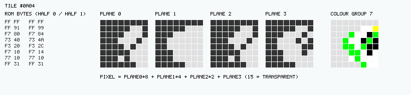

The emulator's decoder is a direct transcription of this layout and is short enough to show; the game itself
never needs it, because the video generator reads the ROMs directly:

```ts
// Decode 8x8 4bpp tiles into one byte per pixel (src/machine/bublbobl.ts)
const total = rom.length / 2 / 16;                 // 16 bytes per tile in each half
const half = rom.length / 2 * 8;                   // bit offset of the second half
const planes = [0, 4, half, half + 4];
const xoffs = [3, 2, 1, 0, 8 + 3, 8 + 2, 8 + 1, 8 + 0];
for (let t = 0; t < total; t++)
  for (let y = 0; y < 8; y++)
    for (let x = 0; x < 8; x++) {
      let v = 0;
      for (let p = 0; p < 4; p++) {
        const bit = t * 128 + planes[p] + y * 16 + xoffs[x];
        if (rom[bit >> 3] & (0x80 >> (bit & 7))) v |= 1 << (3 - p);   // plane 0 is the MSB
      }
      out[t * 64 + y * 8 + x] = v;
    }
```

With 32 bytes per tile the populated 384 KB give 12,288 tiles, numbered `$0000-$2FFF`; the numbers `$3000-$3FFF`
address the empty positions and read as blank. A tile's number is 14 bits: the video RAM cell that places it
holds ten of them, and the object entry that owns the cell adds a "tile bank" of four more bits, in units of 1024
tiles. So the tile ROM is best thought of as sixteen banks of 1024 tiles, twelve of them filled, and an object can
only show tiles from one bank at a time. That constraint shaped where the artists put things.

## What is where

| Bank | Tiles | Contents |
| --- | --- | --- |
| 0 | `$0000-$03FF` | The font (`$0000-$007F`: the TAITO logo pieces, arrows, punctuation, digits and capitals), small item pieces, the round-wall tile sets (`$0200-$02FF`) and the wall edge tiles (`$00F0-$00F5`) |
| 1 | `$0400-$07FF` | A second copy of the font (so text can share an object with bank-1 graphics), the title logo, the Japanese kana used by the instruction screen and the ending |
| 2 | `$0800-$0BFF` | The sprites of play: bubbles and their bursts (`$0800-$08BF`), the points markers, Zen-chan and the other walkers (`$0900-$09FF`), Bub (`$0A00-$0AFF`), the remaining enemies (`$0B00-$0BFF`) |
| 3 | `$0C00-$0FFF` | Monsta (`$0C00-$0C7F`), the items (`$0C80-$0DFF`, `$0EC0-$0FFF`), the green score numbers 10 to 9000 and the x2..x9 multipliers (`$0E00-$0EBF`) |
| 4 | `$1000-$13FF` | The message panels (PUSH 1P START, TO JOIN, GAME OVER, THANK YOU, INSERT COIN), the EXTEND letters, the secret-room doors, the boss's small sprites |
| 5-7 | `$1400-$1FFF` | Large figures: the boss, the story-intro and ending pictures, the big digits of the results screen |
| 8-11 | `$2000-$2FFF` | More large pictures (the ending), two more copies of the font for the mode-select and results screens, the EXTEND bonus screen frame, the second-player dragon Bob in his own colours |
| 12-15 | `$3000-$3FFF` | Empty |

The font appears four times because the tile bank is a property of the object, not of the cell: a panel that
mixes large artwork from bank 9 with letters needs letters in bank 9. The copies are byte-identical.


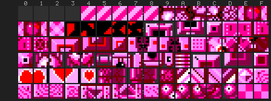

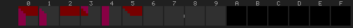

## The palette

The palette lives in the main CPU's memory at `$F800-$F9FF`: 256 entries of two bytes, big-endian nibbles,
`RRRRGGGG` in the first byte and `BBBBxxxx` in the second. Four bits per component give 4,096 possible colours,
of which a round uses a few dozen. The 256 entries are sixteen **colour groups** of sixteen; a tile's cell
selects the group, the pixel selects the entry within it, and entry 15 of any group is never drawn because 15 is
the transparent index. Entry 255 — group 15, colour 15 — is the one exception: the video generator uses it as the
background colour behind everything.

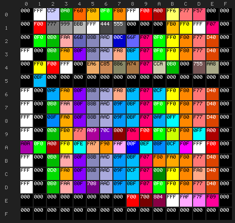

The groups are assigned by convention in the program: text is printed in groups 0 to 5 (white, green, blue, red,
yellow ...), the sprites of the round use group 7, the panels group 8, the walls group 14 (which the round loader
fills from the round's palette selector, chapter 6), and the rest are used by the title, the ending and the
special sequences. The program changes palette entries at run time for effects: the title logo cycles six
entries every two frames, the secret door and the "power up" item flash whole groups, and the round-clear wipe
blinks the wall tiles by flipping an attribute bit rather than the palette (chapter 18).

## From tiles to things

A tile is 8 x 8; almost everything in the game is 16 x 16. The program's unit is the **2 x 2 cell**: four
consecutive tile numbers drawn as top-left, top-right, bottom-left, bottom-right. The artists laid the sprites
out that way in the ROM, so a sprite frame is named by its first tile and the drawing routine adds 1, 2 and 3.

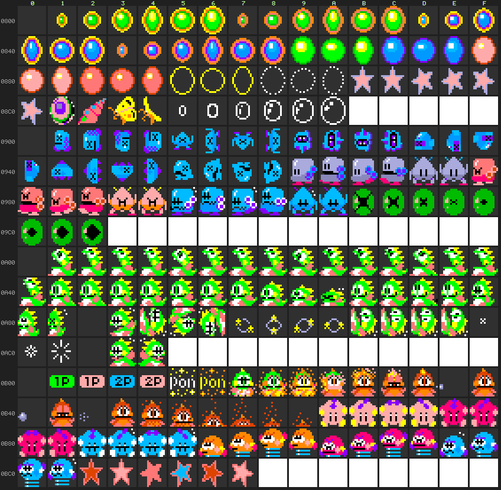

Every 16 x 16 thing on screen is drawn by one small family of routines in the fixed ROM. `code_to_map_addr`
turns a **position code** — one byte, bits 0-4 a column and bits 5-6 a block — into the address of the cell in
video RAM, and `draw_sprite_2x2` writes the four tiles:

```asm
code_to_map_addr:                  ; IY = video RAM address of position code A
145D  PUSH AF
145E  AND $1F                      ; column 0-31
1460  LD L,A
1461  LD H,$00
1463  ADD HL,HL  x7                ; x $80: one column is 128 bytes
146A  LD DE,$C000
146D  ADD HL,DE
146E  POP AF
146F  SRL A
1471  AND $30                      ; block 0-3 x $10
1473  ADD A,L
1474  LD L,A
1475  JP NC,loc_1479
1478  INC H
1479  PUSH HL
147A  POP IY
147C  RET

draw_sprite_2x2:                   ; tiles B..B+3, attribute C, at position code A
147D  CALL code_to_map_addr
1480  LD (IY+$0C),B                ; row 6, left cell: code
1483  LD (IY+$0D),C                ;                   attribute
1486  INC B
1487  LD (IY+$4C),B                ; row 6, right cell ($40 on)
148A  LD (IY+$4D),C
148D  INC B
148E  LD (IY+$0E),B                ; row 7, left
1491  LD (IY+$0F),C
1494  INC B
1495  LD (IY+$4E),B                ; row 7, right
1498  LD (IY+$4F),C
149B  RET
```

The four cells are the last two rows (offsets `$0C` and `$0E`) of an 8-row block, because the video PROM's sprite
shapes draw exactly those two rows (chapter 5). The attribute byte `C` carries the colour group in bits 2-5 and
the high two bits of the tile number in bits 0-1; the flipped variant `draw_sprite_2x2_flipped` sets bit 6 (flip
x) and swaps the left and right tiles, which is how the same four tiles serve for a dragon facing either way.
`draw_sprite_column` stacks `B` such cells downwards from an object's position code, taking the tiles from a
table at `HL`; it builds the 16 x 32 player figures of the entrance and death animations and the tall panels,
and its flipped twin handles mirrored figures. Chapter 5 shows how the game hands out position codes to its
objects so that these writes land in the right place on screen.

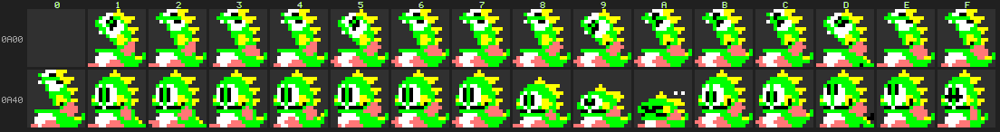

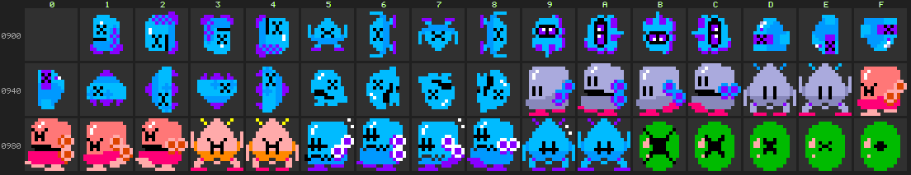

## What is not there

Two absences are worth pointing out. There is no 1 x 1 or 8 x 8 sprite format: the points markers, the small
bubbles of the stream a dragon blows, even the single-tile eyes of a caught enemy are all placed as 2 x 2 cells
with three transparent tiles. And there is no compression anywhere in the graphics: 384 KB of ROM in 1986 was
expensive, and Taito spent it on redundancy — four fonts, left- and right-facing copies of a few asymmetric
figures, whole colour variants of the enemies — rather than on a decoder. The program's own data, by contrast,
is packed tightly (chapters 6 and 8).

# 5. Building the screen

The video generator of Bubble Bobble does one thing: sixty times a second it walks a list of objects in the object
RAM at `$DD00` and, for each, draws a column of tiles from the video RAM at `$C000` onto the 256 x 256 pixel plane.
Walls, text, dragons and bubbles are all objects in that list. This chapter explains the list, the columns, the
PROM that shapes them, and then how the program organises its use of them: two playfields, a pool of sprite
slots, and a text printer that writes straight into the columns.

## The object entry

An object entry is four bytes:

| Byte | Meaning |
| --- | --- |
| 0 | `256 - y`: the vertical position, stored negated (so that 0 means the top and a larger value moves the object up) |
| 1 | Bits 7-5: the **shape**, one of eight lines of the video PROM. Bits 4-0: the **column**, which 128-byte block of video RAM holds the tiles |
| 2 | `x`: the horizontal position |
| 3 | Bits 3-0: the **tile bank**, added to every tile number of the column in units of 1024. Bit 6: x is negative (the object starts to the left of the screen) |

An entry of four zero bytes is skipped. The generator processes the entries in order, and later entries are
drawn over earlier ones; the program uses that ordering deliberately, keeping the playfield columns first and the
sprites after them so that dragons walk in front of walls.

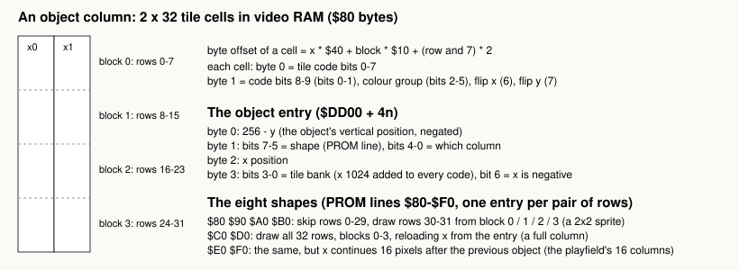

## The columns

The video RAM is 7,424 bytes, `$C000-$DCFF`: 58 columns of 128 bytes. A column is two tiles wide and 32 tiles
high, but it is not stored row by row. Each 128-byte column is two halves of 64 bytes, the left tile column at
offset 0 and the right one at `$40`; each half is four **blocks** of 16 bytes, one per 8 rows; and each block
holds eight 2-byte cells, one per row. The cell's first byte is the low eight bits of the tile number and the
second byte packs the rest:

| Attribute bit | Meaning |
| --- | --- |
| 1-0 | Tile number bits 9-8 |
| 5-2 | Colour group (0-15) |
| 6 | Flip horizontally |
| 7 | Flip vertically |

The entry's column field selects one of the first 32 columns (`$C000-$CFFF`); when bits 7 and 5 of the shape
byte are both set the address gains `$1000`, which reaches the remaining 26 columns at `$D000-$DCFF`. So the 58
columns are really "32 low columns and 26 high columns", and the high ones can only be used by objects whose
shape is `$A0`, `$B0`, `$E0` or `$F0`.

## The shapes

The video PROM (a71-25) has eight lines of sixteen entries in its upper half, one line per shape. An entry covers
two of the object's 32 tile rows and says whether to draw them (bit 3 clear), whether to reload the x position
from the entry before drawing (bit 2 clear) and which of the four blocks of the column supplies the cells (bits
1-0). The eight lines, read straight from the PROM:

```
$80  0C 0C 0C 0C 0C 0C 0C 0C 0C 0C 0C 0C 0C 0C 0C 00
$90  0C 0C 0C 0C 0C 0C 0C 0C 0C 0C 0C 0C 0C 0C 0C 01
$A0  0C 0C 0C 0C 0C 0C 0C 0C 0C 0C 0C 0C 0C 0C 0C 02
$B0  0C 0C 0C 0C 0C 0C 0C 0C 0C 0C 0C 0C 0C 0C 0C 03
$C0  00 00 00 00 01 01 01 01 02 02 02 02 03 03 03 03
$D0  00 00 00 00 01 01 01 01 02 02 02 02 03 03 03 03
$E0  04 04 04 04 05 05 05 05 06 06 06 06 07 07 07 07
$F0  04 04 04 04 05 05 05 05 06 06 06 06 07 07 07 07
```

Shapes `$80` to `$B0` skip 30 rows and draw the last two from block 0, 1, 2 or 3: a 16 x 16 sprite whose top is
16 lines above the line named by byte 0 (the rows are drawn at `256 - byte0 + 240`, modulo 256), which is why
`draw_sprite_2x2` writes rows 6 and 7 of a block (chapter 4) and why the program stores its objects' positions
with an offset of 8. Because the four blocks of one column are addressed by four different
shapes, one 128-byte column holds four independent sprites; 32 columns give 128 **sprite slots**, and a slot is
named by a single byte — the same byte that goes into the entry's shape/column field. The program calls it the
**position code** or slot code (`IX+7` in every object record) and `code_to_map_addr` turns it into the cell
address.

Shapes `$C0` and `$D0` draw all 32 rows, block by block, reloading x from the entry: a full 16 x 256 strip.
Shapes `$E0` and `$F0` are the same strip but with bit 2 set: x is not reloaded, and the generator continues 16
pixels to the right of the previous object. This is how the playfield is drawn as sixteen consecutive strips whose
entries all carry `x = 0`: the first has shape `$C0` and sets x, the fifteen that follow have shape `$E0` and
chain. The listing of the object RAM during round 1 shows it:

```
obj 00: line=0 x=0 shape/column=$9A  cells: 60/2 60/2 60/0 60/0 204/14 205/14 206/14 207/14 ...
obj 01: line=0 x=0 shape/column=$DB  cells: 60/2 60/2 60/0 60/0 208/14 208/14 F0/14 F2/14 F4/14 ...
obj 02: line=0 x=0 shape/column=$DC  cells: 7C/2 75/2 60/0 60/0 208/14 208/14 F2/14 F2/14 F1/14 ...
...
obj 0F: line=0 x=0 shape/column=$E9  cells: 60/5 60/0 65/5 60/0 204/14 205/14 206/14 207/14 ...
obj 10: line=163 x=92  shape/column=$00 bank=2 cells: 864/7 865/7 866/7 867/7     (a bubble, slot 0 block 0)
obj 11: line=174 x=126 shape/column=$20 bank=2 cells: 864/7 865/7 866/7 867/7     (a bubble, slot 0 block 1)
obj 28: line=117 x=40  shape/column=$0C bank=2 cells: 970/7 971/7 972/7 973/7     (Zen-chan)
obj 3A: line=216 x=200 shape/column=$19 bank=4 cells: 1104/8 1105/8 1106/8 1107/8 (the TO JOIN panel)
```

Entry 0 is shape `$80 | $1A`: column `$1A` of the low half, drawn with shape `$C0` after the `$80`-bit trick
(`$9A & $E0 = $80`, PROM line `$C0`); entries 1 to 15 are `$DB` to `$E9`: shape `$E0`, columns `$1B` to `$29`. The
sprites use columns 0 to 25 of the low half, and each of the four shapes `$00`, `$20`, `$40`, `$60` picks a block.

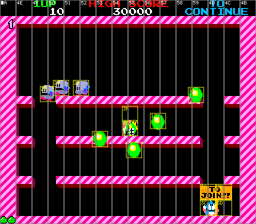

## The program's coordinates

Nothing is rotated: the picture is 256 pixels wide and the object columns are vertical strips, 16 pixels wide and
256 tall, of which lines 16 to 239 are visible. The sixteen playfield strips stand side by side and cover the
whole width; the status row ("1UP", the scores, "HIGH SCORE") is tile rows 2 and 3 of every strip, just below the
invisible top, and the lives icons are drawn near the bottom.

What is unusual is the program's naming. In every record of the game — players, enemies, bubbles, items — the
byte the code calls `x` (`IX+1`) is the **vertical** position, and it grows **upwards**: it is 256 minus the
hardware line of the object's centre. The byte called `y` (`IX+2`) is the horizontal position of the centre.
Bub standing on the floor of round 1 has `x = 32, y = 32`; his object entry holds `256 - 24 = 232` in byte 0 and
`24` in byte 2, which puts the 16 x 16 sprite at lines 216-231 and pixels 24-39: the centre is at line 224 = 256
- 32 and pixel 32. Jumping increases `x`; walking right increases `y`. Whether Taito's engine grew out of a
vertically mounted game or the names were simply chosen this way is not recorded; the article uses "up", "down",
"left" and "right" in the player's sense and quotes `x` and `y` only where the code does.

## Two playfields

The program keeps its object list in work RAM at `$E1CD`, 90 entries (360 bytes), and the frame handler copies it
into `$DD00` at every VBLANK with one `LDIR` (chapter 9). All drawing goes into that shadow and into the video RAM
columns; the generator never sees a half-updated list because the copy happens during the blanking.

The 90 entries are allocated by convention:

| Entries | Address | Use |
| --- | --- | --- |
| 0-15 | `$E1CD` | Playfield A: the sixteen strips in low columns `$1A-$29` (`$CD00-$D4FF`) |
| 16-65 | `$E20D` | Sprites: 24 bubbles first, then enemies, items, panels and the players, in slots of the low columns 0-25 |
| 66-89 | `$E2D5` | Playfield B: sixteen strips in high columns `$0A-$19` (`$D500-$DCFF`), which the round scroll moves about within this range; the part not in use holds Skel-Monsta's sprites |

There are two playfields because the round intro scrolls, but not in the way the word suggests. The sixteen
strips of playfield A are 256 lines tall on a 256-line plane, so each is a ring: raise its line byte and the rows
that leave at the top come back in at the bottom. The scroll rotates the sixteen rings by two pixels a frame for
128 frames, and while a row is out of sight `round_scroll_step` clears it and draws the next round's map row into
it, one row every four frames. The old round rides up and off, the new round rides in from below, and both live in
the same columns the whole time. Playfield B exists for the status row: at the start of the scroll the two text
rows of the score line are copied from A's columns into B's (`swap_playfield_in`, `$CD04` to `$D504`, four bytes per
tile column), B's sixteen entries are at fixed positions so the scores stay still while the walls move, and at the
end the text is copied back and B is cleared (`swap_playfield_out`). `$E352` records which half holds the status
row so that the score printers write into the right columns. Once the round starts, B's entries are cleared
altogether (`clear_init_object_list2`), and the range is free for Skel-Monsta's records. The two sets of columns
are the reason the video RAM is 58 columns rather than 32: sixteen strips twice, plus 26 columns for sprites and
panels. Chapter 6 shows the scroll frame by frame.

`init_object_list` shows the fixed part of the scheme: it clears the spare entries and writes playfield B's
sixteen entries from a table of shape/column and x bytes:

```asm
init_object_list:
0372  LD HL,object_list_b       ; $E2F5
0375  LD BC,$0040
0378  CALL mem_clear
037B  LD HL,object_list_a       ; $E2D5: playfield B's entries
037E  LD DE,$0394
0381  LD B,$10
loc_0383:
0383  LD (HL),$00               ; y = 0
0385  INC HL
0386  LD A,(DE)                 ; shape/column: $AA, $AB ... $B9
0387  LD (HL),A
0388  INC HL
0389  INC DE
038A  LD A,(DE)                 ; x: $00, $10, $20 ... $F0
038B  LD (HL),A
038C  INC HL
038D  INC DE
038E  LD (HL),$00               ; bank 0
0390  INC HL
0391  DJNZ loc_0383
0393  RET
object_list_init:
0394  db AA 00 AB 10 AC 20 AD 30 AE 40 AF 50 B0 60 B1 70
03A4  db B2 80 B3 90 B4 A0 B5 B0 B6 C0 B7 D0 B8 E0 B9 F0
```

These entries carry explicit x positions and the reloading shape `$D0` (`$AA & $E0 = $A0`), unlike playfield A's
chained `$E0` strips — the two halves are built by different code, and both work.

## Sprite slots and object records

A moving thing in the game — a dragon, an enemy, a bubble, an item — is described by a record in work RAM whose
first bytes are the same for all of them:

| Offset | Meaning |
| --- | --- |
| +0 | State flags (the meaning of the bits differs by kind) |
| +1 | x |
| +2 | y |
| +3, +4 | Pointer to the object's entry in the shadow list |
| +5 | Animation frame |
| +6 | Animation tick |
| +7 | Slot code: the column and block whose cells the object draws into |
| +8 | Player number (whose object this is) |
| +9, +A | Kind-specific flags |
| +B | Tick counter |

To move an object, the program updates x and y in the record and copies them into the entry through the
pointer; to animate it, it calls `draw_sprite_2x2` with the slot code and the frame's first tile, which overwrites
the four cells the entry displays. Nothing else is needed: the entry's shape/column byte was set to the slot code
when the record was created, and stays. Creating the bubbles, for instance, links 24 records at `$E76C` to the 24
entries from `$E20D` and hands each a slot (chapter 16); the players' arrival objects at `$E700` take two more.
`anim_step` (`$15CA`) is the shared animation clock: it counts the tick at +6 up to a limit and then the frame at
+5, and reports when the sequence wraps, so that a caller can index its tile table with the frame.

The 16 x 32 figures of the entrance and death animations, the message panels and the big items use several slots
and several entries at once: `draw_sprite_column` stacks cells downwards from a slot code, block after block, and
the panel routines allocate their entries from the spare part of the list.

## Text

Text is written directly into the columns by `print_text`:

```asm
print_text:                     ; HL -> [count, characters...], DE = cell address, C = attribute
0E9A  LD B,(HL)
0E9B  INC HL
loc_0E9C:
0E9C  LD A,(HL)
0E9D  LD (DE),A                 ; the character is the tile number
0E9E  INC HL
0E9F  INC DE
0EA0  LD A,C
0EA1  LD (DE),A                 ; the attribute: colour group
0EA2  LD A,$3F
0EA4  CALL de_add_a             ; DE += $40: the next tile to the right
0EA7  DJNZ loc_0E9C
0EA9  RET
```

Because the font tiles `$20-$5F` have the ASCII codes, a text record is a length byte followed by the string as
it reads. The step of `$40` between characters is the distance between the left and right tile of a column, and
then between the right tile of one column and the left tile of the next, so a string runs horizontally across the
strips without the routine knowing where a column ends. `print_text_list` prints a table of `[address, text,
attribute]` records — the instruction screen, the test screens and the results screen are such tables — and
`copy_tile_block` copies a rectangle of tile numbers from ROM with one attribute, which is how the title logo and
the EXTEND screen are drawn. The status row is printed the same way, into rows 0 and 1 of the current playfield's
strips: "1UP" in group 1 (green), "HIGH SCORE" in group 3 (red), "2UP" in group 2 (blue), the scores in group 0
(white) by `print_score6`, which blanks leading zeros and appends the implied final 0 of the BCD score.

## Effects without redrawing

Three tricks avoid rewriting cells. Flipping a sprite is an attribute bit, so a dragon turning round costs the
same four writes as any frame. The round-clear wipe blinks the walls by toggling attribute bit 6 of a few cells.
And the palette is separate memory, so colour cycling — the title logo's six-entry rotation every two frames, the
flashes of the secret door and the power item — touches no tile at all. The generator reads the palette during
the frame, which is why palette writes are done from the VBLANK handler or accepted as a one-frame glitch.

# 6. Rounds: maps, walls and the round table

A round of Bubble Bobble is a single screen: a border, some platforms, a set of monsters, a time limit, a colour
scheme. All of it comes from two pieces of data — a 43-byte **round record** in bank 1 of the main program and a
288-byte **collision map** in the sub CPU's ROM — plus a few tables that describe the top and bottom borders. This
chapter decodes both and shows all one hundred maps at once.

## The round record

`round_setup` (`$1775`) copies the record of the current round from bank 1 into work RAM at `$E598`:

```asm
round_setup:
1775  LD A,$01
1777  CALL bank_select
177A  LD A,(round_number)      ; $E64B: 0 for round 1
177D  LD B,$2B
177F  CALL mul8x8              ; HL = round x 43
1782  LD DE,$A73A
1785  ADD HL,DE
1786  LD DE,round_record       ; $E598
1789  LD BC,$002B
178C  LDIR
178E  CALL bank_restore
```

and then, unless this is round 100, adjusts three of the fields by the difficulty rank (chapter 12). The record of
round 1 reads:

```
05 90 53 AA 30 00 00 1E 0A 04 90 A0 00 1E 05 0A 01 01 78 90 15 78 90 29 78 90 00 ... 00 78
```

| Offset | Round 1 | Meaning |
| --- | --- | --- |
| `[0]` | `$05` | Palette selector: `load_round_palette` copies the 32-byte scheme number `[0]` from the table at `1:$8200` into colour group 14 or 15, by round parity |
| `[1]`, `[2]` | `$90`, `$53` | Position of the round's special item (the one that appears after a while and is picked up by walking into it) |
| `[3]` | `$AA` | Layout byte: high nibble selects the top-border rows of the map, low nibble the bottom rows; bits 5 and 7 mark rounds whose corner cells are open |
| `[4]`, `[5]`, `[6]` | `$30 $00 $00` | Enemy counts, two per byte: type 0, 1 / type 2, 3 / type 4, 5. Round 1 has three enemies of type 0 (Zen-chan) |
| `[7]` | `$1E` | How long a bubble holds an enemy before it escapes (30 units) |
| `[8]` | `$0A` | The enemies' base speed, from which the difficulty rank adds or subtracts |
| `[9]`-`[$B]` | `$04 $90 $A0` | Bubble-source parameters used when the round spawns its own bubbles (chapter 16) |
| `[$C]` | `$00` | Round flags: bit 0 replaces the type-0 enemies by the missile launchers, bit 4 enables the rounds-49-57 variant (chapter 17) |
| `[$D]` | `$1E` | Time limit in seconds: HURRY UP appears three seconds before it, Skel-Monsta at it |
| `[$E]` | `$05` | Not read by any code path the verification reached |
| `[$F]` | `$0A` | Seconds with a single enemy left before it turns angry |
| `[$10]` | `$01` | Entrance script selector: how the enemies walk in |
| `[$11]`-`[$25]` | `01 78 90 / 15 78 90 / 29 78 90 ...` | Up to seven spawn entries of three bytes: delay in frames, `x`, `y`. Round 1's three Zen-chans appear at the same spot 1, 21 and 41 frames after the start |
| `[$26]`-`[$29]` | `00 00 00 00` | Read by the bubble task's set-up, which builds the round's list of enemy types from the record (chapter 16) |
| `[$2A]` | `$78` | Read by the enemy helper at bank 0 `$87BD`; part of the enemies' entrance behaviour |

The counts in `[4]`-`[6]` are all a round says about its monsters; their behaviour is in the six drivers of
bank 0 (chapter 17). The whole table for all hundred rounds is in appendix D; the first dozen give the flavour:

| Round | Palette | Layout | Type 0 | Type 1 | Type 2 | Type 3 | Type 4 | Type 5 | Time | Angry |
| --- | --- | --- | --- | --- | --- | --- | --- | --- | --- | --- |
| 1 | 5 | `$AA` | 3 | | | | | | 30 | 10 |
| 2 | 4 | `$AA` | 4 | | | | | | 30 | 10 |
| 3 | 4 | `$00` | 4 | | | | | | 30 | 10 |
| 4 | 1 | `$50` | 6 | | | | | | 30 | 10 |
| 5 | 6 | `$55` | 4 | | | | | | 30 | 10 |
| 6 | 0 | `$55` | 2 | | 2 | | | | 30 | 10 |
| 7 | 2 | `$55` | | | 4 | | | | 30 | 10 |
| 8 | 3 | `$5A` | 2 | | 2 | | | | 30 | 10 |
| 9 | 0 | `$5A` | | | 5 | | | | 30 | 10 |
| 10 | 1 | `$55` | 4 | | | | | 3 | 30 | 10 |
| 11 | 3 | `$55` | 3 | | | | | 4 | 30 | 10 |
| 12 | 1 | `$00` | | | | | | 6 | 30 | 10 |

The time limit stays at 30 seconds for the first 41 rounds, then drops towards 20 in the fifties and rises again
for the long late rounds (40 seconds for rounds 63, 72, 79, 81, 83, 84, 88, 94, 95, 99, 100; 50 for round 92; 112
for round 97). Round 56 gives eight seconds and one enemy of every type but the last. Round 100 sets the angry
time to 164 seconds, which is never reached: the boss does not use it.

## The collision map

Everything that moves in Bubble Bobble consults one map: 32 rows of 32 cells, one 8 x 8 pixel cell each, covering
the whole 256 x 256 plane, stored as nibbles in 512 bytes at `$E398-$E597` (16 bytes per row). A cell's value
means:

| Value | Meaning |
| --- | --- |
| 0 | Solid: wall or floor |
| 1 | Air |
| 2 | Air with a current pushing bubbles right |
| 3 | Air with a current pushing bubbles left |
| 4 | Air with a current pushing bubbles down |

The map is assembled from three sources. Rows 5 to 28 — the playfield proper, 24 rows of 16 byte-pairs — are
built by the **sub CPU** from its own ROM: at `$0CFC` it holds 288 bytes per round, a bit stream of six bits per
pair of cells (three bits for the left cell, three for the right), and its `build_collision_map` routine unpacks
one round's 384 pairs into `$E3E8-$E567` whenever the main CPU asks by writing 1 to `$E397`. The stream costs
28,800 bytes for the hundred rounds, most of the sub CPU's 32 KB. Rows 0-4 and 29-31 — the top and bottom borders,
where the status row and the floor live — come from bank 1 of the main program: `load_round_map` picks an
80-byte block for the top and a 48-byte block for the bottom from the table at `1:$95AA` using the two nibbles of
the layout byte, so that the top row of currents and the shape of the floor can differ between rounds without
storing them a hundred times. The sub CPU's contribution is also why the round cannot start until the sub CPU has
acknowledged: `load_round_map` sets `$E397`, yields to the scheduler until bit 7 comes back, and only then copies
the borders.

The map decoded from the ROMs, with the currents as arrows, matches the screen:

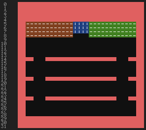

A cell is looked up by `wall_test` (`$174C`) for a position given in the program's coordinates — `x` vertical,
growing upwards, and `y` horizontal — which explains the arithmetic:

```asm
wall_test:                    ; A = x, H = y; returns the cell's nibble in A
174C  LD D,H
174D  NEG                     ; 256 - x
174F  AND $F8                 ; ... rounded to a row of 8 pixels
1751  ADD A,A                 ; x 2: 16 bytes per row (with the carry into H)
1752  LD L,A
1753  LD H,$00
1755  RL H
1757  LD A,D
1758  RRCA
1759  RRCA
175A  RRCA
175B  RRCA
175C  AND $0F                 ; y / 16: the byte within the row
175E  ADD A,L
175F  LD L,A
1760  JP NC,loc_1764
1763  INC H
loc_1764:
1764  LD BC,collision_map     ; $E398
1767  ADD HL,BC
1768  LD A,(HL)
1769  BIT 3,D                 ; y bit 3: which nibble
176B  JP NZ,loc_1772
176E  RRCA
176F  RRCA
1770  RRCA
1771  RRCA
loc_1772:
1772  AND $0F
1774  RET
```

Row 0 of the map is line 0 of the picture, so `256 - x` turns the program's height into a line number. The
routines built on `wall_test` — the cell below an object, above it, to its left and right, and the three cells
along its moving side — are the subject of chapter 15.

## Drawing the walls

The walls are not a separate drawing; they are the map made visible. Three address spaces are involved: the
collision map, a nibble per cell; the video RAM of playfield A, a two-byte cell per tile; and the sixteen object
entries whose strips put those columns on screen. `round_scroll_step` (`$18EE`) walks them one map row at a time,
32 calls per round — all in one go when `$E5C3` is zero, otherwise one call every four frames during the scroll.

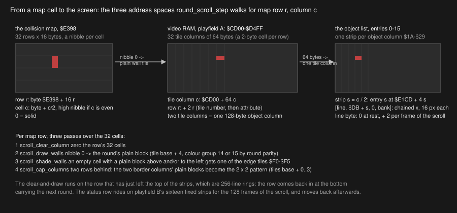

The arithmetic is short because the video RAM was laid out for it. Map row r is sixteen bytes at `$E398 + 16r`,
two cells per byte. Tile column c of playfield A is the 64-byte half-column at `$CD00 + 64c`, and its row r is the
two bytes at `+2r`. So one map row maps onto the same offset `2r` in each of the 32 half-columns, and each pass is
a loop of 32 steps of `$40`:

```asm
scroll_draw_walls:            ; the fill pass for map row (scroll_column)
1958  LD A,(scroll_column)
195B  PUSH AF
195C  LD B,$10
195E  CALL mul8x8             ; HL = row x 16
1961  LD DE,collision_map
1964  ADD HL,DE               ; -> the sixteen bytes of the row
1965  POP AF
1966  ADD A,A
1967  LD E,A
1968  LD D,$00
196A  LD IY,$CD00
196E  ADD IY,DE               ; -> cell (row, column 0) in video RAM
1970  LD B,$10                ; sixteen bytes ...
loc_1972:
1972  PUSH BC
1973  LD B,$02                ; ... of two nibbles each
1975  LD A,(HL)
loc_1976:
1976  LD C,A
1977  AND $F0                 ; the high nibble: 0 = solid
1979  LD A,C
197A  JR NZ,loc_198D          ; air: leave the cell as the clear pass left it
197C  EX AF,AF'
197D  EXX
197E  CALL wall_tile_base     ; HL = the round's tile word
1981  INC HL
1982  INC HL
1983  INC HL
1984  INC HL                  ; + 4: the plain block
1985  LD (IY+$00),L
1988  LD (IY+$01),H
198B  EXX
198C  EX AF,AF'
loc_198D:
198D  CALL shl4               ; the low nibble up
1990  LD DE,$0040
1993  ADD IY,DE               ; next tile column
1995  DJNZ loc_1976
1997  INC HL
1998  POP BC
1999  DJNZ loc_1972
199B  RET
```

Each call runs four passes over the row:

1. `scroll_clear_column` zeroes the row's 32 cells.
2. `scroll_draw_walls`, above, puts the round's **plain block** into every cell whose nibble is zero.
3. `scroll_shade_walls` (`$199C`) looks at each *empty* cell's three neighbours above, to the left and above-left
   — the row above is at `-2`, the column to the left at `-$40` — and, when any of them is the plain block, writes
   one of the six edge tiles. The shadow therefore falls below and to the right of every wall. Which tile:

| Above | Left | Above-left | Tile | What it draws |
| --- | --- | --- | --- | --- |
| wall | wall | — | `$F0` | The inner corner: shadow along the top and the left |
| — | wall | air | `$F1` | A left strip whose top tapers, where the wall beside it begins |
| wall | air | wall | `$F2` | A top strip running to the left edge |
| air | air | wall | `$F3` | The small corner cast by a diagonal neighbour |
| air | wall | wall | `$F4` | A full left strip |
| wall | air | air | `$F5` | A top strip starting a little in from the corner |

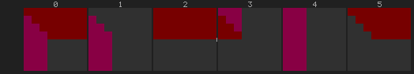

4. `scroll_cap_columns` runs *two rows behind* the others and only on the two outer tile columns of each side: it
   replaces the plain blocks there with the round's 2 × 2 patterned block, tiles base + 0 and 1 on even rows, 2 and
   3 on odd ones. That is why the left and right borders show the big pattern while the platforms inside are the
   plain block, and the two-row lag is so that the shading pass, which looks for the plain tile, still finds it
   next to the border when it gets there. When the first row is done the same routine also patches two cells of
   the top border by the layout byte's bits 5 and 7, the gaps in the ceiling of the rounds that have them.

### The hundred tile sets

Each round has its own five tiles in graphics bank 0, at `$0204 + 5 × (round − 1)`: the four quarters of the
patterned block and the plain block. `wall_tile_base` (`$1929`) forms the tile word, with the attribute `$38` for
even rounds and `$3C` for odd ones — colour group 14 or 15 — so that the outgoing and the incoming round can be on
screen together in different colours: `load_round_palette` fills the other group with the 32-byte scheme the round
record's first byte names (eight schemes at `1:$8200`) while the old one is still visible.

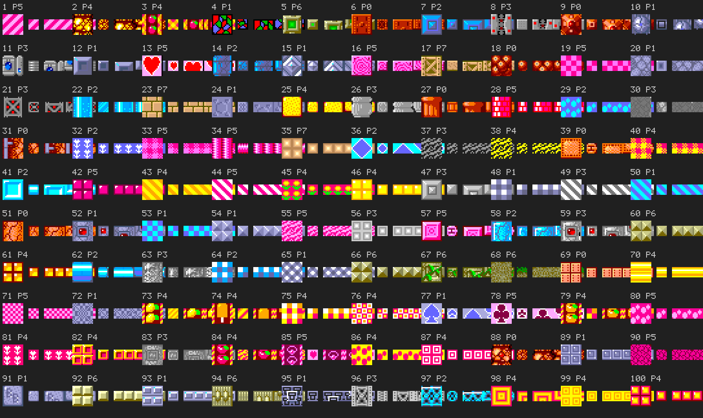

The sets are graphics, not rules: the fill pass never looks at which round it is beyond the arithmetic above, and
the designers used the freedom — 100 different patterns from 500 tiles, in eight palettes.

### The scroll

`round_intro` (`$0A12`) drives the transition. The status row is copied into playfield B and B's strips are
placed; `scroll_animate` is set; then, unless this is the first round of a game, a demo, or a secret room's
return (`skip_round_intro`), the loop at `$0A47` runs 128 frames: every frame it adds 2 to the line byte of each
of A's sixteen entries — 8 at a game over's round skip — and every time the first entry's line byte is a multiple
of 8 it calls `round_scroll_step` for the next row. When the line byte wraps to zero the strips are back where
they started, now holding the new round, and `swap_playfield_out` brings the status row home. The rows drawn are
the ones that have just left the top: each comes back in at the bottom carrying the next round.

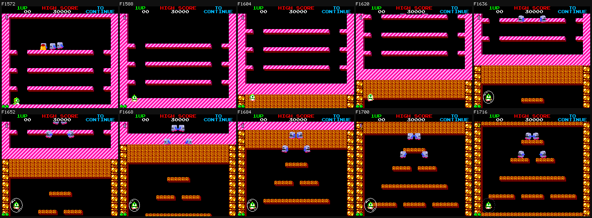

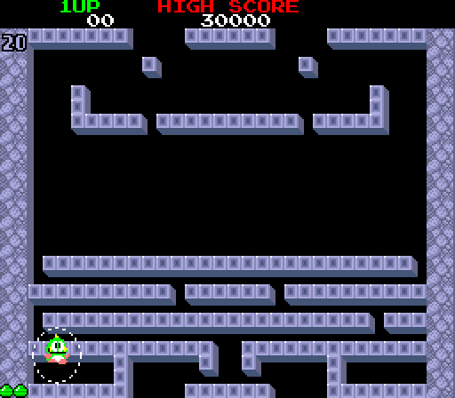

## All hundred maps

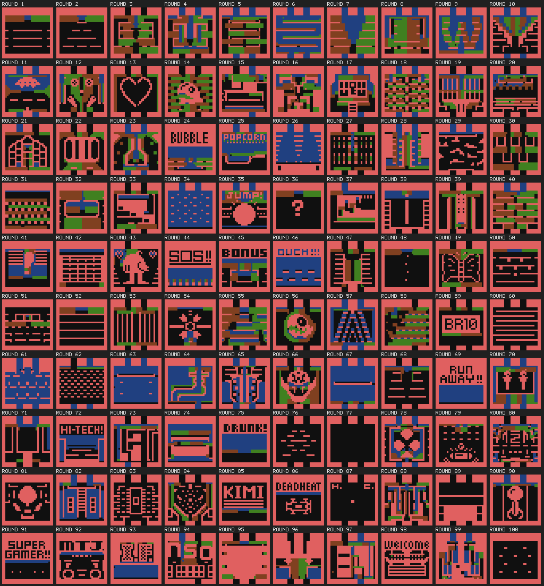

Seen together, the maps show what the level designers did with 32 x 32 cells. The early rounds are ladders of
platforms with gaps; from round 10 the layouts become pictures — a heart (13), a face (14), a butterfly (49),
an eye (56), the letters of "BUBBLE" (24), "POPCORN" (25), "JUMP!" (35), "SOS!!" (44), "BONUS" (45), "OUCH!!!"
(46), "BR10" (59), "RUN AWAY!!" (69), "HI-TECH!" (72), "DRUNK!" (75), "KIMI" (85), "DEADHEAT" (86), "SUPER GAMER!!"
(91), "MTJ." (92, the designer's initials) and "WELCOME" (98). The currents are drawn wherever a bubble should
travel: along the ceiling in almost every round (blue and green rows at the top), down the shafts of the rounds
built around vertical wells, and in loops around the closed figures, so that a bubble blown anywhere circulates
back to the player. Round 100, the boss's room, is empty air with a few solid specks: the boss fight is fought on
the bubble ring alone (chapter 19).

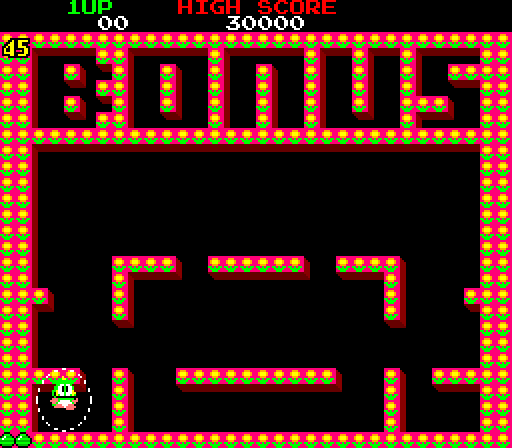

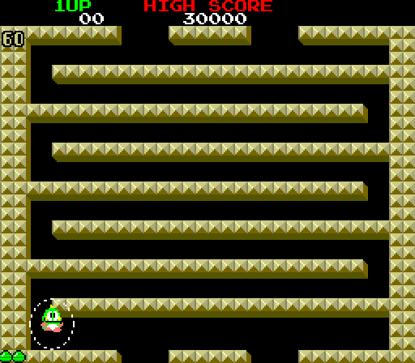

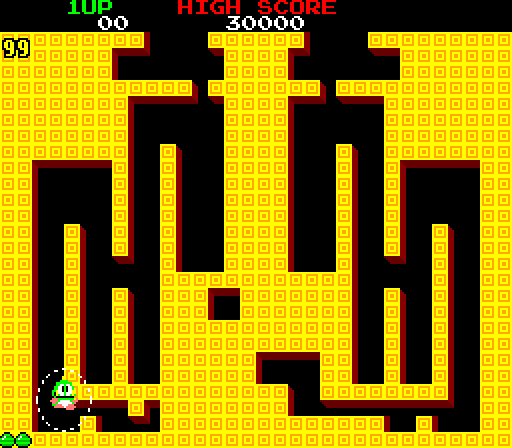

The border tables of bank 1 give the tops and bottoms: layout `$AA` (rounds 1, 2, 16, 24 ...) has a five-row solid
top and a three-row solid bottom; `$55` and `$5A` open the corners so that bubbles and enemies wrap round; `$00`
(round 3, the letter rounds) uses the plain border with a full-width ceiling current. Where the low nibble differs
from the high one (`$50`, `$19`, `$22`, `$88`), the bottom is not the mirror of the top: a floor with holes, or a
raised floor.

## Round 100

The last round has no walls at all in its stream: the map is air with the boss's arena rules coming from code.
Its record sets seven enemies (`2 of type 2, 2 of type 4, 2 of type 5` — the counts are read but the boss task
ignores them), a 40-second limit and the impossible 164-second angry time. The round loop treats it specially at
every step: `round_setup` skips the difficulty adjustment, the enemy task only animates the boss, and the bubble
task links 18 records instead of 24.

# 7. Text, fonts and tables

Between the graphics and the code sit the small tables that give the game its words and its numbers: the messages,
the two languages of the instruction screen, the score thresholds, the default high-score table, the demo
recordings. None of them is large, and each shows a habit of the programmers worth knowing before reading the
engine.

## Text records

Chapter 5 showed `print_text`: a record is one length byte followed by the characters, and each character is a
tile number — the font tiles `$20-$5F` carry the ASCII codes, so the strings read directly in a hex dump. The
boot's error messages at `$0234` are typical:

```
0234  0E "WORK RAM ERROR"
0244  10 "COMMON RAM ERROR"
0254  0D "PS4 SUM ERROR"
0262  09 "I/O ERROR"
```

Every message is printed with `print_text` at an explicit cell address and colour, or through `print_text_list`,
which walks a table of `[cell address, text pointer, colour]` triples. The routine steps `$40` bytes per
character, so a string can only run horizontally; there is no word wrap and no centring — every line of the game
was positioned by hand.

Some strings carry tile numbers below `$20`. The instruction texts begin each line with `$12` or `$1A`, tiles
from the row `$10-$1F` of the font: small marker glyphs used as bullets. Other tables use the heavier alphabet at
`$60-$7F`: the status row ("1UP", "HIGH SCORE", "2UP") is printed with those tiles, which is why it looks bolder
than the play-time messages.

## The instruction screen

The attract mode's "how to play" screen is a table of seven text records printed over a running demo of
round 1 (chapter 12). The English strings live at `$2D7E-$2EDB`:

```
BASIC SKILL ...
TRAP ENEMIES INSIDE BUBBLES.
BURST BUBBLES WITH YOUR HORNS OR FINS.
ADVANCED SKILL ...
HIGHER POINTS ARE SCORED WHEN BURSTING SEVERAL BUBBLES AT THE SAME TIME.
YOU CAN JUMP OVER BUBBLES.
ONE STAGE CLEARED WHEN ALL ENEMIES ARE DESTROYED.
```

DIP switch A bit 0 selects the Japanese version instead. It is printed by a different routine
(`instructions_japanese`, `$2B69`) because its characters are not font tiles: the kana are 16 x 16 pictures in
bank 1 of the tile ROM, placed with the sprite routines rather than the text printer, and the text records are
lists of tile numbers.


## Scores and thresholds

Scores are three bytes of binary-coded decimal, least significant byte first, and a final zero is implied: the
bytes `00 50 00` are the number 005000 and print as 50000. `print_score6` prints six digits with leading zeros
blanked and appends the 0, so every score on screen ends in 0 and the largest representable score is 9,999,990.
There are three of them in work RAM — player 1 at `$E641`, player 2 at `$E646`, the high score at `$E64C` — and
`add_score` (chapter 16) is the only routine that changes the first two.

The extra-life thresholds come from a 96-byte table at `$3180`: four entries of eight BCD numbers, selected by
DIP switch B bits 2-3:

| Entry | 1st life | 2nd | 3rd | 4th | 5th | 6th | 7th | 8th |
| --- | --- | --- | --- | --- | --- | --- | --- | --- |
| 0 | 50,000 | 250,000 | 500,000 | 1,000,000 | 2,000,000 | 3,000,000 | 4,000,000 | 5,000,000 |
| 1 | 40,000 | 200,000 | 500,000 | 1,000,000 | 2,000,000 | 3,000,000 | 4,000,000 | 5,000,000 |
| 2 | 20,000 | 80,000 | 300,000 | 1,000,000 | 2,000,000 | 3,000,000 | 4,000,000 | 5,000,000 |
| 3 | 30,000 | 100,000 | 400,000 | 1,000,000 | 2,000,000 | 3,000,000 | 4,000,000 | 5,000,000 |

The game keeps a pointer to the next threshold per player (`$E63B`, `$E63E`) and awards at most eight extra
lives; after the eighth entry the pointer stops. The first threshold of the selected entry is also the default
high score: `init_high_score` copies it into `$E64C` at boot, which is why a freshly switched-on machine shows
30000 (entry 3, the factory setting of the DIP switches).

Two other small DIP tables live nearby. The number of lives is `1 + table[$32DB]` indexed by DIP B bits 4-5:
the bytes `01 00 04 02` give 2, 1, 5 or 3 lives. The starting difficulty rank is `table[$22D6]` indexed by bits
0-1: `0D 0A 04 07`, so the "normal" setting starts at rank 7 and the hardest at 13 (chapter 12 explains what the
rank does).

## The high-score table

The table at `$E654` has five entries of seven bytes: a three-byte score, the best round reached, and three
letters. `sub_3448` fills it at boot from the extend table's first four thresholds and from a list of names:

```
347B  db 00 20 00  1F  "I.F"
      db 00 20 00  1B  "MTJ"
      db 00 20 00  17  "NSO"
      db 00 20 00  13  "KIM"
      db 00 20 00  0F  "YSH"
```

The scores in the ROM are placeholders; the loop that follows overwrites the first five with the values from the
DIP-selected extend entry, so the default table reads 50000, 250000 ... or 30000, 100000 ... as the switches
dictate, and the rounds are 31, 27, 23, 19 and 15. The names are the initials of the team; `MTJ` is Fukio
Mitsuji, the game's designer.

After a game over that reaches the table, `name_entry` (`$36D0`) lets the player enter three letters with the
joystick and the button, 300 frames per letter. Ten three-letter codes are recognised. `SEX` is refused: the name
becomes `H.!`, the screen flashes and a counter is incremented. `TAK`, `STR`, `KTT` and three more set flags at
`$E604-$E607`, and the six names of the default table — `.I.`, `.F.`, `MTJ`, `NSO`, `KIM`, `YSH` — set `$E608`.
What the flags do is left to chapter 20; they are the developers' own back door into the game.

## The results screen

When a game ends, `high_score_rank` compares the score with the five entries and, if it ranks, runs the name
entry; then `results_screen` draws the table with headings from `print_text_list`, the five scores, the rounds
("ALL" for a completed game) and the names, and finally a bar along which each player's round is counted up
with the big digit sprites from tile bank 6, one frame per step.

## Demo recordings

The attract mode plays the game itself. Its inputs are recordings in bank 1, one stream per player, encoded as
run-length pairs: a count and an input byte. `demo_playback` (`$08C0`) keeps a countdown per player (`$E33D`,
`$E33E`) and a pointer (`$E353`, `$E355`); when the countdown reaches zero it takes the next pair:

```asm
demo_playback:
08C0  LD A,$00
08C2  AND A
08C3  JR NZ,loc_0909       ; never: the recorder
08C5  LD A,$01
08C7  CALL bank_select
08CA  LD IY,(demo_ptr_p1)
08CE  LD HL,$E33D
08D1  LD A,(HL)
08D2  AND A
08D3  JR NZ,loc_08E1
08D5  LD A,(IY+$00)        ; count
08D8  LD (HL),A
08D9  INC IY
08DB  INC IY
08DD  LD (demo_ptr_p1),IY
loc_08E1:
08E1  DEC (HL)
08E2  LD A,(IY-$01)        ; the input byte of the current pair
08E5  LD (input_p1),A
      ...                  ; the same for player 2
0906  JP bank_restore
```

The first three instructions are the remains of a development switch: `LD A,0 / AND A / JR NZ` can never jump,
but the code it would jump to is still in the ROM. `$0909` is the **recorder** — it reads the real joysticks and
appends run-length pairs to the stream in RAM — and Taito's staff used it to produce the demos, then left it in
with its switch turned off. The recordings themselves are the streams at bank 1 `$A5BC` and `$A6BC` for the
instruction screen's demo of round 1, and the seven demo rounds are chosen from the table at `$2FAB`:

```
2FAB  db 00 04 15 23 18 1B 31        ; rounds 1, 5, 22, 36, 25, 28, 50
```

with their streams from a table at bank 1 `$9A6A`. Every demo is a two-player recording that runs for 1,320
frames, after which `demo_game_over` fakes the end and the next round in the table is chosen (`$E634` counts
modulo 7).

## The coinage table

One more boot-time copy deserves a mention because its name in the listings is misleading. `round_table_copy`
takes sixteen bytes from the end of bank 3 — the entry at `$BFDF + 16 x (byte at $BFFF)` — into `$E36A`. The
bytes are not rounds: they are the coinage table, eight pairs of `[coins, credits]` for the two slots (`$E36A`
and `$E372`), selected by a version byte at the very end of the bank so that regional editions could ship
different pricing without touching the fixed ROM. The rounds themselves need no list; the game walks them in
numerical order through the record table of chapter 6.

## Message panels

The words a player sees during play — "INSERT COIN", "PUSH 1P START", "TO JOIN!!", "GAME OVER", "THANK YOU",
the two message panels of rounds 16 and 32 — are not text records but sprites: 2 x 2 cells and columns from tile
bank 4, moved into place by the panel routines of bank 2 (chapter 18). Only the status row, the ROUND/READY
banner, the instruction screen, the results and the test mode use the text printer. The choice is deliberate:
the panels have to slide in and out over the playfield, and only objects can move.

# 8. Sound and music data

The sound program is a sequencer. It has no notion of "the round theme" or "the jump sound": it has fifty-three
numbered commands, each of which names one or more channel records to fill from data in its ROM, and a byte code
that the channels interpret every timer tick. This chapter follows a command from the main CPU's queue to the
chip registers, decodes the data formats, and lists the commands.

## From the main CPU to the sound CPU

The main program does not write the sound latch directly from game code. Routines that want a sound push a byte
into a sixteen-entry queue at `$E381` (`sound_queue_push`, `$1387`), and the frame handler's per-frame list sends
the first queued byte to the latch `$FA00` once per VBLANK (`sound_queue_pump`, `$136C`), shifting the rest down.
So at most one command reaches the sound CPU per frame, in the order requested, and a routine that fires many
sounds in one frame simply fills the queue.

On the sound CPU the latch raises the NMI. The handler at `$0066` disables further NMIs, reads the byte and
appends it to its own sixteen-byte ring at `$8F82` (write index `$8F80`, read index `$8F81`; a full ring drops the
oldest entry), re-enables the NMI and returns. The main loop, running with interrupts disabled, drains the ring
(`$02A3`):

| Byte | Meaning |
| --- | --- |
| `$00-$34` | Play sound number n: look the command up in the table at `$329C` |
| `$35-$DF` | Ignored |
| `$EE` | All sound off: `$8FAA = 0`, and every later request is refused until |
| `$EF` | All sound on |
| `$F0` | Toggle echo mode: instead of playing, the sound CPU replies each command byte on the latch (a test hook) |
| `$F2 $F4 $F6 $F8` | Play an entry of a second table at `$3306` (unused by the game) |
| `$FF` | Ignored |

The queue and the ring exist because a command must not be lost while the sound CPU is busy in its interrupt
handler, which can run for most of a frame.

## Requests, headers and slots

Entry n of the table at `$329C` is a pointer. It points either at a **sound header** or, when the first byte is
below `$1B`, at a list: a count followed by that many header pointers, all requested together. The round theme,
command `$07`, is a list of nine headers, one per channel of the YM3526; the jump, command `$2C`, is a single
header.

A header is four bytes:

| Byte | Meaning |
| --- | --- |
| 0 | Kind: which channel record the sound occupies. `(kind & $FE) - $84` indexes a table of record addresses at `$0378` |
| 1 | High nibble: priority. Low nibble: loop count (0 = 16) |
| 2 | Number of steps |
| 3 | Follow-up: a command byte queued for the main loop when the sound ends (`$FF` = none) |

The kinds map onto the sound CPU's RAM like this:

| Kind | Record | Channel |
| --- | --- | --- |
| `$84`, `$86` | `$8000`, `$8070` | SSG channels A and B (112 bytes each) |
| `$8C`, `$8E` | `$80E0`, `$8170` | YM2203 FM channel 0, primary and alternate voice (288 bytes each) |
| `$90`, `$92` | `$8200`, `$8290` | YM2203 FM channel 1 |
| `$94`, `$96` | `$8320`, `$83B0` | YM2203 FM channel 2 |
| `$98`, `$9A` | `$8440`, `$8490` | YM3526 channel 0, first and second voice (80 bytes each) |
| `$9C`, `$9E` | `$84E0`, `$8530` | YM3526 channel 1 |
| ... | ... | ... |
| `$B8`, `$BA` | `$8940`, `$8990` | YM3526 channel 8 |

`request_sound` (`$0332`) claims the record for the header: if the record is idle it is taken; if it is playing,
the new sound wins only when its priority is not below the byte at `[5]` of the playing one (the priority of the
step it is in). The record gets flags = 1 (requested), the header pointer and the command number, and the next
timer tick starts it. This is the whole arbitration scheme, and it is where the two voices per channel matter:
the theme occupies the *second* voices of the nine YM3526 channels; an effect on a first voice takes the channel
for its duration (the second voice's writes are skipped while the first is playing) and the melody resumes
where it would have been, because the second voice keeps counting.

After the header come the **steps**, three bytes each: a priority nibble and a repeat nibble, then a pointer to
a **pattern**. A channel plays its steps in order, repeating each `repeat` times, and the whole sequence `loops`
times; then the sound ends and the follow-up byte is queued.

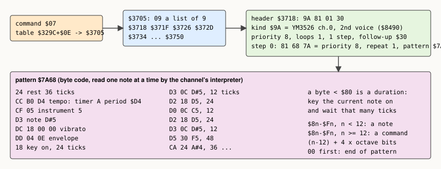

## The pattern byte code

A pattern is a stream of bytes read by the channel's interpreter each time its note duration runs out. There
are three interpreters — for the YM3526 channels (`$077D`), the YM2203 FM channels (`$1557`) and the SSG
(`$243C`) — with the same shape and different command sets. For the FM channels:

| Byte | Meaning |
| --- | --- |
| `$00-$7F` | A duration: key the current note on for this many ticks, then continue with the next byte |
| `$8n-$Fn`, n < 12 | A note: n is the semitone (C to B, tables at `$0840` for the YM3526 and `$1619` for the YM2203), bits 4-6 the octave |
| `$8n-$Fn`, n >= 12 | A command: `(n - 12) + 4 x octave bits` selects one of 32 handlers; most take the next byte as an argument, a few take more |
| `$00` as a pattern's first byte | End of pattern: advance to the next step |

The commands set everything a note does not: the instrument (an index into the instrument table), the operator
levels, key scaling, the software envelope, vibrato, frequency sweeps, the tempo (timer A's period), a tie, a
volume scale, or a note with a detune byte. A second note in the same step, before any duration, marks a tie so
that the key is not retriggered.

Here is the first pattern of the theme's first channel (header `$3718`, YM3526 channel 0, second voice), as the
ROM has it and as the interpreter reads it:

```
7A68  24              rest for 36 ticks
7A69  CC B0 D4        extended command $B0: tempo, timer A period $D4
7A6C  CF 05           instrument 5
7A6E  D3              note D#, octave 5
7A6F  DC 18 00 00     vibrato: depth $18, rate 0, waveform 0
7A73  DD 04 0E        envelope: mask $04, one parameter $0E
7A76  18              ... play D#5 for 24 ticks
7A77  D3 0C           D#5 for 12
7A79  D2 18           D5 for 24
7A7B  D0 0C           C5 for 12
7A7D  D2 18           D5 for 24
7A7F  D3 0C           D#5 for 12
7A81  D5 30           F5 for 48
7A83  CA 24           A#4 for 36
7A85  D0 18           C5 for 24
7A87  C7 0C           G4 for 12
7A89  C7 18           G4 for 24
7A8B  D2 20           D5 for 32
7A8D  CF 00           instrument 0
7A8F  D3 ...
```

The other eight channels of the theme run the same tick clock with their own patterns — the second channel
doubles the melody through "note + detune" commands (`$8F xx`, the same notes slightly off pitch, a chorus)
with a volume command after every note, the third holds long bass notes — and because every channel's pattern is independent, a nine-voice
arrangement costs nine byte streams and no score.

## Instruments

Command 19 loads an instrument. For the YM3526 the table at `$28D7` holds pointers to variable-length records of about eighteen bytes: the
feedback and algorithm bits, the key-scale bits, then for each of the two operators an inverted level and six
envelope bytes (multiplier, key scale, attack/decay, sustain/release, waveform), followed by optional vibrato,
envelope and sweep parameters that the loader hands to the same routines the pattern commands use. The YM2203's
table at `$2A8A` has the four-operator version. Instrument 5, the theme's lead:

```
70 00 18 01 E0 44 02 01 F1 03 00 00 00 01 00 08 01 F5
```

The loader does not copy these bytes to the chip. It copies them into the channel record — bytes `[$18]` to
`[$4D]` for the YM3526 voice — and marks the record's dirty bits. The writer that runs at the end of the tick
(`$0CED` for a full rewrite after an instrument change, `$0D6B` for whatever changed since) turns the record into
register writes. Everything the chip ever receives goes through one of two routines: `$1DD6` writes a YM2203
register after waiting for the chip's busy flag, `$0ECB` writes a YM3526 register and pads the required delay
with NOPs.

## The tick

Both chips' timers are set up at boot (chapter 3). Timer A of the YM2203 paces the YM3526 channels, timer B the
YM2203's FM and SSG channels; the interrupt handler at `$0195` reads the status register, acknowledges whichever
timer expired, and runs the corresponding pass:

* **Timer A** (`$04D8`, `$0535`): for each of the nine YM3526 channels, first voice then second, write pending
  register changes, then count the note duration down; when it reaches zero read the next pattern bytes; then the
  per-tick effects — software envelope, LFO, sweep, pitch modulation — and the key-on/key-off writes. A command
  from the pattern can change timer A's period, which is how a tempo command takes effect at the next tick.
* **Timer B** (`$125E`, `$225B`): the same for the three YM2203 FM channels (each with an alternate record that
  plays when the primary is silent) and the two SSG channels, whose records shadow the SSG registers and write
  only the ones that changed.

A tick is roughly a sixty-fourth note at the theme's tempo; the durations in the patterns are in ticks, so `$18`
= 24 ticks is a dotted quarter at that scale. Nothing in the sound program refers to frames: it is paced entirely
by the chip timers, and the main CPU only ever says "play number 7".

## The commands

The fifty-three sound numbers, with the header kinds they use and where the game issues them (from the traced
play sessions; a few effects are only reached in situations the tracing did not visit):

| Command | Channels | Used for |
| --- | --- | --- |
| `$00` | list of 26 headers | Silence everything: a "stop" sound that claims every record with a short pattern; sent at boot and when a round ends |
| `$01`-`$04` | 9 / 9 / 3 / 3 | Silence lists for the YM3526 first voices, its second voices (the theme), the YM2203 primary and alternate voices: the same stop pattern as `$00`, aimed at one group |
| `$05`, `$06` | SSG A / B | Silence one SSG channel |
| `$07` | 9 YM3526 second voices | The main theme; started by the story intro and left running through the rounds |
| `$08` | 9 | The game-over jingle (task 0 sends it when the last player is gone) |
| `$09` | 3 | An effect |
| `$0A`, `$0B` | 9 / 9 | Music: `$0B` accompanies the GAME OVER text |
| `$0C`-`$0E` | YM2203 channel 1 | Effects: `$0D` the player is hit, `$0E` a rock bursts |
| `$0F`, `$10` | 9 / 9 | Music (the ending, the results) |
| `$11` | YM2203 channel 1 | An item is collected |
| `$13`, `$14`, `$19` | 9 each | Music: the secret room, EXTEND, the ending |
| `$15`-`$17`, `$1A`, `$1D`-`$22` | YM2203 channels 1 and 2 | Effects: `$22` is the fire breather's shot |
| `$25` | 1 | An enemy dies in the floor fire |
| `$29`-`$2B`, `$30`, `$32` | 9 each | More music (rounds with the message panels, the true ending) |
| `$2C` | YM2203 channel 0 | The jump |
| `$2D` | 3 | Sent at the end of boot |
| `$2E` | SSG A | An effect |
| `$2F`, `$31`, `$33` | YM2203 channel 0 | `$31` is the bubble blow, the most frequent sound in the game |
| `$34` | YM2203 channel 0, priority 1 | A coin |

The chain-pop scores of chapter 16 pick their fanfare from a six-byte table at `$46B7` in the main program by the
number of enemies popped: `$26` for two to four, `$27` for five to seven.

## The two chips in one word

The arrangement the tables describe is unusual for 1986: the nine-channel OPL chip, meant for music, plays the
music; the OPN chip, with its richer four-operator voices, is spent on the jump, the bubble and the coin — the
sounds a player hears hundreds of times an hour and that must never be delayed by a busy channel. The priority
byte in every header and step is the only mixing rule, and the two-voice channel record is what lets an effect
interrupt a melody line without silencing it.

# 9. The frame: interrupts and the scheduler

After boot, the main CPU executes exactly one instruction of its own: `JR $01ED`, a jump to itself. Everything
that makes the game a game — the players, the bubbles, the monsters, the scoring, the attract mode — runs inside
the interrupt handler that the MCU triggers once per frame. The handler calls a small cooperative scheduler,
the scheduler runs each of six tasks until it yields, and when the last one has yielded the handler returns to
the two-byte loop to wait for the next frame. This chapter is about that kernel: it is 150 bytes of code, and
every later chapter runs on top of it.

## The interrupt

The main CPU has no line to the video circuit. Its interrupt comes from the MCU, which is itself interrupted at
the start of vertical blanking (line 240 of the 264-line frame), reads the joysticks and coin switches, and then
drops bit 6 of its port 1 for a moment. On the traced machine the pulse arrives about 100 microseconds after
VBLANK begins. The CPU runs in interrupt mode 2 with `I = $0B`, the MCU has put `$2E` into the shared byte
`$FC00` that the hardware presents as the vector, and the word at `$0B2E` is `$044D`: `irq_vblank`.

```asm
irq_vblank:
044D  PUSH AF
044E  LD (IO_watchdog),A       ; kick the hardware watchdog
0451  LD A,(mcu_dswa)          ; DIP switch A ...
0454  AND $05
0456  JP Z,irq_test_mode       ; ... selects the test modes (chapter 3)
0459  LD A,(frame_done)        ; $E194
045C  AND A
045D  JR Z,irq_nested          ; the previous frame's tasks are still running
045F  CALL irq_frame_start
0462  LD HL,frame_done
0465  LD (HL),$00
0467  EI
0468  CALL scheduler_run
046B  LD A,$01
046D  LD (frame_done),A
0470  POP AF
0471  DI
0472  POP HL                   ; the interrupted PC
0473  PUSH AF
0474  LD A,H
0475  CP $C0
0477  JR C,loc_048B            ; it must be in ROM
0479  ...                      ; otherwise: TIME ERROR
048B  POP AF
048C  PUSH HL
048D  EI
048E  RETI
```

Three paths leave this routine. If the DIP switches ask for a test mode, `irq_test_mode` handles the frame and
the game never runs. If `frame_done` is zero, the tasks of the previous frame have not finished: the handler
takes the `irq_nested` path described below. Otherwise this is a normal frame:

```asm
irq_frame_start:
04AD  LD HL,objram_shadow      ; $E1CD
04B0  LD DE,$DD00
04B3  LD BC,$0168
04B6  LDIR                     ; 360 bytes: the object list, to the hardware
04B8  CALL sound_queue_pump    ; one queued sound byte to the sound CPU (chapter 8)
04BB  CALL rng_pre             ; the random number generator's per-frame step (chapter 20)
                               ; ... falls into irq_essentials

irq_essentials:
04BE  PUSH BC
04BF  PUSH DE
04C0  PUSH HL
04C1  CALL coin_handling       ; credits from the MCU's coin counters
04C4  CALL tilt_check
04C7  CALL rng_step
04CA  CALL timer_chain         ; frames, seconds, minutes
04CD  CALL sub_cpu_watchdog
04D0  LD HL,frame_counter      ; $E338
04D3  INC (HL)
04D4  POP HL
04D5  POP DE
04D6  POP BC
04D7  RET
```

The order matters. The object list is copied first because the video hardware reads object RAM while it draws
the picture, and a half-copied list would show objects at last frame's positions with this frame's tiles. The
`LDIR` of 360 bytes takes 7,560 cycles — 1.26 milliseconds — and VBLANK lasts 2.56 milliseconds, so the copy
is done with a millisecond to spare, before the first visible line. The game code never touches `$DD00`
directly; it builds the next frame's list in the shadow at `$E1CD` (chapter 5) at its leisure, and the handler
commits it atomically.

The per-frame essentials come after: `coin_handling` turns the MCU's coin counts into credits, `timer_chain`
counts frames into seconds and minutes (three bytes at `$E335`, each rolling over at 60), and
`sub_cpu_watchdog` reads the heartbeat byte the sub CPU increments at `$F66E` — if it has not changed for 180
frames, `RST $00` reboots the whole machine, on the theory that a stalled sub CPU means a broken board. Then
`frame_done` is cleared, interrupts are re-enabled, and the scheduler is called from inside the handler.

## The scheduler

Six tasks live in six bytes at `$E000-$E005`, the **task states**, and six saved stack pointers at
`$E006-$E011`. Each task has a 64-byte stack at `$E020 + 64 x n`. The scheduler makes one pass over the six
slots:

```asm
scheduler_run:
005E  LD HL,task_state         ; $E000
sched_check_slot:
0061  LD A,(HL)
0062  AND A
0063  JR Z,sched_next_slot     ; 0: asleep
0065  DEC (HL)
0066  JR NZ,sched_next_slot    ; 2 or more: counting down, not yet
task_switch_in:
0068  LD (cur_task_ptr),HL     ; $E192
006B  SLA L
006D  LD A,$06
006F  ADD A,L
0070  LD L,A                   ; HL = $E006 + 2n
0071  LD (sched_sp),SP         ; $E1C5: where to come back to
0075  LD E,(HL)
0076  INC HL
0077  LD D,(HL)
0078  EX DE,HL
0079  LD SP,HL                 ; the task's stack
007A  POP IY
007C  POP IX
007E  POP HL
007F  POP DE
0080  POP BC
0081  EXX
0082  POP HL
0083  POP DE
0084  POP BC
0085  RET                      ; ... into the task, where it last yielded
sched_next_slot:
0086  INC L
0087  LD A,L
0088  CP $06
008A  JR NZ,sched_check_slot
008C  RET
```

A state of 0 means the task is asleep and is skipped. A state of 1 means it runs now: the scheduler saves its
own stack pointer, loads the task's, pops the eight register pairs the task saved when it last yielded, and
`RET`s to the instruction after the yield. A state of 2 or more is a countdown: it is decremented once per
frame and the task runs when it reaches 1, which is how a task sleeps for a fixed number of frames without
polling.

Yielding is the reverse, reached through two of the `RST` vectors at the bottom of the ROM:

```asm
rst18_yield:                   ; RST $18: sleep; A = new state
0018  PUSH BC
0019  PUSH DE
001A  PUSH HL
001B  JP task_switch_out
rst20_yield_runnable:          ; RST $20: run again next frame
0020  PUSH BC
0021  PUSH DE
0022  PUSH HL
0023  LD A,$01
0025  JP task_switch_out

task_switch_out:
0093  EXX
0094  PUSH BC
0095  PUSH DE
0096  PUSH HL
0097  PUSH IX
0099  PUSH IY
009B  LD HL,(cur_task_ptr)
009E  LD (HL),A                ; the task's new state
009F  SLA L
00A1  LD A,$06
00A3  ADD A,L
00A4  LD L,A
00A5  LD (tmp_sp),SP
00A9  LD DE,(tmp_sp)
00AD  LD (HL),E                ; save the task's SP
00AE  INC HL
00AF  LD (HL),D
00B0  LD SP,(sched_sp)         ; back on the scheduler's stack
00B4  LD HL,(cur_task_ptr)
00B7  JR sched_next_slot
```

`RST $20` is the ordinary end of a task's frame: "I am done, run me again next frame". `RST $18` with `A = n`
yields and runs again n frames later, so `RST $20` is the case n = 1; with `A = 0` the task is suspended until
another task wakes it. Note that the `DEC` in the scheduler leaves a running task's state at 0: a task is asleep
while it runs and chooses its next state only when it yields. A yield costs about 270 cycles to switch out and
230 to switch in, so with four tasks the scheduler's whole overhead is about 2% of a frame.

The remaining vectors manage tasks from outside:

| Vector | Name | Effect |
| --- | --- | --- |
| `RST $08` | `task_clear` | `state[A] = 0`: put task A to sleep |
| `RST $10` | `task_wake` | `state[A] = 1`: task A runs on the next pass |
| `RST $18` | `yield` | Save the current task with state A |
| `RST $20` | `yield_runnable` | Save the current task with state 1 |
| `RST $28` | `tasks_clear_all` | All six states to 0 |
| `RST $30` | `task_start` | Create task A from scratch |

`RST $30` builds the stack frame that `task_switch_in` expects. It sets the state to 1, points the slot's SP at
the base of the task's stack, and stores the entry address sixteen bytes above it — where the `RET` will find
it after the eight pops — with the sixteen bytes in between as whatever the RAM held:

```asm
rst30_task_start:
0030  LD L,A
0031  LD H,$E0
0033  LD (HL),$01              ; runnable
0035  PUSH HL
0036  CALL times64             ; DE = 64 x A
0039  LD HL,$E020
003C  ADD HL,DE                ; the stack base for this slot
003D  EX DE,HL
003E  POP HL
003F  SLA L
0041  LD C,L
0042  LD A,$06
0044  ADD A,L
0045  LD L,A
0046  LD (HL),E                ; slot SP = base
0047  INC HL
0048  LD (HL),D
0049  LD A,$10
004B  ADD A,E
004C  LD E,A                   ; DE = base + 16
004D  JR NC,loc_0050
004F  INC D
loc_0050:
0050  LD HL,$0B22              ; the entry table
0053  LD B,$00
0055  ADD HL,BC                ; + 2 x task number
0056  LD C,(HL)
0057  INC HL
0058  LD B,(HL)
0059  EX DE,HL
005A  LD (HL),C                ; entry address at base + 16
005B  INC HL
005C  LD (HL),B
005D  RET
```

The entry table at `$0B22` is twelve bytes of addresses followed by two more — the interrupt vector, which the
MCU's `$2E` selects because `$0B22 + 12 = $0B2E`. The two tables are one:

```
0B22  17 1D    task 0  $1D17  task0_game_flow
0B24  F7 2A    task 1  $2AF7  task1_attract
0B26  38 05    task 2  $0538  task2_round_loop
0B28  EF 3D    task 3  $3DEF  task3_enemies
0B2A  A8 85    task 4  0:$85A8 task4_enemies
0B2C  3B 5B    task 5  $5B3B  task5_bubbles
0B2E  4D 04    interrupt vector: irq_vblank
```

A task starts with its stack pointer at `base + 18` and pushes downward from there, towards the previous task's
slot. Task 0's stack therefore runs below `$E020`, into the fourteen free bytes `$E012-$E01F` that separate it
from the table of saved stack pointers. The RAM trace recorded during the port shows writes as low as `$E012`
and no lower: two bytes of margin. Nothing in the code checks it; the programmers knew how deep their calls
went.

## The six tasks

| Task | Entry | Started by | Does |
| --- | --- | --- | --- |
| 0 | `task0_game_flow`, `$1D17` | boot | Waits for a coin, starts a game, advances rounds, handles game over and the results (chapter 12) |
| 1 | `task1_attract`, `$2AF7` | task 0 | The attract sequence: title, instructions, demos, high scores (chapter 12) |
| 2 | `task2_round_loop`, `$0538` | task 0, or task 1 for a demo | Sets up a round, then every frame: inputs, the join prompts, HURRY UP, the round clock, game over |
| 3 | `task3_players`, `$3DEF` | task 2 | Round-start initialisation, then every frame: both players (chapters 13-15), the special and bonus items, the falling and flying objects, the message-panel and HURRY UP sequences (chapter 18) |
| 4 | `task4_enemies`, `0:$85A8` | task 3 | The enemies: their entrance, the six type drivers, the chasers, rocks and missiles, the records the MCU reads, and the boss (chapters 10, 17, 19) |
| 5 | `task5_bubbles`, `$5B3B` | `round_start_anim` | Bubbles, items, the EXTEND letters, the boss (chapters 16, 18, 19) |

Task 3 starts task 4 (the enemies) from its own set-up, and `round_start_anim`, which task 3 calls every frame
until the players have walked in, starts task 5 (and task 4 again on the rounds where task 3 did not). Task 2
is the shape of all of them. Its opening is a straight sequence of set-up calls; its middle is a loop
that starts with a yield:

```asm
task2_round_loop:
0538  CALL clear_round_vars
053B  CALL round_setup         ; the round record (chapter 6)
053E  CALL anim_counter_reset
      ...
0552  CALL load_round_palette
      ...
0563  LD A,$03
0565  RST $30                  ; start task 3
0566  CALL round_intro         ; ROUND n / READY
      ...
loc_057B:
057B  RST $20                  ; one frame
057C  CALL read_inputs_unless_demo
057F  LD A,(round_start)       ; $E6FF: set by round_start_anim
0582  AND A
0583  JP P,loc_057B            ; wait until the arrival animation is over
      ...
0599  LD A,$03
059B  RST $18                  ; skip two frames
059C  LD A,(demo_flag)
059F  AND A
05A0  JP NZ,task2_demo_loop
loc_05A3:
05A3  RST $20                  ; --- the frame loop ---
05A4  LD A,$02
05A6  CALL bank_select
05A9  CALL $B18F               ; 2:$B18F join_update: PUSH START prompts, a second player joining
05AC  CALL bank_restore
05AF  CALL round_ready_display
05B2  CALL read_inputs
05B5  CALL game_over_check
05B8  CALL play_time_tick
05BB  CALL hurry_up_logic
05BE  CALL last_enemy_angry_timer
05C1  CALL last_enemy_check
05C4  LD A,(players_alive)
05C7  AND A
05C8  JR Z,loc_0614            ; nobody left: end the round
05CA  LD A,(enemy_count)
05CD  AND A
05CE  JP M,loc_05D3
05D1  JR NZ,loc_05A3           ; enemies left: next frame
loc_05D3:
05D3  LD HL,bubble_pause
05D6  LD (HL),$01
      ...
05E5  LD BC,$01A4              ; 420 frames of clean-up after the last enemy
loc_05E8:
05E8  RST $20
      ...                      ; players still move, bubbles still pop
0612  JR NZ,loc_05E8
loc_0614:
      ...
0622  LD A,$00
0624  RST $10                  ; wake task 0: the round is over
0625  XOR A
0626  RST $18                  ; and sleep for good
```

Every frame, then, task 2 captures the inputs, runs the round clock and the end-of-round tests and yields; when the
last enemy is gone it keeps yielding for seven seconds so that the fruit can be collected, then wakes task 0 and
suspends itself with state 0. Task 0, which has been asleep since it started task 2, resumes on the next pass
and decides whether to advance the round, show a message panel, or end the game. Tasks 3, 4 and 5 are ended
from outside, with `RST $08`, when task 0 tears the round down. There is no return value and no message queue:
tasks talk to each other through work RAM and through the six state bytes.

## What a frame looks like

The figure gives the timing of one frame of round 1, with one player and the traced machine's clock:

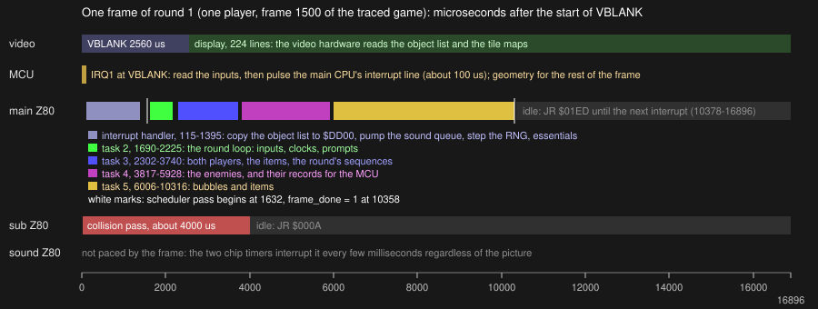

| Time (us) | Event |
| --- | --- |
| 0 | VBLANK begins at line 240. The sub CPU is interrupted and starts its collision pass; the MCU is interrupted |
| ~100 | The MCU pulses the main CPU's interrupt line |
| 115 | `irq_vblank` entered |
| 1395 | Object list copied, sound queue pumped, RNG stepped, essentials done |
| 1632 | Scheduler pass begins |
| 1690-2225 | Task 2: the round loop: inputs, clocks, prompts |
| 2302-3740 | Task 3: both players, items, sequences |
| 3817-5928 | Task 4: the enemies, and their records for the MCU |
| ~4000 | The sub CPU finishes its pass and idles |
| 6006-10316 | Task 5: bubbles and items |
| 10358 | `frame_done = 1`; the handler returns to the idle loop |
| 16896 | The next VBLANK |

Tasks 0 and 1 are asleep during play, so the pass goes 2, 3, 4, 5 in slot order every frame, which is also a
data-flow order: task 2 reads the inputs, task 3 moves the players on them, task 4 moves the enemies against
where the players now are and updates the records the MCU will read during the next VBLANK, and the
bubbles — which need both the players' and the enemies' new positions — go last. All of it fits in the first ten milliseconds; the CPU idles for the remaining
six and a half. Averaged over sixty frames of round 1 with one player:

| Where the main CPU spends a frame | Cycles | Share |
| --- | --- | --- |
| Idle loop | 44,981 | 44% |
| Task 5, bubbles and items | 17,453 | 17% |
| Task 4, enemies | 13,328 | 13% |
| Task 3, players and items | 11,167 | 11% |
| Interrupt handler | 9,103 | 9% |
| Task 2, round loop | 3,227 | 3% |
| Scheduler | 1,975 | 2% |

The sub CPU is busy for about 23% of its frame and the sound CPU is not paced by the frame at all: it runs its
sequencer from the chip timers (chapter 8). The chart below stretches the same measurement over the first
3,000 frames of a one-player game, from power-on through the attract screens, the story intro and round 1 into
round 2:

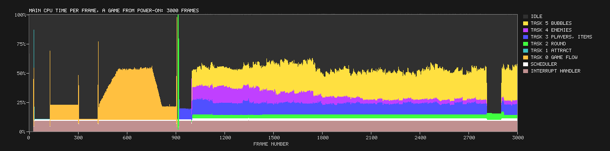

The attract screens cost almost nothing; the story intro, which runs entirely in task 0, climbs to half a frame
as its animation fills the screen; and round 1 settles between 45% and 60%, with the bubble task growing as bubbles
accumulate. The spikes to 100% are the subject of the next section. The same picture for the attract mode's
demos looks like a game with nobody at the controls:

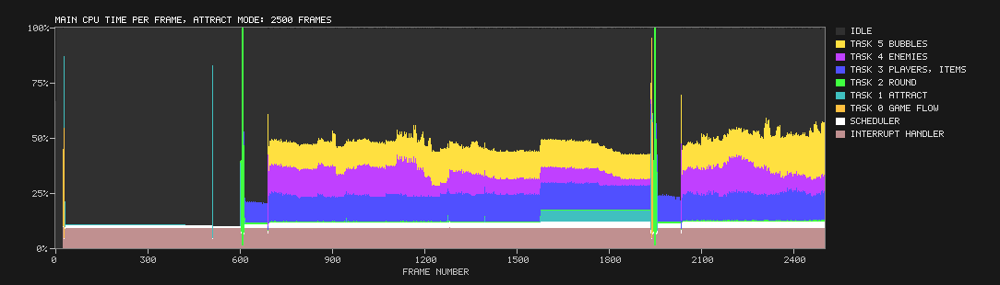

## Overruns

A frame is not guaranteed to fit. If the tasks are still running when the MCU's next pulse arrives,
`frame_done` is still zero and the handler takes the short path:

```asm
irq_nested:
0490  LD (irq_saved_sp),SP     ; $E1C7
0494  LD SP,sched_sp           ; a temporary stack just below $E1C5
0497  CALL irq_essentials
049A  LD SP,(irq_saved_sp)
049E  POP AF
049F  EI
04A0  RETI
```

Only the essentials run — coins, timers, the sub CPU watchdog, the frame counter — on a temporary stack in the
gap above task 5's slot, and control returns to the interrupted task. The object list is not copied, the sound
queue is not pumped and the random number generator's per-frame step is skipped; the tasks finish in their own
time, the CPU idles, and the following pulse starts a normal frame. The visible effect is one frame in which
nothing on screen moves, and one frame's delay to any queued sound. The invisible effect is that the frame
counter and the clock keep going, so the game's timers do not drift.

In the traced 3,000 frames this happened 21 times, all at transitions: the screen clears of the boot and title
sequence, the story intro's screen fills, and seven consecutive frames at the start of round 1, where task 2's
set-up draws all thirty-two rows of the map at once — the three passes of `round_scroll_step` (chapter 6) with
the scroll disabled — behind a screen that has just been cleared. In play proper, with the player, the bubbles and the enemies all active, the worst frame stayed under 69%. Bubble Bobble does not slow down; it
was budgeted not to, and the overruns are confined to moments when nothing is moving.

The check after the scheduler is a different guard. `irq_vblank` pops the interrupted program counter and
insists that it lie below `$C000`. A frame that starts with `frame_done = 1` can only have interrupted the idle
loop at `$01ED`, so a return address in RAM means the stack has been corrupted; the code prints `TIME ERROR`
from the string at `$04A2`, clears the MCU's enable key so that no further interrupts come, and hangs. The name
suggests the programmers once used it to catch overruns during development; the shipped check catches crashes.

## The other processors' frames

Each of the helpers has its own relationship to the picture.

* The **sub CPU** is interrupted by the VBLANK signal directly, sixteen microseconds after line 240 in the
  trace. Its handler runs the whole collision pass — every bubble against every player, every enemy against
  every player, bubbles against bubbles — and returns to its idle loop about four milliseconds later. It reads
  the object positions that the main CPU wrote during the previous frame's tasks, so the collisions it reports
  are one frame old when the main CPU acts on them (chapter 11).
* The **MCU** is interrupted at the same instant. It samples the inputs, updates the coin counters, and pulses
  the main CPU; then it spends the rest of the frame on the enemy-to-player geometry it computes from the
  records task 4 maintains (chapter 10). The main CPU therefore sees inputs that are at most a frame old and
  MCU results from the frame before.
* The **sound CPU** never sees VBLANK. It is interrupted by the timers of the YM2203 several hundred times a
  second and drains its command ring in between (chapter 8). The only frame-paced thing about sound is that
  the main CPU sends at most one command per frame.

One detail of task 4's start belongs here because it concerns the interrupt: before it does anything else, the
task compares `$044D` with the word at `$0B2E` — the interrupt vector — and if they differ, pushes IX and
leaves it on the stack. The task's first `RET` then goes somewhere else, and the game dies a little later in a
way that does not point at the check. A bootleg that replaced the MCU with a plain VBLANK line and its own
vector would fail here. Task 3 opens the same way, summing the first three bytes of the ROM (`DI`, `IM 2`) and
pushing DE if the sum is not `$3E`. Chapter 20 collects the rest of these traps.

# 10. The microcontroller

The fourth processor is a Motorola 6801U4: an 8-bit microcontroller with 4 KB of program in its own mask ROM,
192 bytes of RAM, four 8-bit ports and a 1 MHz clock. Its program is 1,407 lines of disassembly, and its
job, as chapter 1 put it, is to be indispensable. It is the only chip wired to the coin switches, the
joysticks, the buttons and the DIP switches, it raises the main CPU's frame interrupt, and it computes the
one thing the enemy AI cannot do without: where each player is relative to each enemy. This chapter reads the
program service by service, shows which of those services the game actually uses, and ends with the traps
it sets for anyone who tries to replace it.

## The port protocol

The MCU is not on the main CPU's bus. It reaches the 1 KB of shared RAM at `$FC00-$FFFF` — MCU addresses
`$0C00-$0FFF` — and the input ports through its own four ports, bit-banging an address and a data byte:

```asm
shared_read:                   ; B = shared[X]
F1BF  LDAA PORT1
F1C1  ORAA #$80                ; bit 7 high: read
F1C3  STAA PORT1
F1C5  CLR $0004                ; port 3 as input
F1C8  STX $004A
F1CB  LDD $004A                ; A = address high, B = address low
F1CE  ANDA #$0F
F1D0  STAB PORT4               ; address low byte
F1D2  STAA PORT2               ; address high nibble ...
F1D4  ORAA #$10
F1D6  STAA PORT2               ; ... then the strobe bit
F1D8  LDAB PORT3               ; the data comes back on port 3
F1DA  RTS

shared_write:                  ; shared[X] = B
F1DB  LDAA PORT1
F1DD  ANDA #$7F                ; bit 7 low: write
F1DF  STAA PORT1
F1E1  LDAA #$FF
F1E3  STAA P3DDR               ; port 3 as output
F1E5  STAB PORT3               ; the data
F1E7  STX $004A
F1EA  LDD $004A
F1ED  ANDA #$0F
F1EF  STAB PORT4
F1F1  STAA PORT2
F1F3  ORAA #$10
F1F5  STAA PORT2               ; strobe
F1F7  RTS
```

Addresses below `$0800` select the input latches instead of RAM: `$0000` is DIP switch A, `$0001` DIP
switch B, `$0002` the player 1 stick and buttons, `$0003` player 2 and the start buttons. Port 1 carries the
coin and service switches on its low bits and, on its high bits, the outputs: bit 4 the coin lockout coil,
bit 5 the coin counter, bit 6 the main CPU's interrupt line, bit 7 the read/write direction. Every byte the
MCU moves costs it about thirty cycles of port writes; the whole per-frame service list is written around
that cost.

## Boot and the frame

At reset the program first checks whether the factory's port tester is attached (fixed patterns on all four
ports, `selftest_check` at `$FEBB`); if not it falls into `init`: port directions, a clear of its RAM, one
read of the inputs, the coin-lockout coil off, a 500-loop delay after which a coin switch held at power-on is
recorded in `$FC7D`, a 16-bit checksum of its own ROM into `$FC82` (the ROM is padded to make it zero), and
finally the handshake byte:

```asm
F03A  LDAB #$37
F03C  LDX #$0C85
F03F  JSR shared_write         ; $FC85 = $37: the MCU is up
F042  CLI
loc_F043:
F043  BRA loc_F043             ; and it waits for the picture
```

Chapter 3 showed the main CPU waiting for that `$37` at `$FC85`, 394 milliseconds after power-on. From then on
the MCU, like the main CPU, lives in its interrupt handler. The VBLANK signal is wired to its IRQ1 pin, and the
handler is a list of nineteen services:

```asm
irq1_handler:
F046  JSR svc_main_irq         ; pulse the main CPU
F049  JSR svc_inputs           ; DIP switches, sticks, buttons, coins -> $FC1F-$FC23
F04C  JSR svc_coins            ; the MCU's own credit counting
F04F  JSR svc_lockout_cmd      ; $FF94: lockout coil on or off
F052  JSR svc_counter_0C24     ; lives counter, player 1
F055  JSR svc_counter_0C25     ; lives counter, player 2
F058  JSR svc_value_0C26       ; a round-like value
F05B  JSR svc_enemy_p1         ; geometry: 7 enemies against player 1
F05E  JSR svc_enemy_p2         ; ... and player 2
F061  JSR svc_sequence_0C73    ; four "random" sequences
F064  JSR svc_sequence_0C77
F067  JSR svc_sequence_0C81
F06A  JSR svc_countdown        ; a 16-bit frame countdown
F06D  JSR svc_cheat_credits    ; 42 credits for the right key
F070  JSR svc_extend_letter    ; a counter 0..5
F073  JSR svc_table_0C88       ; three table-copy services
F076  JSR svc_table_0D88
F079  JSR svc_table_0E88
F07C  JSR svc_reset_cmd        ; $FF97 = $4A restarts the MCU
F07F  LDX #$0F96
F082  JSR shared_read
F085  CMPB #$47
F087  BEQ loc_F091
F089  LDD #$0170               ; 368 turns of a delay loop
loc_F08C:
F08C  SUBD #$0001
F08F  BNE loc_F08C
loc_F091:
F091  RTI
```

The first service is the one the rest of the machine waits for. It reads `$FF98`, and only if the main CPU
has written `$47` there does it drop port 1 bit 6, raise it and drop it again — the pulse that becomes the
main CPU's interrupt (chapter 9). On the traced board the pulse comes 94 cycles into the handler, about 100
microseconds after VBLANK. The main CPU writes the key exactly once, at the end of boot, after its own tests
have passed: until then there are no interrupts and the game cannot start.

Measured on the emulator during round 1 with one enemy active, the handler takes 7,300 cycles — 7.3 of the
16.9 milliseconds in a frame. The inputs cost 500 cycles, the coin logic 400, the geometry 1,600, and 2,640
go to the delay loop at the end: the main program never writes `$47` to `$FF96`, so the MCU spends a sixth of
every frame counting to 368 for nothing. With all seven enemies active the geometry grows to about 7,000
cycles and the handler to 13 milliseconds — still inside the frame, which is presumably what the delay was
tuned against.

## The inputs

`svc_inputs` copies port 1 and the four input latches into `$FC1F-$FC23` every frame. That is the whole input
path of the game: the main program's `read_inputs` (chapter 13) reads `$FC22` and `$FC23`, `coin_handling`
reads the port copy at `$FC1F`, `irq_vblank` reads DIP switch A at `$FC20` to decide whether it is in test
mode, and nothing on the main board can see a switch any other way. The inputs a task acts on were sampled
during the previous VBLANK, one frame before.

The coin switches are handled twice. The MCU's own `svc_coins` edge-detects the three switches, looks up the
coinage table at `$F187` — four pairs of coins and credits per slot, selected by DIP A — adds to its credit
byte at `$FC1E`, sets `$FF99` to flag the event, and drives the lockout coil: credits at nine or more lock the
mechanism. The main program, meanwhile, does the same job itself in `coin_handling` from the port copy, with
the coinage table it took from bank 3 at boot (chapter 7), keeps the credits it believes in at `$E366`, and
sends the lockout state back as a command in `$FF94`. It never reads `$FC1E`. The two counts agree because
they see the same edges, but only the main CPU's is used; the MCU's coin logic is a service this program
does not call on, left running. Its one visible effect is the lockout coil, which the MCU alone can drive and
which obeys the main CPU's command byte.

## The enemy geometry

Task 4 keeps seven records of four bytes at `$FC01` — `[flags, x, y, -]` per enemy, with bit 0 of the flags
set while the enemy is on the field — and task 3 writes each player's position to `$FC60-$FC61` and
`$FC68-$FC69` after moving it (`player_pos_to_mcu`). During the next VBLANK the MCU computes, for every
active record and each active player, the sign and magnitude of the difference on both axes:

```asm
loc_F4CF:                      ; record X = $0058 -> [flags, x, y]; player x in $55, y in $56
F4CF  LDX $0058
F4D2  INX
F4D3  JSR shared_read          ; B = enemy x
F4D6  LDAA $0055               ; A = player x
F4D9  SBA                      ; A = player - enemy
F4DA  BEQ loc_F4E7             ; equal: code $80
F4DC  BCC loc_F4E3             ; no borrow: player is higher, code 0
F4DE  LDAB #$01                ; borrow: player is lower, code 1
F4E0  NEGA                     ; ... and make the distance positive
F4E1  BRA loc_F4E9
loc_F4E3:
F4E3  LDAB #$00
F4E5  BRA loc_F4E9
loc_F4E7:
F4E7  LDAB #$80
loc_F4E9:
F4E9  LDX $005A                ; result record
F4EC  PSHA
F4ED  JSR shared_write         ; [0] = direction code
F4F0  LDX $005A
F4F3  INX
F4F4  INX
F4F5  INX
F4F6  INX
F4F7  PULA
F4F8  PSHA
F4F9  TAB
F4FA  JSR shared_write         ; [4] = |dx|
F4FD  PULA
F4FE  CMPA #$08
F500  BCC loc_F505
F502  INC $005C                ; within 8: remember it for the touch test
loc_F505:
      ...                      ; the same for y into [2] and [6]
```

The results go to eight-byte records at `$FC27`, player 1 in the even bytes and player 2 in the odd ones.
When an enemy is within eight pixels of the player on both axes the service also writes a touch report —
`$FC62 = 1` and the enemy's index in `$FC63` — and stops scanning.

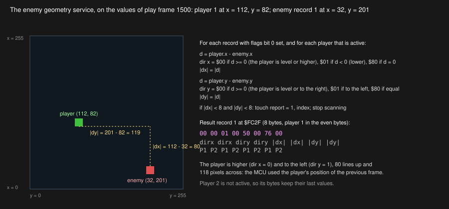

The main program reads the results in two places, both in the enemy code of bank 0 (chapter 17).
`mcu_player_relation` (`0:$9179`) fetches the direction byte for the enemy's target player and answers "is the
player that way?"; it is the test behind every turn an enemy makes towards a player. `enemy_chase`
(`0:$94FF`) reads the vertical distance and, when it is less than 20 lines, decides between turning and
jumping. Those two reads are the whole of the MCU's contribution to the AI, and they are why a board without
the MCU has monsters that walk back and forth but never come after you: without the codes, the tests fail,
and the enemies fall through to their patrol behaviour.

The touch reports are never read. The main program does not need them because the sub CPU tests every enemy
against every player with the objects' real bounding boxes (chapter 11); the MCU's eight-pixel test is
coarser and a frame older. The service is complete on the MCU's side and unconnected on the other — a
pattern that repeats through the rest of the list.

## The countdown

`svc_countdown` decrements a 16-bit number at `$FC78` while `$FC7A` is set and, at zero, clears the run flag
and sets a done flag at `$FC7B`. The enemy code uses it as a timer for the missile launchers of the rounds
whose record has bit 0 of `[$C]` set (chapter 6): at the start of a round task 4 loads 600 frames, and the
launcher code polls the done flag to release its missiles, then reloads. Ten seconds of the round's timing
therefore run on the MCU's clock, in step with the frame because the MCU is interrupted by the same VBLANK.

## Services that run for nobody

The rest of the list is machinery this game does not switch on. Each service acts on a command byte in the
shared RAM, and the RAM trace of the port — every read and write of the main CPU over hours of play, attract
mode, the test screens and the boot — shows the main program never writing those bytes and never reading the
results:

* **Lives counters** (`$FC24`, `$FC25`): commands in `$FC6F` and `$FC70` initialise a counter from the DIP
  lives table (`[1, 0, 4, 2]`, the same numbers as the main CPU's own table), increment it to a maximum of 10,
  decrement it or set it to 10. The game keeps lives in its work RAM and never sends a command.
* **A value** (`$FC26`): commands in `$FC7E` clear it, increment it, or set it to 49, 98, 99, 100 or 101 — the
  numbers of the rounds after the secret-room warps and the boss. It is the round number, kept in parallel,
  for a program that would consult the MCU about which round it is in. This one does not.
* **Four sequences** (`$FC72-$FC77`, `$FC80-$FC81`): the main CPU names a list, the MCU serves its next value
  every frame and wraps at the `$FF` terminator. The forty lists at `$F769-$F88E` are strings of small
  numbers — list 1 is one 1 in ten zeros, list 20 is mostly 2s, list 39 mostly 4s — the shape of a
  graded random choice, a probability that rises with the list number. The game reads none of the values.
  It does write one of the list-number bytes: the bubble task keeps the round's bubble-speed list number in
  `$FC76` and reads it back as an ordinary variable (chapter 16), and the MCU obligingly serves a sequence
  from that list into `$FC77` every frame that nobody looks at.
* **The EXTEND counter** (`$FC7C`) steps from 0 to 5 and back every frame: a free-running picker for the six
  letters of EXTEND. This one the game does use, rarely: when the round's bubble source decides to release
  an EXTEND bubble (chapter 16), the letter it carries is whatever the counter holds at that moment — a
  random letter, chosen by the only chip on the board that was counting.
* **Table copies**: a request in `$FF88` (`$FF8C`, `$FF90`) with an index, a list number and a destination
  makes the MCU copy one byte from a table in its ROM to `$FC88` (`$FD88`, `$FE88`). The tables at
  `$F9BB-$FEBA` are not tables: they are 1,280 bytes of Z80 code — fragments of some Taito program, used as
  filler to make the ROM's checksum come out — and nothing ever requests a byte of them.
* **The restart** (`$FF97 = $4A`) and **the credit cheat**: if `$FC71` holds `$0D` while the value byte's
  mirror is 12, the MCU writes 42 credits into `$FC1E` — which, as we saw, the main program never reads.

The picture that emerges is of a service MCU written once for a family of Taito boards, with a menu of
facilities a game could call on, and of a Bubble Bobble program that uses five of them: the inputs, the
interrupt, the geometry, the countdown and, once in a while, the EXTEND counter. Everything else is ballast, but ballast that costs nothing to
carry and makes the chip harder to replace, because a copyist reading the shared RAM cannot tell from the
outside which bytes matter.

## The traps

Three of the idle services are armed by a byte the main program never writes. If `$FF95` holds `$42`, the
lives counters and the value byte compare their shared copy with a private mirror in the MCU's own RAM each
frame, and if they differ:

```asm
F2C7  LDX #$0C24
F2CA  JSR shared_read
F2CD  CMPB $0052               ; the shared byte against the private copy
F2D0  BEQ loc_F2D3
F2D2  PSHA                     ; not equal: push one byte and ...
loc_F2D3:
F2D3  RTS                      ; ... return through it
```

The extra byte on the stack turns the `RTS` into a jump to a garbage address, the MCU stops pulsing, and the
game freezes with no message. A player who altered the lives byte in shared RAM with a cheat device, or a
bootleg board that did not keep it, would have met this — had the main program ever armed it. The same
pattern, one `PSHA` too many, sits in an unreachable watcher routine at `$F217` that would have punished a
change to the byte at `$FC7F`.

The trap that is armed is the handshake itself. Chapter 3 showed the boot refusing to continue without the
`$37` at `$FC85`; five more places in the game check it again during play — in the enemy walking code, in the
round-start animation, in the bubble-blowing routine, in the map-drawing pass and in a small routine that is
called from the bubble task — and each responds to a wrong value in its own quiet way. Chapter 20 lists them
with the other protection checks, including the main CPU's own habit of confirming that the interrupt vector
at `$0B2E` still points at the handler the MCU was designed to trigger.

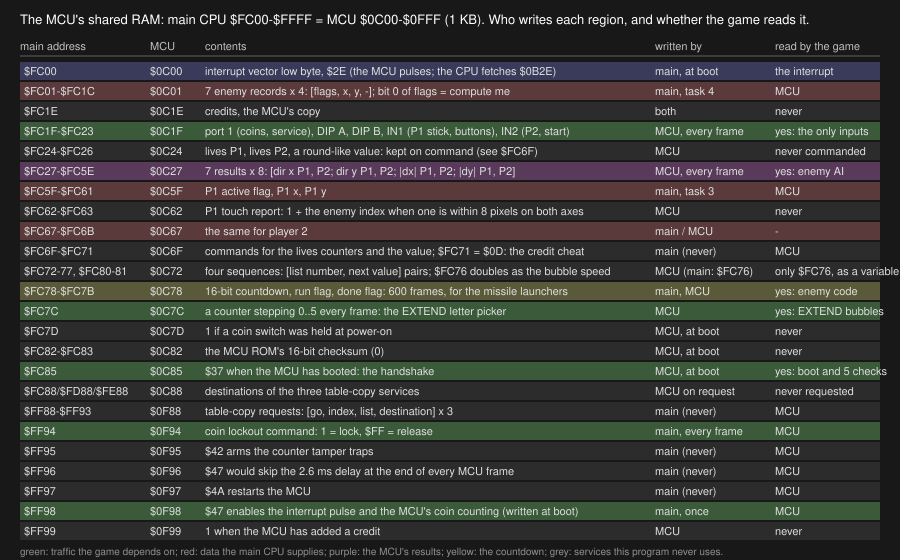

## What the MCU is, then

Take the chip away and three things happen at once. The main CPU boots, prints nothing, and waits at
`$0158` for a `$37` that never comes. If that wait is patched out, no interrupt ever arrives and the CPU sits
in `JR $01ED` for ever. If a VBLANK line is wired to the interrupt pin instead, the vector byte at `$FC00` is
not `$2E`, and a bootlegger who fixes that too finds that the joysticks are dead, because the input latches
hang off the MCU's ports. Fix that with a different board and the monsters no longer chase. The MCU is the
copy protection, and every layer of it is also a job the game needs done. That is the design.

# 11. The sub CPU

The second Z80 is the least visible processor on the board and the one that decides most of what a player
feels. It has no inputs, no outputs, no ROM banking and no RAM of its own: 32 KB of program ROM, of which
28.8 KB are the level maps of chapter 6 and 3.3 KB are code, and the 6 KB of RAM at `$E000-$F7FF` that it
shares with the main CPU. Once per frame it is interrupted by the VBLANK signal, walks every bubble, enemy,
player, rock, missile and item on the field, decides who is touching whom, writes its verdicts into the
records the main CPU owns, and goes back to sleep. Every catch, every pop, every bounce off a bubble and every
death in the game is a byte this processor wrote.

## Boot and the frame

```asm
reset:
0000  DI
0001  IM 1
0003  LD SP,$F7CE              ; a stack in the shared RAM, below the main CPU's
0006  CALL rom_checksum        ; the 32 KB must sum to zero, or spin at $018D
0009  EI
loc_000A:
000A  JP loc_000A              ; and wait

irq_vector:                    ; $0038, interrupt mode 1
0038  JP frame_handler

frame_handler:
0068  LD HL,sub_frame_counter  ; $F66E: the heartbeat the main CPU watches
006B  INC (HL)
006C  CALL build_collision_map ; when $E397 = 1
006F  CALL sequence_objects_hit; the secret-room doors
0072  LD A,(round_running)     ; $F66B
0075  CP $49
0077  JP NZ,loc_00A7           ; nothing else unless a round is being played
007A  CALL players_caught
007D  CALL enemies_touch_players
0080  CALL bubbles_update
0083  CALL chain_pop
0086  CALL flying_objects_catch
0089  CALL falling_items_catch
008C  CALL missiles_hit_players
008F  CALL rocks_hit_players
0092  CALL flyer_catches
0095  CALL bouncing_object_catches
0098  CALL f3ce_objects_hit_players
009B  CALL f367_objects_hit_players
009E  CALL boss_vs_players
00A1  CALL fire_shots_hit_players
00A4  CALL main_watchdog
loc_00A7:
00A7  EI
00A8  RET
```

The handler runs with interrupts disabled and re-enables them only on the way out, so a VBLANK that arrives
while it is still working waits until the next `EI`. The gate at `$0072` is the byte `$F66B`, which the main
CPU sets to `$49` when the round-start animation finishes and clears when the round ends; outside a round the
handler costs 185 cycles and the sub CPU does nothing else. Inside a round it is the sixteen calls below,
and their cost depends on how much is on the field:

| Frame of the traced game | Handler | Of which the bubble pass |
| --- | --- | --- |
| 600 (attract mode, no round) | 185 cycles, 0.03 ms | - |
| 908 (round 1 set-up: the map build) | 130,769 cycles, 21.8 ms | - |
| 1200 (round 1, a few bubbles) | 25,728 cycles, 4.3 ms | 20,975 |
| 1500 | 42,098 cycles, 7.0 ms | 36,003 |
| 2500 (many bubbles) | 58,478 cycles, 9.7 ms | 52,525 |

The rest of the list is cheap — a few hundred cycles each, mostly the cost of looking at a record and finding
it inactive — and the bubble pass, which compares every bubble with every player and every other bubble,
is the whole budget. On the busiest frames the sub CPU is working for more than half of the frame, and it
started at VBLANK: the main CPU's tasks, which begin 1.6 milliseconds later, overlap it for most of that time.
The map build at round start takes longer than a frame; the main CPU's `load_round_map` yields until the
acknowledgement comes back, and the VBLANK that arrives meanwhile is simply taken late.

## The shared RAM

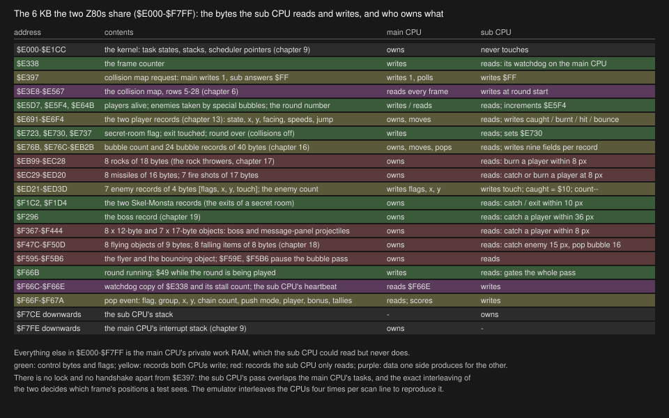

The two processors have no way to lock a byte against each other and, apart from the map request, no
handshake. The convention that keeps them consistent is one of roles: for every record, one side moves things
and the other side judges. The main CPU writes positions; the sub CPU reads them and writes flags — a player's
state becomes `$10`, an enemy's touch byte names a player, a bubble's push and pop fields are filled in — and
the main CPU's tasks act on the flags in the frame that follows. Nothing is ever written by both sides in the
same frame except by accident of timing, and the timing is exact enough that the accidents are the same on
every board: the sub CPU's pass starts within sixteen microseconds of VBLANK and the main CPU's tasks at a
fixed offset after it, so which frame's positions a test sees is decided by how long the pass is. The emulator
interleaves the two CPUs four times per scan line for this reason; a coarser interleave changes which bubble
catches which enemy.

Two bytes exist only to watch the other side. The main CPU's `sub_cpu_watchdog` (chapter 9) reboots the board
if the heartbeat at `$F66E` stops for 180 frames. The sub CPU's `main_watchdog` does the reverse with the main
CPU's frame counter at `$E338`:

```asm
main_watchdog:
0190  LD A,($E338)
0193  LD HL,watchdog_copy      ; $F66C
0196  CP (HL)
0197  LD (HL),A
0198  INC HL
0199  JR NZ,loc_01B6           ; changed: reset the count
019B  INC (HL)                 ; $F66D
019C  LD A,(HL)
019D  CP $3C
019F  RET C                    ; under 60 frames: fine
01A0  LD HL,$E800              ; otherwise: copy the upper half of the shared RAM
01A3  LD DE,$E000              ; over the lower half, inverted ...
01A6  LD BC,$0800
loc_01A9:
01A9  LD A,(HL)
01AA  CPL
01AB  LD (DE),A
01AC  INC HL
01AD  INC DE
01AE  DEC BC
01AF  LD A,C
01B0  OR B
01B1  JR NZ,loc_01A9
loc_01B3:
01B3  JP loc_01B3              ; ... and stop
loc_01B6:
01B6  LD (HL),$00
01B8  RET
```

If the main CPU's frame counter stops moving for a second during a round, the sub CPU destroys the kernel's
RAM and hangs. The main CPU, if it is still running at all, can no longer kick the hardware watchdog from a
scheduler whose task table has been overwritten, and the board resets. It is a deliberate second line behind
the hardware watchdog, for a main CPU that is alive enough to kick it but no longer playing.

## The windows

Every test in the program has the same shape. It takes a record's `(x, y)` — `x` vertical, `y` horizontal, as
in the rest of the code — subtracts the other object's, takes the absolute value of each difference and
compares it with a constant. The result is a square window; no test looks at a sprite's real outline. The
helper that does it for the enemies is typical:

```asm
enemy_near:                    ; an active enemy within C pixels of (E, D)? carry, HL -> its record
02B4  LD B,$00
02B6  LD HL,$ED21
loc_02B9:
02B9  BIT 0,(HL)               ; flags: bit 0 = on the field
02BB  JR Z,loc_02D4
02BD  PUSH HL
02BE  INC HL
02BF  LD A,(HL)                ; enemy x
02C0  SUB E
02C1  JP P,loc_02C6
02C4  NEG
loc_02C6:
02C6  CP C
02C7  JR NC,loc_02D2           ; too far vertically
02C9  INC HL
02CA  LD A,(HL)                ; enemy y
02CB  SUB D
02CC  JP P,loc_02D1
02CF  NEG
loc_02D1:
02D1  CP C
loc_02D2:
02D2  POP HL
02D3  RET C                    ; within C on both axes
loc_02D4:
02D4  INC HL
02D5  INC HL
02D6  INC HL
02D7  INC HL
02D8  INC B
02D9  LD A,B
02DA  CP $07
02DC  JR NZ,loc_02B9
02DE  XOR A
02DF  RET
```

The seven enemy records at `$ED21` are the same four bytes per enemy that task 4 hands to the MCU (chapter
10), kept in the shared RAM for the sub CPU: `[flags, x, y, touch]`. The windows, collected:

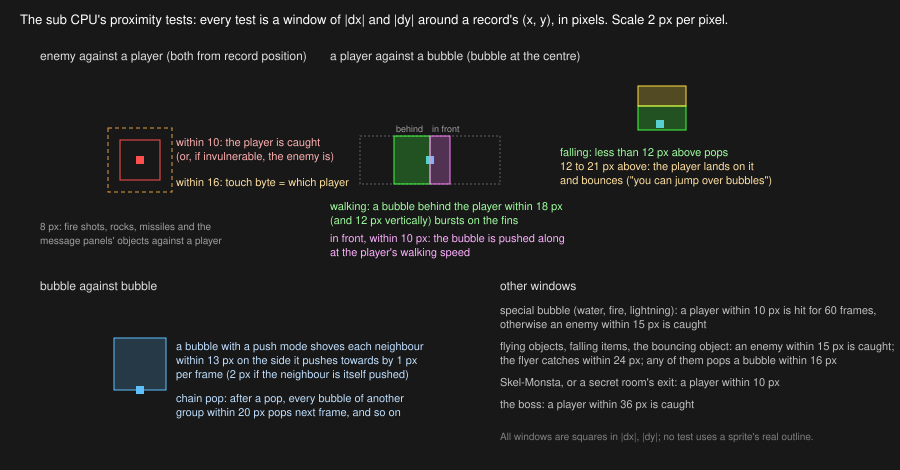

| Test | Window | Effect |
| --- | --- | --- |
| Enemy against a live player | 10 | The player is caught: its state byte becomes `$10`. If the player is in the invulnerable state, the enemy is marked caught instead and the enemy count drops |
| Enemy against a live player | 16 | The enemy's touch byte is set to 1 or `$FF` for the player it touches; the enemy AI reads it to turn on the player |
| Player walking, a bubble behind | 18 across, 12 up or down | The bubble pops: a pop event (the fins) |
| Player walking, a bubble in front | 10 across, 12 up or down | The bubble is pushed: the player's walking speed is added to its push field, the player is noted as the pusher, and the bubble gets a push mode; a standing player is shoved back by the bubble's own drift |
| Player falling, above a bubble | 12 across, under 12 above | The bubble pops |
| Player falling, above a bubble | 12 across, 12 to 21 above | The player lands on it: a flag in the player record makes the jump code bounce |
| Bubble against bubble | 13, on the side of its push mode | The neighbour's push field moves by 1 (2 if it is being pushed itself) |
| Chain pop | 20 | Every bubble of another group within 20 pixels of the last pop pops next frame |
| Special bubble (water, fire, lightning) against a player | 10 | The player is hit for 60 frames |
| Special bubble against an enemy | 15 | The enemy is caught |
| Flying object, falling item, bouncing object against an enemy | 15 | The enemy is caught; the object is marked used |
| The flyer against an enemy | 24 | The enemy is caught |
| Any of those against a bubble | 16 | The bubble is treated as popped by it |
| Fire shot, rock against a player | 8 | The player is burnt: it stumbles and is caught |
| Missile, message-panel object against a player | 8 | The player is caught |
| Special bubble against the boss (round 100) | 44 | A hit on the boss |
| Skel-Monsta record against a player | 10 | In a secret room, where the records are the exits, the round-end flag is raised; otherwise the player is caught |
| The boss against a player | 36 | The player is caught |

Two of the numbers are the game's feel. A monster catches you at ten pixels, on both axes, from centre to
centre: with sixteen-pixel sprites that means the pictures overlap by about a third before the sub CPU calls
it a touch, which is why Bubble Bobble feels forgiving. And the bubble rules are exactly the ones the
instruction screen states: a bubble in front of you, within ten pixels, is pushed along by your walking; a
bubble behind you, within eighteen, bursts on your fins; a bubble you fall onto from less than twelve pixels
bursts on your horns, and from twelve to twenty-one you land on it and bounce.

## The bubble pass

`bubbles_update` walks the twenty-four records of forty bytes at `$E76C` and dispatches on each bubble's
state byte: an ordinary drifting bubble, a bubble with an enemy inside, the two states between, or a special
bubble. For the first four it does the same three things:

1. **Push the neighbours.** If the bubble has a push mode in `[$0F]`, it looks at every other bubble on the
   side the mode names and, for each within thirteen pixels, moves the neighbour's push counter by one
   (`[$14]` horizontally, `[$13]` vertically). The main CPU's bubble code turns the counters into motion
   next frame (chapter 16). This is what makes a crowd of bubbles spread and a pushed bubble shove the ones
   in front of it.
2. **Player 1, then player 2.** `player_vs_bubble` applies the walking or falling windows above, using the
   player's facing byte to tell front from behind. On a pop it calls `pop_event`; on a push it fills in the
   push and pusher fields and returns. The first player to touch a
   bubble claims it for the frame — `[$1A]` is set to the bubble's state, and a claimed bubble is skipped
   until the main CPU has processed it.
3. **A bubble with an enemy inside** is first offered to the flying objects, the falling items, the flyer and
   the bouncing object: any of them within sixteen pixels pops it, so that a thrown item bursts the bubbles it
   passes.

`pop_event` is the sub CPU's one message to the main CPU:

```asm
pop_event:                     ; bubble IX popped by player IY
09C7  LD HL,pop_event          ; $F66F
09CA  BIT 0,(HL)
09CC  JP NZ,loc_0A2E           ; one pop per frame: the rest wait
09CF  LD (HL),$01
09D1  INC HL
09D2  LD A,(IX+$1D)
09D5  LD (HL),A                ; $F670: the bubble's group
09D6  INC HL
09D7  LD A,(IX+$01)
09DA  LD (HL),A                ; $F671: x
09DB  INC HL
09DC  LD A,(IX+$02)
09DF  LD (HL),A                ; $F672: y
09E0  INC HL
09E1  BIT 2,(IX+$00)           ; an enemy inside?
09E5  JR Z,loc_0A02
09E7  INC (HL)                 ; $F673: the chain count
09E8  LD A,(HL)
09E9  DEC A
09EA  LD (IX+$22),A            ; this bubble's place in the chain
      ...
0A02  INC HL
0A03  INC HL
0A04  LD A,(IY+$09)
0A07  LD (IX+$16),A            ; the player who popped it ...
0A0A  LD (HL),A                ; ... also in $F675
      ...
0A26  LD A,(IX+$00)
0A29  LD (IX+$1A),A            ; claim the bubble
0A2C  SCF
0A2D  RET
```

Only one pop is reported per frame. The next routine in the handler, `chain_pop`, is what turns one into many:
if a pop was reported, it clears the flag, finds the first bubble of a different group within twenty pixels of
the popped position and reports *that* one, with the chain count advanced. So a cluster of bubbles pops one
per frame, outward from the first, each link twenty pixels from the last — the ripple a player sees when a
row of trapped monsters goes up together — and the chain count in `$F673` climbs with it. When no bubble is
left within reach the count is reset and two done flags are raised for the tallies at `$F677` and `$F679`,
which the main CPU's bubble task reads to award the chain scores of chapter 16: the sub CPU counts the chain,
the main CPU prices it.

## Everything else on the field

The remaining routines are the same window applied to the other things that can touch a player or an enemy,
each reading a table the main CPU owns and writing a result byte into it:

* `players_caught` and `enemies_touch_players`: the ten- and sixteen-pixel windows over the seven enemy
  records. A player is "catchable" only if it is alive, not already caught, not in its invulnerable spell, and
  between eight and 247 pixels from the bottom of the plane — the last test keeps a player who is walking off
  the top or bottom edge from dying to an enemy on the other side of the wrap.
* `flying_objects_catch`, `falling_items_catch`, `flyer_catches`, `bouncing_object_catches`: the items of the
  special rounds and the thrown objects of chapter 18 catch enemies at fifteen pixels (the flyer at
  twenty-four); the enemy's flags become `$10` and its result byte says what caught it, so that the enemy code
  can turn it into the right kind of fruit.
* `fire_shots_hit_players` and `rocks_hit_players`: the fire breathers' shots and the rock throwers' rocks burn
  a player at eight pixels; `missiles_hit_players` and the two message-panel object tables catch at eight.
* `special_bubble`: water, fire and lightning bubbles hit a player at ten pixels (sixty frames of the effect) and
  otherwise catch an enemy at fifteen. On round 100 there are no enemies to catch: a special bubble within
  forty-four pixels of the boss sets bit 7 of the boss record and counts a hit at `$F2A1`, which is how the boss
  is beaten (chapter 19).
* `boss_vs_players`: the boss catches at thirty-six pixels while it is active, and while it is dying it notes
  which player was within thirty-six pixels, for the ending.
* `sequence_objects_hit`, called even outside a round: the two records at `$F1C2` and `$F1D4` — Skel-Monsta's
  in a normal round, the exits in a secret room — catch a player within ten pixels; in the secret room the touch
  raises the round-end flag instead of a death.

None of these routines moves anything. The sub CPU never changes a position; it only says, in a byte of the
record, what the position means. The main CPU's tasks read the bytes in the frame that follows, and chapters
13 to 19 are about what they do with them.

# 12. Game flow

Three of the six tasks are about the shape of a session rather than the play itself. Task 0 is the state
machine: it waits for a coin, runs the mode select and the story, hands each round to task 2, judges the
outcome and runs the game over. Task 1 is the attract mode, started whenever there are no credits. Task 2
is a round from set-up to clear, and it serves the demos as well as the game. This chapter follows the three
through a session, from the first coin to GAME OVER, and stops at the doors of the play chapters.

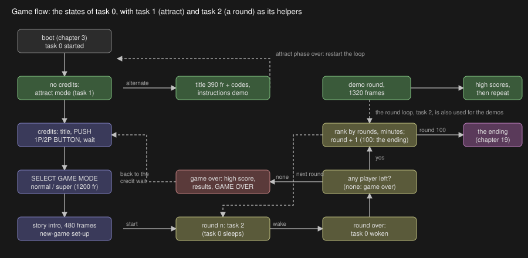

## Task 0: waiting for a coin

Task 0 is the first task the boot creates (chapter 3). It prints the licence notice and the score header,
and enters a loop that it will return to after every game:

```asm
loc_1D1E:
1D1E  RST $20
1D1F  LD B,$03                 ; the first three ROM bytes must sum to $3E ...
1D21  XOR A
1D22  LD HL,$0000
loc_1D25:
1D25  ADD A,(HL)
1D26  INC HL
1D27  DJNZ loc_1D25
1D29  SUB $3E
1D2B  JR Z,loc_1D2E
1D2D  POP AF                   ; ... or the stack is unbalanced (chapter 20)
loc_1D2E:
1D2E  LD A,$01
1D30  LD (attract_active),A    ; $E5D4
1D33  LD (demo_flag),A         ; $E5D3
      ...                      ; clear the playfields and object lists, the palette, the credit text
1D4B  LD A,$01
1D4D  RST $30                  ; start task 1, the attract mode
loc_1D4E:
1D4E  RST $20
1D4F  LD A,(credits)           ; $E366
1D52  OR A
1D53  JR NZ,loc_1D70           ; a coin: go on
1D55  LD A,(attract_active)
1D58  AND A
1D59  JR NZ,loc_1D4E           ; the attract task is still busy: wait
1D5B  RST $28                  ; it has finished its phase: stop everything ...
      ...
1D6E  JR loc_1D1E              ; ... and start it again
```

With a credit, task 0 stops all tasks, draws the title logo, and waits for a start button while it prints the
credit count, the bonus thresholds and "PUSH ONLY 1 PLAYER BUTTON" or "PUSH 1 OR 2 PLAYERS BUTTON":

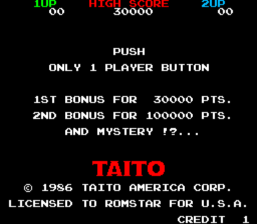

`start_buttons` (`$1FF7`) accepts player 1's button whenever there is a credit; player 2's button needs two
credits, takes both, and starts a two-player game. Every pass through the wait also compares the interrupt
vector with `$044D` and pushes IX if it differs, the second of the tamper checks that chapter 20 lists.

## Mode select and the story

The start button leads to a screen this version of the game has and the Japanese original does not:

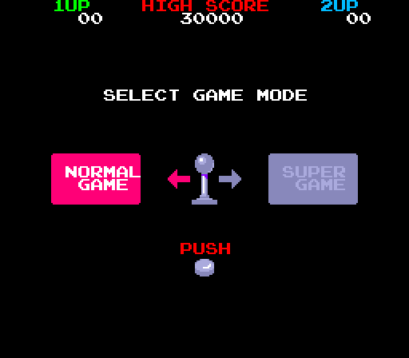

`mode_select` (`$2931`) draws two logos from tile blocks and a joystick picture, highlights NORMAL GAME or
SUPER GAME as the stick is pushed left or right, and returns on either button. The choice is one byte,
`$E5DB`, which the round set-up reads (chapter 6): in the super game the enemy parameters of every round
record are rewritten before the round starts, and the true ending needs it (chapter 19). The routine also opens with a check that `$FC85` still holds the
MCU's `$37`; if not, it swaps the return address for garbage.

Then the story. `story_intro` (`$2578`) clears the screen, prints the four lines of the introduction, starts the
theme — sound command 7, from which point it plays without a break until the game ends — and for 480
frames drifts the two dragons across a field of bubbles:

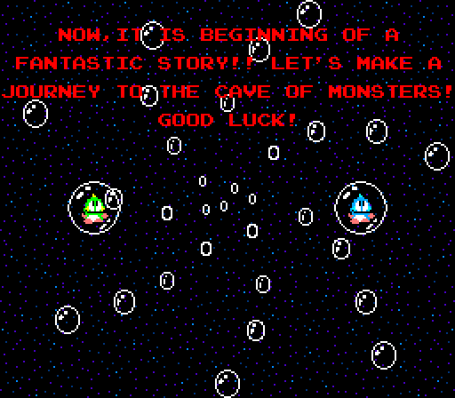

After it, task 0 sets up a new game. Round number 0, the EXTEND letters, the round counters and the flags are
cleared; the difficulty rank comes from DIP switch B (`13`, `10`, `4` or `7` for the four settings, so the
factory setting starts at rank 7) and is raised by 3 for a two-player game; the clocks are reset, the players'
scores and parameters initialised, the playfields cleared, and the board of the new game drawn. Then:

```asm
loc_1E2F:
1E2F  LD A,$02
1E31  RST $30                  ; start task 2: the round
1E32  XOR A
1E33  RST $18                  ; and sleep until it wakes us
1E34  RST $28                  ; back: stop everything
1E35  RST $20
1E36  LD A,(players_alive)     ; $E5D7
1E39  AND A
1E3A  JP Z,loc_1F90            ; nobody left: game over
1E3D  RST $20
1E3E  CALL difficulty_by_rounds
1E41  CALL difficulty_by_minutes
1E44  CALL round_counters
1E47  LD HL,round_number       ; $E64B
1E4A  INC (HL)
1E4B  LD A,(HL)
1E4C  CP $64
1E4E  JR Z,ending              ; after round 100
1E50  CALL round_flags
      ...                      ; clear the screen and the object lists
1E62  JR loc_1E2F
```

That is the whole of a game as task 0 sees it: start a round, sleep, be woken, count, start the next. The
round loop never returns; it wakes task 0 with `RST $10` and suspends itself (chapter 9), and task 0's
`RST $28` clears every task slot including the round's, so each round starts on fresh stacks.

## The difficulty rank

Two routines run between rounds. `difficulty_by_rounds` counts the rounds played (`$E5DE`) and adds 1 to the
rank on the second and third round of every four (`BIT 1` of the count); at 5, 10, 15, 20 and 30 rounds it
raises a floor — `$E5DD` — to 8, 15, 20, 25 and 30 and lifts the rank to it. `difficulty_by_minutes` does the
same with the clock: after 10, 15, 20 and 25 minutes of play the floor becomes 15, 20, 25 and 30. The rank
is capped at 30 by `difficulty_bump`, and everything that depends on it goes through the tables that
`round_setup` applies to the round record (chapter 6):

| Rank | Bubble hold time `[7]` | Time limit `[$D]` | Angry time `[$F]` | Enemy speed `[8]` |
| --- | --- | --- | --- | --- |
| 0-7 | +7 down to 0 | - | - | - |
| 8-15 | -1 down to -8 (never below 1) | - | - | - |
| 16-30 | -8 | -3 down to -7 s (never below 5) | -2 down to -7 s (never below 2) | +1 up to +5 (never above 30) |

A game that starts at rank 7 spends its first five rounds with the bubbles holding enemies a little longer
than the record says; by round 30 the floor has pushed the rank to 30 and every round is seven seconds
shorter, the enemies five units faster, and a caught enemy escapes eight units sooner. Nothing else
in the game reads the rank; the record's five numbers are where difficulty lives.

## The round, from task 2's side

Chapter 9 printed the round loop. Its life, in order:

1. **Set-up.** `clear_round_vars`, the round record and the map request (chapter 6), the animation
   counter, the object lists, the round's palette. Task 3 is started; it starts task 4, and later
   `round_start_anim` starts task 5.
2. **The banner.** `round_intro` prints ROUND n and READY while the players walk in from the corners — the
   entry animation is 90 frames — and the enemies drop in from the top on the record's schedule:

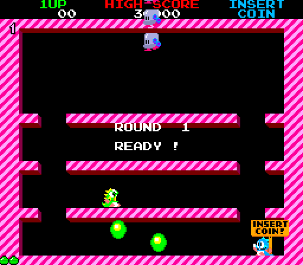

3. **The wait.** The loop at `$057B` yields each frame until `round_start` (`$E6FF`) has bit 7 set, which
   `round_start_anim` does when the arrival is complete; then two frames' pause, and a branch to the demo
   variant if this is the attract mode.
4. **The frame loop** at `$05A3`: the join prompts, the READY banner's removal, the inputs, the game-over check,
   the round clock, HURRY UP, the angry timer, the last-enemy flag. It ends when `players_alive` is zero or
   the enemy count reaches zero.
5. **The clear.** With the last enemy gone `bubble_pause` is set, the round's special item is chosen, and the
   loop continues for 420 frames — seven seconds in which the fruit can still be collected and the players
   still move — unless the bonus flag or the game-over flag ends it sooner.
6. **The hand-off.** Task 0 is woken; task 2 sleeps with state 0.

The join prompts are the small texts in the second player's corner of the status row, INSERT COIN alternating
with TO CONTINUE every sixty frames (`join_update`, `2:$B18F`), and the TO JOIN!! panel that slides in at the
bottom right; when the 2P button is pressed with a credit in hand, the second player enters the running
round. In a two-player game, or in a game the second player has joined, both players are in the round for
the rest of the game; there is no separate continue.

## HURRY UP

The round clock is three bytes, `$E344-$E346`: frames, seconds, minutes, stepped by `play_time_tick` unless
`time_paused` is set. `hurry_up_logic` compares the seconds with the record's time limit:

```asm
0765  LD A,(play_minutes)
0768  AND A
0769  RET NZ                   ; past a minute: nothing more happens
076A  LD A,(e345_timer_word)   ; the seconds
076D  LD HL,round_time_limit   ; $E5A5
0770  CP (HL)
0771  JR Z,loc_0781            ; at the limit: the sequence
0773  LD A,(HL)
0774  SUB $03
0776  LD HL,e345_timer_word
0779  CP (HL)
077A  RET NZ
077B  LD HL,hurry_up_flag      ; $E34A: three seconds to go
077E  LD (HL),$01
0780  RET
loc_0781:
0781  LD A,$03
0783  RST $08                  ; sleep task 3 (players, items) ...
0784  LD A,$05
0786  RST $08                  ; ... task 5 (bubbles) ...
0787  LD A,$04
0789  RST $08                  ; ... and task 4 (enemies)
078A  LD HL,$F66B
078D  LD (HL),$00              ; collisions off (chapter 11)
078F  CALL rom_check_walker3
0792  LD A,$00
0794  LD (IO_sound_latch),A    ; all sound off
0797  LD HL,$0847
079A  LD DE,object_list_a
079D  LD BC,$0010
07A0  LDIR                     ; four objects: the HURRY UP text
07A2  LD HL,hurry_state
07A5  LD (HL),$FF
```

The flag three seconds early does not show anything; it tells the item code to stop producing bonus items for
the last stretch of the round. What the player sees happens at the limit itself: the whole game freezes —
players, enemies and bubbles asleep, the sub CPU's collisions switched off, the music silenced — and the
HURRY UP text, four sprites, rises from the bottom four pixels a frame until it reaches the middle of the
screen; the jingle plays (sound `$18`), the text waits sixty frames, and then everything is woken and the
text carries on upward, eight pixels a frame, until it has left the screen. When it has, `last_enemy_flag` is
set to 1 — the value that the enemy drivers read as "everyone is angry" — and a flag at `$F453` is raised for
the enemy code, which brings Skel-Monsta, the invincible ghost that hunts the players until the round ends:

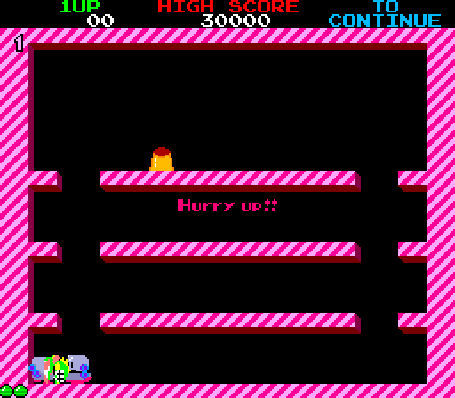

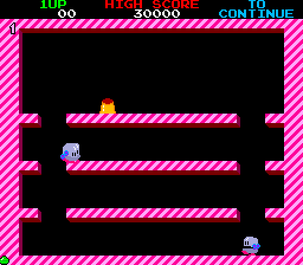

The sequence has a cousin for the *last* enemy. `last_enemy_check` raises `last_enemy_flag` to `$FF` when
the enemy count is 1, and `last_enemy_angry_timer` counts seconds from then: when they exceed the record's
angry time (`[$F]`, 10 seconds in round 1), the flag becomes 1 — the same "angry" value — and the last monster
speeds up. A player who dawdles over the final enemy meets the same monster as one who lets the clock run
out, only sooner.

## Game over

When task 0 wakes to find no players alive it takes the path at `$1F90`. It first confirms that the `RST $00`
vector at `$0004` still points at the boot — the third of the checks in this task — and then clears the
screen, redraws the board, plays the game-over jingle, and calls three routines that chapter 7 described:
`high_score_check` runs the name entry if the score ranks, `results_screen` shows the table and the round bar,
and `game_over_sequence` prints GAME OVER, waits 200 frames, and resets the sound CPU:

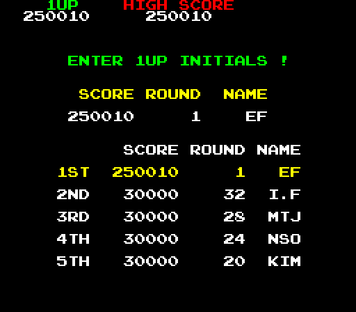

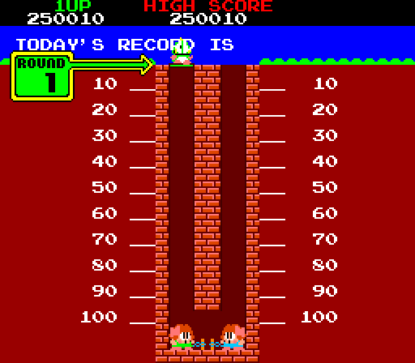

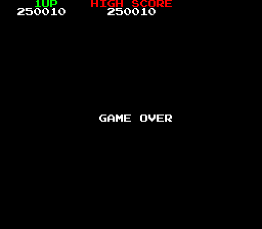

Then `JP loc_1D1E`: the loop at the top of the task, which will start the attract mode if the credits are
gone and the next game if they are not. There is no continue in this game. What looks like one — TO
CONTINUE in the corner during play — is the invitation to a second player.

## Task 1: the attract mode

Task 1 runs whenever task 0 is waiting for a credit, and alternates two phases each time it is started (a bit
in `$E635` remembers which):

* **Title and instructions.** `title_screen` (`$1AED`) draws the logo and cycles its colour every two frames
  for 390 frames — the six palette words at `$1BAE` — while `title_code_input` listens to the joystick (below).
  Then INSERT COIN, in the singular only when both coin slots are set to one coin per credit, and the
  instructions: a one-player demo of the single-platform layout that the ROM keeps as round index 100, with
  the seven lines of "how to play" printed over it in English or Japanese (chapter 7), the last two blinking
  for 360 frames.
* **A demo round.** `attract_demo_round` (`$2EC9`): two players from the recordings of chapter 7 on one of
  the seven demo rounds, 1,320 frames, then a faked game over and the high-score table.

Both phases end by clearing `attract_active` and sleeping, which task 0 reads as the signal to clear all
tasks and start the attract mode again from the other phase. A demo is a real round: task 2 runs it with
`demo_flag` set, which only changes where the inputs come from and skips the parts of the loop — HURRY UP,
the game-over test — that would end it early.

## The codes on the title screen

While the logo cycles, `title_code_input` records every change of the player 1 inputs, up to eight, and when
the eighth arrives compares the buffer with three tables. The bytes are the input latch with the coin bit
masked, so each entry is one control:

| Sequence | On a genuine board | Sets |
| --- | --- | --- |
| BUBBLE JUMP BUBBLE JUMP BUBBLE JUMP RIGHT START | Prints ORIGINAL GAME ... | `$E5D1`, read by `round_flags` |
| LEFT JUMP LEFT START LEFT BUBBLE LEFT START | Prints POWER UP! | `$E5D2`: the fast player of `player_params_special` (chapter 13) |
| START JUMP BUBBLE LEFT RIGHT JUMP START RIGHT | Draws a small logo | `$E5DB`: the super game, without the mode select |

The second table has the sharpest teeth in the program. After the eight bytes match, the code runs five
checks: the MCU's `$37`, a ROM byte, the interrupt vector's target, the sum of the first three ROM bytes, and
the vector itself. If they all pass, it prints ORIGINAL GAME and sets its flag. If any fails, it prints
DEAD COPY GAME !!! and gives the player 100 credits. A pirate testing a bootleg with the cheat everybody knew
would see the credits arrive and the words, and conclude the board was fine; the message was for the
operator who looked over the player's shoulder, and the 100 credits for anyone who preferred not to read.
The strings are held as tile numbers in the bank-1 alphabet, which is why they do not show up in a text
search of the ROM.

## The secret rooms

One more branch of the flow belongs here because task 0 does not know about it. On certain rounds a door
may appear; a player who reaches it is taken to a secret room — the same round
loop, a different map, a treasure of diamonds, a message written in the game's own alphabet, and no enemies:

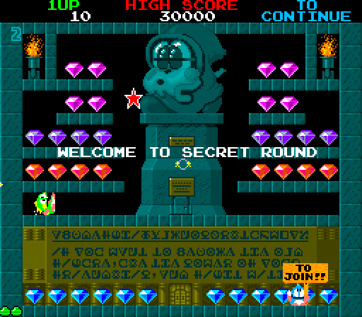

The secret rooms and the warp they give are chapter 18's; from task 0's point of view they are rounds like
any other, and the round counter is simply moved.

# 13. Bub and Bob

The two dragons are two records of fifty bytes at `$E691` and `$E6C3`, a pair of object slots, and one
routine, `player_life_cycle`, that task 3 calls every frame for both of them. Everything the player does —
walking, jumping, blowing, dying — is a function of that record and the input byte the MCU delivered during
the last blanking. This chapter is the record and the parts of the routine that concern walking, blowing and
living; the next two chapters take the jump and the collisions.

## The record

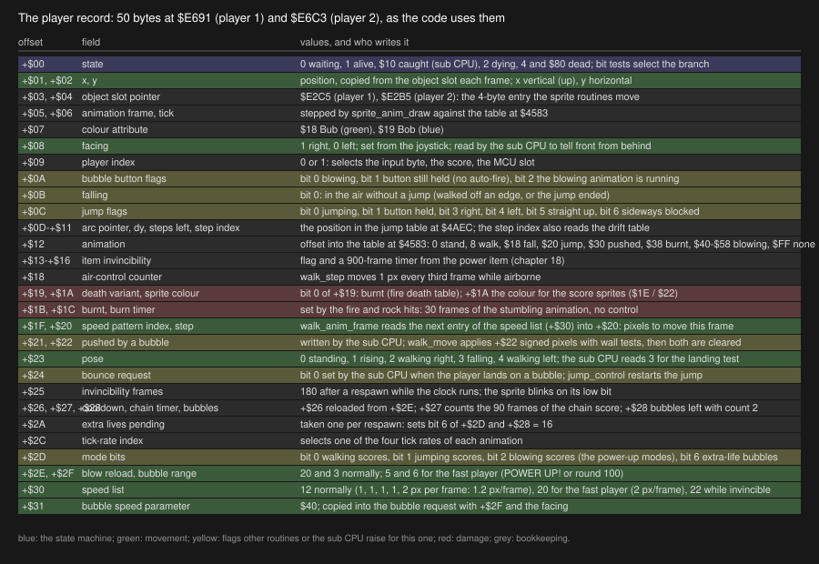

The record is cleared at the start of every round and every life (`player_round_init`, `$3EB4`), and its
constants are put back by `player1_params_init`:

```asm
player_round_init_p1:
3EB4  LD HL,player1_record
3EB7  LD BC,$002A
3EBA  CALL mem_clear
      ...
3EEC  LD HL,$E2C5              ; the object slot
3EEF  LD (IX+$03),L
3EF2  LD (IX+$04),H
3EF5  LD (HL),$18              ; x = 24: standing on the floor
3EF7  INC HL
3EF8  LD (HL),$18              ; attribute: Bub's green
3EFA  INC HL
3EFB  LD (HL),$18              ; y = 24: the left corner
3EFD  INC HL
3EFE  LD (HL),$12              ; tile
3F00  LD HL,mcu_p1_active
3F03  LD (HL),$01              ; tell the MCU there is a player 1
3F05  LD (IX+$09),$00          ; player index
3F09  LD (IX+$08),$01          ; facing right
3F0D  LD (IX+$07),$18
3F11  LD (IX+$1A),$1E
      ...
3F2D  LD HL,(e345_timer_word)  ; is the round clock already running?
3F30  LD A,L
3F31  OR H
3F32  RET Z
3F33  LD (IX+$25),$B4          ; then 180 frames of invincibility
3F37  RET

player1_params_init:
3FC0  LD (IX+$30),$0C          ; speed list 12
3FC4  LD (IX+$2C),$00          ; tick-rate index 0
3FC8  LD (IX+$31),$40          ; bubble speed
3FCC  LD (IX+$2E),$14          ; 20 frames between bubbles
3FD0  LD (IX+$2F),$03          ; bubble range
3FD4  LD (IX+$2D),$00          ; no scoring modes
```

Player 2 is the mirror: the slot at `$E2B5`, `y = $D8` (the right corner), facing left, Bob's blue. The
fast player of the POWER UP! code and of round 100 (`player_params_special`) changes three of the constants:
speed list 20, four frames between bubbles, and range 6.

## The life cycle

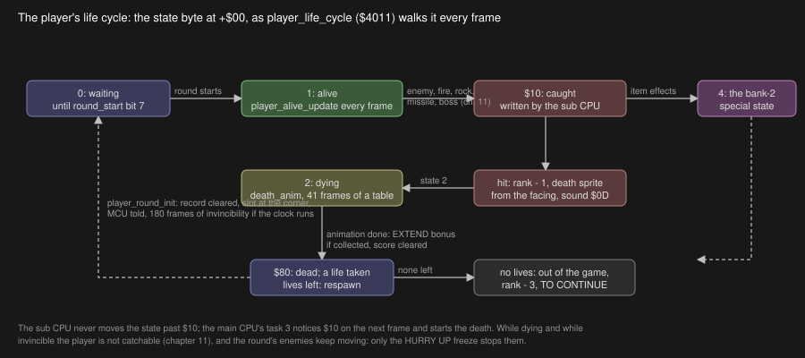

`player_life_cycle` dispatches on the bits of the state byte:

```asm
player_life_cycle:
4011  LD IX,player1_record
4015  LD B,$02
loc_4017:
4017  PUSH BC
4018  LD A,(IX+$00)
401B  BIT 7,A
401D  JP NZ,loc_406F           ; $80: dead, the bank-2 handler
4020  BIT 2,A
4022  JP NZ,loc_4061           ; 4: the bank-2 special state
4025  BIT 0,A
4027  JP NZ,player_alive_update; 1: alive
402A  BIT 1,A
402C  JP NZ,loc_40DF           ; 2: dying
402F  BIT 4,A
4031  JP NZ,loc_407D           ; $10: just caught
4034  LD A,(round_start)       ; 0: waiting for the round to start
4037  AND A
4038  JP P,loc_41D6
      ...
405A  LD (IX+$00),$01          ; alive
405E  JP player_alive_update
```

The transition that matters most is the one the main CPU does not make. State `$10` is written by the sub
CPU (chapter 11) when an enemy, a rock, a missile or the boss is close enough; task 3 finds it on the next
frame and runs the hit:

```asm
loc_407D:
407D  LD C,$01
407F  CALL difficulty_drop     ; the rank drops by 1 for a death
      ...
409D  BIT 0,(IX+$19)           ; burnt?
40A1  JR NZ,loc_40BC
40A3  LD A,(IX+$01)
40A6  ADD A,$07                ; the death sprite starts 7 pixels up ...
40A8  LD (HL),A
      ...
40B1  LD A,(IX+$02)
40B4  SUB $08                  ; ... and 8 to the left
40B6  LD (HL),A
      ...
40D6  LD (IX+$00),$02          ; dying
40DA  LD C,$0D
40DC  CALL sound_queue_push    ; the death sound
```

The dying state runs `death_anim` for 41 frames from a table of `[ticks, tile, tile]` — the dragon spins and
drifts — then takes the consequences: the EXTEND bonus if the letters were complete, the score variables
cleared, a life removed, and either a respawn through `player_round_init` (with the 180 frames of blinking
invincibility if the round clock is running, so that a player who dies mid-round is not caught again on the
spot) or, with no lives left, the player's bit cleared from `players_alive`, the round recorded for the
results screen, and the rank dropped by three more. The invincibility is `[+$25]`, counted down by
`invincible_tick`, and its low bit blanks the sprite every other frame — that is the blink.

## A frame of an alive player

```asm
player_alive_update:
419E  CALL obj_position_from_slot   ; x, y from the object slot into the record
41A1  CALL player_pos_to_mcu        ; ... and to the MCU (chapter 10)
41A4  CALL walk_anim_frame          ; this frame's step from the speed list
41A7  CALL invincible_tick
41AA  CALL jump_control             ; chapter 14
41AD  CALL bubble_blow
41B0  CALL walk_move                ; pushed by a bubble (chapter 11)
41B3  CALL ground_control           ; walking, or falling (chapter 14)
41B6  CALL bubble_anim_timer
41B9  CALL sprite_anim_draw         ; the animation, into the object slot
41BC  LD A,$02
41BE  CALL bank_select
41C1  CALL $854E                    ; special item pickup
41C4  CALL $873E                    ; bonus item pickup
41C7  CALL $91A3                    ; power item pickup
41CA  CALL $8CC7                    ; big item pickup
41CD  CALL $9233                    ; the power effect timer
41D0  CALL bubble_chain_score       ; chain scores from the sub CPU (chapter 16)
41D3  CALL bank_restore
loc_41D6:
41D6  XOR A
41D7  LD (IX+$21),A                 ; the sub CPU's push fields, consumed
41DA  LD (IX+$22),A
41DD  LD (IX+$24),A                 ; and the bounce request
```

The order is the order of authority: the position is taken from the object slot, because the slot is what
was drawn and what the sub CPU tested; the jump is decided before the walk, because a jump in progress
overrides the joystick's sideways control; the animation is drawn last, from whatever the movement decided
the pose is.

## Inputs

`read_inputs`, called by task 2, copies the two MCU bytes `$FC22` and `$FC23` to `$E33F` and `$E340` once
per frame, and `read_input` (`$43B4`) returns the right one for the player in IX. The bits are active low:
bit 0 left, bit 1 right, bit 4 jump, bit 5 bubble, bit 6 start. The joystick's up and down are not read at
all; Bubble Bobble has no ladders and no ducking, and the two bits are ignored everywhere except in the
name entry.

## Walking

Walking is `ground_control` when the player is neither falling nor jumping:

```asm
ground_control:
4246  BIT 0,(IX+$1B)
424A  RET NZ                   ; burnt: no control
424B  BIT 0,(IX+$0B)
424F  JP NZ,fall_control       ; falling: chapter 14
4252  BIT 0,(IX+$0C)
4256  RET NZ                   ; jumping: chapter 14
4257  CALL read_input
425A  BIT 0,A
425C  JR Z,loc_42AD            ; left
425E  BIT 1,A
4260  JR Z,loc_4270            ; right
4262  LD (IX+$23),$00          ; neither: standing
4266  LD A,(IX+$22)
4269  AND A
426A  RET NZ
426B  LD A,$00
426D  JP set_anim              ; animation 0
loc_4270:
4270  CALL set_facing
4273  LD (IX+$23),$02          ; pose 2: walking right
4277  LD A,$08
4279  CALL set_anim            ; animation 8: the walk
427C  LD A,(IX+$20)            ; this frame's step: 0, 1 or 2 pixels
427F  OR A
4280  RET Z
4281  LD B,A
loc_4282:
4282  PUSH BC
4283  CALL obj_position_from_slot
4286  LD A,(IX+$02)
4289  ADD A,$08                ; the cell 8 pixels ahead ...
428B  LD H,A
428C  LD A,(IX+$01)
428F  CALL wall_test           ; ... at the sprite's row
4292  JR Z,loc_42AB            ; solid: stop
4294  CALL wall_test_left3     ; the three cells below
4297  JR NZ,loc_42A5           ; no floor under the next pixel: fall
4299  CALL obj_slot_ptr
429C  INC HL
429D  INC HL
429E  INC (HL)                 ; y + 1 in the object slot
429F  POP BC
42A0  DJNZ loc_4282            ; the next pixel of this frame's step
42A2  JP walk_score
loc_42A5:
42A5  POP BC
42A6  SET 0,(IX+$0B)           ; falling
42AA  RET
```

The speed is not a number but a list. `walk_anim_frame` steps through the list named by `[+$30]` — one
byte per frame, `$FF` wrapping to the start — and puts the byte in `[+$20]`; `ground_control` then moves that
many pixels, one at a time, with the wall tests repeated for each. List 12, the normal player, is `1 1 1 1
2`: six pixels in five frames, 1.2 pixels per frame, 71 pixels a second. The fast player's list 20 is a flat
`2`, and the invincible player's list 22 is `3 2 2 2 2 2 2 2 2 2`. There are forty-two lists in the table at
`$11CE`, most of them for the enemies (chapter 17), and they are why the monsters' speeds can be graded so
finely by the round record: a speed of 12 and a speed of 13 differ by one extra pixel every few frames.

The wall tests are the subject of chapter 15; here it is enough that the cell ahead must be air and one of
the three cells under the sprite must be solid, or the pixel is not taken and, in the second case, the player
falls. The map has no rows above `x = $E0`; up there the air-control routine clamps `y` to `$18-$E7` instead
of testing cells.

## The animation system

The player is always in exactly one of twelve animations, named by an offset into the table at `$4583`:

| Offset | Frames | Tick rates | Used for |
| --- | --- | --- | --- |
| 0 | 2 | 20, 10, 10, 5 | Standing (a slow two-frame idle) |
| 8 | 4 | 5, 3, 3, 2 | Walking |
| `$10` | 2 | 10, 6, 6, 4 | (spare) |
| `$18` | 2 | 10, 6, 6, 4 | Falling |
| `$20` | 2 | 10, 6, 6, 4 | Jumping |
| `$28` | 3 | 8, 6, 6, 5 | (spare) |
| `$30` | 3 | 8, 6, 6, 5 | Being pushed by a bubble |
| `$38` | 2 | 10, 8, 8, 7 | Burnt |
| `$40`, `$48`, `$50`, `$58` | 4 | 3, 2, 2, 2 | Blowing, one-shot: standing, walking, falling, jumping variants |

Each entry is eight bytes: the frame count, four tick rates of which `[+$2C]` picks one, a pointer to the
tiles, and flags — bit 0 marks a one-shot animation that ends with `[+$12] = $FF`, bit 1 a list of tile
numbers rather than a base. `sprite_anim_draw` advances the tick and the frame and writes the tile into the
object slot through `draw_sprite_2x2` or its flipped twin, chosen by the facing byte; the tile of a frame is
the base plus four times the frame number, which is how the tile ROM is laid out (chapter 4). The four tick
rates are a design allowance that the shipped game barely uses: `[+$2C]` is set to 0 and stays there.


`set_anim` refuses to change the animation while a one-shot is playing (`[+$0A]` bit 2), which is what keeps
the blowing pose on screen for its full four frames while the player keeps walking underneath it.

## Blowing bubbles

```asm
bubble_blow:
4B75  BIT 0,(IX+$0A)
4B79  JP NZ,loc_4C02           ; already blowing: count the cooldown
4B7C  CALL read_input
4B7F  BIT 5,A
4B81  JR Z,loc_4B88            ; button down
4B83  RES 1,(IX+$0A)           ; button up: arm it again
4B87  RET
loc_4B88:
4B88  BIT 1,(IX+$0A)
4B8C  RET NZ                   ; still held from last time: nothing
4B8D  LD A,(mcu_ready)
4B90  AND $25
4B92  JR NZ,loc_4B95
4B94  PUSH BC                  ; the MCU byte has the wrong bits: unbalance the stack
loc_4B95:
4B95  LD HL,bubble_request_p1  ; $E75E (player 2: $E764)
      ...
4BA1  LD A,$01                 ; count 1 ...
4BA3  BIT 6,(IX+$2D)
4BA7  JR Z,loc_4BB3
4BA9  DEC (IX+$28)             ; ... or 2 for an extra-life bubble
      ...
4BB3  LD (HL),A
4BB5  LD A,(IX+$01)
4BB8  LD (HL),A                ; x
4BBA  LD A,(IX+$02)
4BBD  LD (HL),A                ; y
4BBF  LD A,(IX+$08)
4BC2  LD (HL),A                ; facing
4BC4  LD A,(IX+$31)
4BC7  LD (HL),A                ; speed
4BC9  LD A,(IX+$2F)
4BCC  LD (HL),A                ; range
4BCD  LD B,$0D
4BCF  LD HL,$4C1A              ; the blowing variant of the current animation
      ...
4BDE  CALL set_anim
4BE1  LD HL,bubbles_blown
4BE4  INC (HL)
4BE5  BIT 2,(IX+$2D)
4BE9  LD DE,$0010
4BEC  CALL NZ,score_add_player ; 10 points in the power-up mode
4BEF  LD A,(IX+$2E)
4BF2  LD (IX+$26),A            ; the cooldown
4BF5  SET 1,(IX+$0A)
4BF9  SET 0,(IX+$0A)
4BFD  SET 2,(IX+$0A)
4C01  RET
```

A bubble is a request: six bytes at `$E75E` for player 1 or `$E764` for player 2 — count, position, facing,
speed, range — that the bubble task (chapter 16) picks up in its own frame and turns into a record. The player
code never touches a bubble after that. The button must be released between bubbles (`[+$0A]` bit 1), and
the cooldown of twenty frames (`[+$2E]`, four for the fast player) is what limits a player to three bubbles a
second; the fast player's twelve a second, with range 6, is the difference the POWER UP! code makes.

## What goes out, what comes back

Every frame the player sends two bytes to the MCU — its position — and nothing else. It reads nothing back:
the MCU's geometry is for the enemies. What the player does read, in the frame after they are written, are
the sub CPU's bytes in its own record: the state `$10`, the push fields `[+$21]`, `[+$22]` that
`walk_move` turns into motion with the same wall tests as walking, the bounce request `[+$24]`, and the
burnt flags. The bank-2 pickup routines that follow the movement are the only object-against-object tests
the main CPU makes on the player's behalf: an item within fourteen pixels (twenty-four for the big items) is
collected, scored and its effect started (chapter 18).

Lives are two bytes at `$E645` and `$E64A`, drawn by `lives_display` as up to five small dragons along the
bottom of the screen; the extra-life thresholds of chapter 7 raise them through `add_score`, and the
respawn takes one. The player's position is never bounds-checked against the enemies by the main CPU, its
sprite is never compared with anything but the map, and its death is a byte it did not write. That division
is the subject of chapter 15.

# 14. Jumping, falling and riding

A jump in Bubble Bobble is a table. The player rises forty-two pixels along a fixed arc, drifts sideways on
the steps a second table marks, passes up through platforms and lands on the first one whose cells are
solid under the sprite's feet on the way down. There is no velocity and no gravity anywhere in the program:
what feels like an arc is a list of sixty-one numbers read one per step, and what feels like weight is the
number of steps taken per frame.

## Starting a jump

```asm
jump_control:
4868  BIT 0,(IX+$0B)
486C  JR NZ,loc_4874           ; falling
486E  BIT 0,(IX+$0C)
4872  JR Z,loc_4894            ; not jumping: may we start one?
loc_4874:
4874  BIT 0,(IX+$24)           ; landed on a bubble (the sub CPU)?
4878  JR Z,loc_488D
487A  RES 0,(IX+$24)
487E  CALL read_input
4881  BIT 4,A
4883  JR NZ,loc_488D           ; button not held: no bounce
4885  LD DE,$0001
4888  CALL score_add_player    ; a bounce is worth one point
488B  JR loc_48A5              ; and restarts the jump
loc_488D:
488D  BIT 0,(IX+$0B)
4891  RET NZ                   ; falling: nothing
4892  JR loc_4911              ; jumping: continue below
loc_4894:
4894  CALL read_input
4897  BIT 4,A
4899  JR Z,loc_48A0            ; button down
489B  RES 1,(IX+$0C)           ; button up: arm
489F  RET
loc_48A0:
48A0  BIT 1,(IX+$0C)
48A4  RET NZ                   ; still held: no auto-jump
loc_48A5:
48A5  LD C,$2C
48A7  CALL sound_queue_push    ; the jump sound
48AA  LD (IX+$0C),$00
48AE  SET 1,(IX+$0C)
      ...
48BA  BIT 1,(IX+$2D)
48BE  LD DE,$0050
48C1  CALL NZ,score_add_player ; 50 points in the power-up mode
48C4  SET 0,(IX+$0C)           ; jumping
48C8  LD HL,jumps_count
48CB  INC (HL)
48CC  CALL read_input
48CF  BIT 0,A
48D1  JR Z,loc_48DD            ; left held
48D3  BIT 1,A
48D5  JR Z,loc_48E3            ; right held
48D7  SET 5,(IX+$0C)           ; neither: straight up
48DB  JR loc_48E7
loc_48DD:
48DD  SET 4,(IX+$0C)           ; to the left
48E1  JR loc_48E7
loc_48E3:
48E3  SET 3,(IX+$0C)           ; to the right
loc_48E7:
48E7  LD HL,$4AEC              ; the arc table
48EA  LD (IX+$0D),L
48ED  LD (IX+$0E),H
48F0  LD A,(HL)
48F1  LD (IX+$0F),A            ; dy of the first segment
48F4  INC HL
48F5  LD A,(HL)
48F6  LD (IX+$10),A            ; its length
48F9  INC HL
48FA  LD A,(HL)
48FB  CALL set_anim            ; its animation
48FE  LD (IX+$11),$00          ; step 0
      ...
490D  RES 0,(IX+$0B)
loc_4911:
4911  CALL set_facing
4914  CALL walk_step           ; air control: 1 pixel every third frame
4917  LD A,(IX+$20)            ; this frame's step count from the speed list
491A  OR A
491B  RET Z
491C  LD B,A
loc_491D:
491D  PUSH BC
491E  CALL jump_physics        ; one step of the arc
4921  POP BC
4922  DJNZ loc_491D
4924  RET
```

The direction of a jump is fixed at take-off. Whichever way the stick is held when the button goes down
becomes bit 3 or 4 of `[+$0C]`, or bit 5 for a vertical jump, and the drift follows that bit for the whole
arc; the stick can only add the slow air control of `walk_step`, one pixel every third frame. This is the
Bubble Bobble jump everyone remembers: committed, and steerable only a little.

## The arc

```
jump_arc_table:   ; [dy, steps, animation] until $80
4AEC  02 10 20    ; +2 pixels for 16 steps, animation $20 (jumping)
4AEF  01 09 20    ; +1 for 9
4AF2  00 02 20    ; hover
4AF5  01 01 20
4AF8  00 02 20
4AFB  00 03 18    ; the top, animation $18 (falling)
4AFE  FF 01 18    ; -1
4B01  00 02 18
4B04  FF 09 18    ; -1 for 9
4B07  FE 10 18    ; -2 for 16
4B0A  80          ; end
```

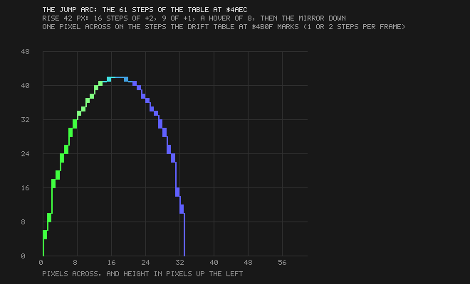

`jump_physics` executes one step: it sets the pose (1 while `dy` is positive, 3 while it is negative), runs
the side tests of chapter 15 on the moving side, then adds `dy` to the slot's `x` and, if the drift table
says so for this step number and nothing has blocked the side, one pixel to `y`:

```asm
loc_4A7D:
4A7D  CALL obj_slot_ptr
4A80  LD A,(IX+$0F)
4A83  ADD A,(HL)               ; x += dy
4A84  LD (HL),A
4A85  BIT 5,(IX+$0C)
4A89  JR NZ,loc_4AAA           ; a vertical jump: no drift
4A8B  BIT 6,(IX+$0C)
4A8F  JR NZ,loc_4AAA           ; blocked at the side: no drift
4A91  INC HL
4A92  INC HL
4A93  LD A,(IX+$11)
4A96  LD DE,$4B0F              ; the drift table
4A99  CALL de_add_a
4A9C  LD A,(DE)
4A9D  OR A
4A9E  JR Z,loc_4AAA            ; 0: not this step
4AA0  BIT 3,(IX+$0C)
4AA4  JR NZ,loc_4AA9
4AA6  DEC (HL)                 ; y - 1
4AA7  JR loc_4AAA
loc_4AA9:
4AA9  INC (HL)                 ; y + 1
loc_4AAA:
4AAA  INC (IX+$11)             ; next step
4AAD  DEC (IX+$10)
4AB0  JR NZ,loc_4AD3           ; more of this segment
      ...                      ; else the next segment, or $80: the jump is over
loc_4ADF:
4ADF  SET 0,(IX+$0B)           ; falling from here
```

The drift table is sixty-one bytes of ones and zeros, with a one on about two steps in three — sparser at
the beginning and the end of the arc, denser in the middle — so a jump covers about thirty-three pixels
across for forty-two up. Because the arc is walked in steps and the player takes as many steps per frame as
the speed list gives (one, or two on every fifth frame), the whole rise takes twenty-seven frames and a
fast player's jump is the same shape at a different speed.

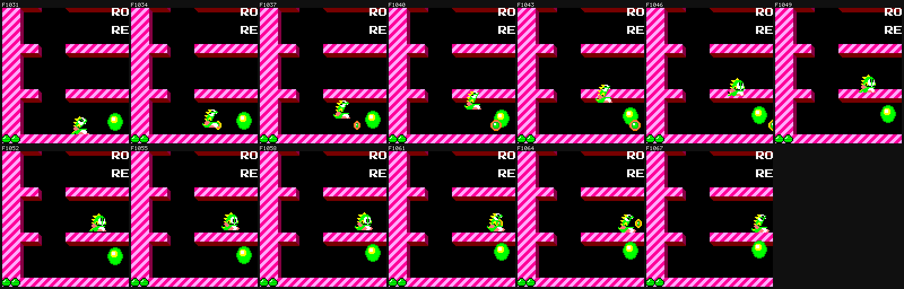

The traced jump above began at `x = 32`, reached `x = 74` at its top after 27 frames, and landed on the
first platform at `x = 72` two steps into its descent.

## Through the platforms

Nothing in `jump_physics` stops a rising player: the tests on the way up concern the sides only. The
platforms are one-way because of what the landing test asks for. On the way down, at every step where `x`
is a multiple of eight, the code looks at the three cells of the sprite's own lower row and at the three
below it:

```asm
loc_4A3E:
4A3E  BIT 7,(IX+$0F)
4A42  JP Z,loc_4A7D            ; rising: no landing test
4A45  LD A,(IX+$01)
4A48  AND $07
4A4A  JR NZ,loc_4A7D           ; not on a cell boundary: not yet
4A4C  LD H,(IX+$02)
4A4F  LD A,(IX+$01)
4A52  CALL wall_test           ; the cell at (x, y)
4A55  JR Z,loc_4A7D            ; solid: we are inside a platform, keep going
4A57  LD A,(IX+$02)
4A5A  SUB $07
4A5C  LD H,A
4A5D  LD A,(IX+$01)
4A60  CALL wall_test           ; (x, y - 7)
4A63  JR Z,loc_4A7D
4A65  LD A,(IX+$02)
4A68  ADD A,$07
4A6A  LD H,A
4A6B  LD A,(IX+$01)
4A6E  CALL wall_test           ; (x, y + 7)
4A71  JR Z,loc_4A7D
4A73  CALL wall_test_left3     ; the three cells under the sprite
4A76  JR NZ,loc_4A7D           ; all air: keep falling
4A78  SET 0,(IX+$0B)           ; a floor: land
4A7C  RET
```

A player whose lower half overlaps a platform is inside it and passes through; one whose lower half is
clear with solid cells beneath has landed. The same test, in `fall_control`, governs a plain fall, and it is
why a jump that reaches a platform's height exactly at a cell boundary lands on it and one that is a pixel
short passes up through it and comes down on top: the test only fires on multiples of eight, so the sprite
snaps to the grid on landing.

## Falling

```asm
fall_control:
42E2  CALL rom_check_walker_0ae3
42E5  LD (IX+$23),$03          ; pose 3
42E9  LD A,$18
42EB  CALL set_anim            ; the falling animation
42EE  LD A,(IX+$20)
42F1  OR A
42F2  RET Z
42F3  LD B,A                   ; this frame's pixels
loc_42F4:
42F4  PUSH BC
42F5  CALL obj_position_from_slot
42F8  LD A,(IX+$01)
42FB  CP $20
42FD  JR C,loc_4312            ; below the map: keep falling
42FF  CP $E0
4301  JP NC,loc_4312           ; above it: keep falling
4304  AND $07
4306  JR NZ,loc_4312           ; not on a boundary
4308  CALL wall_test_here3     ; the sprite's own row
430B  JR Z,loc_4312            ; inside a platform
430D  CALL wall_test_left3     ; the row below
4310  JR Z,loc_4325            ; a floor: land
loc_4312:
4312  CALL obj_slot_ptr
4315  DEC (HL)                 ; x - 1
4316  JR NZ,loc_431C
4318  LD HL,fell_through_count ; x reached 0: through the bottom
431B  INC (HL)
loc_431C:
431C  POP BC
431D  DJNZ loc_42F4
431F  CALL walk_step           ; air control
4322  JP set_facing
loc_4325:
4325  POP BC
4326  LD (IX+$0B),$00          ; landed
432A  LD A,(IX+$0C)
432D  AND $02
432F  LD (IX+$0C),A            ; keep only "button held"
4332  RET
```

A fall is one pixel per step at the speed list's rate — the same 1.2 pixels a frame as walking. There is no
terminal velocity because there is no velocity; a long fall takes as long as the distance divided by the
walking speed. When `x` counts down through zero the slot's byte wraps to 255 and the sprite reappears at
the top of the plane, still falling: the bottom of every round is open, and the round's top border rows are
air in the map wherever the designers wanted the wrap to work (chapter 6).

## Bouncing and riding

The sub CPU's landing window (chapter 11) sets `[+$24]` when a falling player is twelve to twenty-one pixels
above a bubble. `jump_control` reads it at the top of the next frame: with the jump button held the arc is
restarted from where the player is — a bounce, worth one point — and with the button up the request is
simply cleared, and the player keeps falling onto the bubble, which the sub CPU has meanwhile pushed down
(`[$1B] = 4` in the bubble's record) so that the player appears to ride it for a moment before the fall
resumes. Bouncing repeatedly across a field of bubbles is the technique the instructions call "YOU CAN JUMP
OVER BUBBLES", and it is one flag, one table restart and one point per bounce.

A player carried by a bubble the other way — pushed sideways by a bubble drifting into it while it stands
still — is `walk_move`: the sub CPU writes the displacement into `[+$22]` and `walk_move` applies it a pixel
at a time with the same wall tests as walking, in the "pushed" animation. Neither routine knows about
bubbles; they know about a byte in their own record, written by another processor.

# 15. Collision

Three processors answer three different questions about what touches what, and none of them asks the
others. The main CPU asks the map: is this pixel inside a wall? The sub CPU asks the records: are these two
objects within so many pixels of each other? The MCU asks, for the enemies only, which way and how far to
the player. This chapter is the first question in detail — the wall tests every mover uses — and the
division of the other two.

## The wall test and its family

Chapter 6 printed `wall_test` (`$174C`): given `x` in A and `y` in H it returns the nibble of the collision map
for the cell containing that pixel, zero for solid. Every object test in the main program is built from it,
through a family of helpers that take the position from the record in IX and offset it by a cell or a
half-sprite:

| Routine | Cells tested | Asks |
| --- | --- | --- |
| `wall_test_left3` (`$1676`) | `(x - 8; y - 7, y, y + 7)` | Is there a floor under the sprite? (Z = one of the three is solid) |
| `wall_test_here3` (`$169F`) | `(x; y - 7, y, y + 7)` | Is the sprite's own lower row clear? |
| `wall_test_below` (`$15E9`) | `(x + 8, y + 8)` and `(x, y + 8)` | Is the column to the right clear at the sprite's height? |
| `wall_test_above` (`$1604`) | `(x + 8, y - 8)` and `(x, y - 8)` | ... and to the left? |
| `wall_test_right` (`$161F`) | `(x + 8, y)`, unless `x + 8` is in `$D8-$DF` | Is the cell above solid? |
| `wall_test_left` (`$166B`) | `(x - 8, y)` | Is the cell below solid? |

The names come from the disassembly, and they are wrong in an instructive way: they were given by someone
reading `IX+1` as a horizontal coordinate, as it would be in almost any other program. In Bubble Bobble
`IX+1` is `x`, the vertical coordinate that grows upward, and `IX+2` is `y`, the horizontal one (chapter 5).
So `wall_test_below` looks to the *right*, `wall_test_left3` looks *down*, and the helper the walking
code calls to find the floor is the one named for the left. The names are kept in this article because they
are the names in the listings; the table above says what each one does.

The geometry is the sprite's. A player or a monster is sixteen pixels square with its record position at its
centre. Three cells at `y - 7`, `y` and `y + 7` cover its width; three rows at `x - 8`, `x` and `x + 8` cover
its height; the cell at `x - 8` is the row under its feet, and the cell at `x` is the row of its lower half.


## What each movement asks

Put together from chapters 13 and 14, the rules a player lives by:

* **Walking**: for each pixel of this frame's step, the cell one cell ahead of the sprite's lower half must be
  air (a wall stops the step), and one of the three cells under the feet must be solid (no floor starts a
  fall). The upper half of the sprite is not tested: the dragon's head passes under an overhang that its feet
  would stop at, and this is why the platforms can be stacked with only two cells of clearance.
* **Falling**: at every step where `x` is a multiple of eight, the sprite's lower row must be clear and the
  row beneath solid to land. Inside a platform, fall on. Outside the map's rows (`x` below `$20` or from
  `$E0` up) there is nothing to land on.
* **Jumping**: on the moving side, the three cells at `y ± 9` and `x - 8`, `x`, `x + 8` are tested each step;
  a solid one sets the blocked bit and the drift stops for the rest of the arc, but the rise continues. On the
  way down the falling rule applies.
* **Air control**: `walk_step`'s sideways pixel is refused if any of the three cells at `y ± 8` is solid, and at
  the top of the plane (`x` at or above `$E0`, where the map has no rows) `y` is clamped to `$18-$E7` instead.

The enemies use the same family with their own offsets, and the bubbles use `wall_test` directly to read the
currents (chapter 16). One function and one map, read a few hundred times a frame, is the whole of the
geometry the main CPU keeps for itself.

## Who decides what


The main CPU never compares two objects' positions to decide a touch — with one family of exceptions. The
item pickups of bank 2 (`special_item_pickup`, `bonus_item_pickup`, `big_item_pickup`, `power_item_pickup`)
test the player against an item with a fourteen- or twenty-four-pixel window, because items are few, appear
one at a time, and are handled in the same task as the player that collects them. Everything else — every
enemy against every player, every bubble against every player and every other bubble, every projectile —
is the sub CPU's, and the enemy AI's "where is the player" is the MCU's.

The reason is arithmetic. The sub CPU's bubble pass alone runs to fifty thousand cycles on a busy frame
(chapter 11), half of the main CPU's whole frame budget; the main CPU with the same work would have had
nothing left for the game. The reason it *could* be moved is the shape of the data: the tests need only
positions and flags, both of which live in shared RAM, and their results are a byte per object that the
owner acts on later. Taito's designers drew the line where it cost nothing to cross.

## Which frame

The cost of the division is a frame of latency, and the game is built around it:

1. During frame N, the main CPU's tasks move everything and write the positions into the records and the
   object slots.
2. At the VBLANK that ends frame N, the sub CPU reads those positions and writes its flags; the MCU reads the
   enemy records and the player positions and writes its geometry.
3. During frame N + 1, task 3 finds a player's state at `$10` and starts the death, task 4's enemies read the
   MCU's direction bytes and the touch bytes, task 5's bubbles find their push fields and the pop event.

So a monster that walks into a player during frame N kills it during frame N + 1, and the game shows the
touch one picture before the death. Nobody notices, because a sixtieth of a second is below what a player
can see, and because every other latency in the machine is the same: the joystick read at one VBLANK moves
the dragon in the next frame, the sound sent in one frame plays in the next. The one place where the
latency is visible in the design is the sub CPU's landing window of twelve to twenty-one pixels above a
bubble (chapter 11): wide, because the player falls one or two pixels per step and the test is a frame old
when the main CPU acts on it.

## The hit that the main CPU makes itself

There is one touch test on the player that bank 2 performs directly, and it shows what the others would
have looked like. `fire_vs_player` (`2:$BAB5`) tests a player against the floor fire of a fire bubble
(chapter 18) with an eight-pixel window through `find_player_near`, and on a hit calls `player1_burn`
(`$4B50`). The traced sessions never reached it — the fire is the player's own weapon and the players kept
out of it — but the routine is there:

```asm
player1_burn:
4B50  LD HL,$E6AC              ; [+$1B] of player 1
loc_4B53:
4B53  BIT 0,(HL)
4B55  RET NZ                   ; already burning
4B56  SET 0,(HL)
4B58  INC HL
4B59  LD (HL),$1E              ; 30 frames
4B5B  RET
```

Thirty frames of the burnt animation with no control, and no death: the floor fire stuns. The fire *shots* of
the fire-breathing monsters, and the rocks, are the sub CPU's: its `player1_burnt` writes the state `$10`
and the burnt flag `[+$19]`, and the death that follows uses the second of the two death tables — the
scorched dragon rather than the spinning one. Two routines with almost the same name, on two processors,
with two different outcomes, are the clearest sign in the program of where the collision work was split and
where a little of it stayed behind.

# 16. Bubbles

Everything in Bubble Bobble that is not a wall, a player or a monster is a bubble record. Twenty-four of them,
forty bytes each, from `$E76C`: the bubbles the players blow, the bubbles the round itself releases, the
water, fire and lightning bubbles, the EXTEND letters, the burst that a popped bubble leaves behind, and
the fruit that a popped monster falls as. Task 5 walks the twenty-four every frame and dispatches on a state
byte; the sub CPU walks them again during the blanking and writes back what touched what. This chapter is
the life of a bubble from the button press to the points.

## The record

| Offset | Field |
| --- | --- |
| `+$00` | State: 1 floating, 2 in flight, 4 holding an enemy, 8 an EXTEND letter, `$10` special (water, fire, lightning), `$20` a lightning bolt, `$40` a falling fire, `$80` popping; 0 free |
| `+$01`, `+$02` | x, y, copied from the object slot |
| `+$03`, `+$04` | The object slot: `$E20D + 4n` |
| `+$07` | The slot code for the sprite routines |
| `+$0A` | The last current nibble read from the map |
| `+$0B` | Bit 0: counted out of `bubbles_active` already |
| `+$0C`, `+$0D` | Lifetime: a 60-frame tick and the number of periods left |
| `+$0E` | Phase: 0 and 1 the owner's colour (Bub green, Bob blue), 2 and 3 the ageing colours, `$FF` = pop now |
| `+$0F` | Direction: 1 right, 3 left, 0 up, 2 down; also the sub CPU's push mode |
| `+$10`-`+$12` | The flight: range left in `+$12` |
| `+$13`, `+$14` | Pending vertical and horizontal displacement, written by the sub CPU (crowding, pushing) |
| `+$15` | The caught enemy's record index |
| `+$16` | The owner: player 0 or 1, also written by the sub CPU when a player claims the bubble |
| `+$17` | The EXTEND letter, 0-5 |
| `+$18` | The special kind: 1 fire, 2 water, 3 lightning |
| `+$19` | The caught enemy's tile set (type x 4) |
| `+$1A` | The sub CPU's claim: the bubble's state bit while a player touches it, bit 2 = popped by a player |
| `+$1B` | Bob offset: 4 or 8 while a player stands on it |
| `+$1D` | Group: the record index, used by the chain pop |
| `+$1F` | Flight speed, pixels per frame |
| `+$20`, `+$21` | Animation flags; `+$21` bit 7 a killer bubble, bit 5 and 6 the two kinds of item |
| `+$22` | Place in the chain, from the sub CPU |
| `+$23`, `+$24` | The drift: this frame's step count and the index into the speed list |
| `+$25`, `+$26` | Animation counters; `+$26` bit 5 and 6 the sub CPU's "collected" flags for items |

## Blowing

The player's six-byte request (chapter 13) is picked up by the first free record that `bubble_update` reaches:

```asm
bubble_spawn_from_request:
6349  LD HL,bubble_request_p1  ; $E75E
634C  LD A,(HL)
634D  AND A
634E  JR Z,loc_6357            ; player 1 has not asked: try player 2
6350  LD (IX+$16),$00          ; owner
6354  JP loc_6364
      ...
loc_6364:
6364  PUSH HL
6365  INC HL
6366  LD A,(HL)
6367  AND $F8                  ; x, rounded to the cell
6369  LD E,A
636A  LD (IX+$01),E
636D  INC HL
636E  LD A,(HL)
636F  AND $FE                  ; y, rounded to even
6371  LD D,A
6372  LD (IX+$02),D
6375  INC HL
6376  LD A,(HL)
6377  LD (IX+$0F),A            ; the facing: the flight direction
637A  INC HL
637B  LD A,(HL)
637C  LD (IX+$12),A            ; range: 64 pixels
637F  INC HL
6380  LD A,(HL)
6381  LD (IX+$1F),A            ; speed: 3 pixels per frame
      ...
6394  CALL bubble_phase_from_owner
6397  CALL bubble_random_lifetime
639A  LD HL,bubbles_active
639D  INC (HL)
      ...
63B0  LD (IX+$11),$01
63B4  LD (IX+$00),$02          ; in flight
63B8  LD C,$31
63BA  CALL sound_queue_push    ; the blow sound
```

A new bubble starts where the dragon's mouth is and flies in the facing direction at three pixels a frame
for sixty-four pixels — twenty-one frames — while `bubble_in_flight` looks for an enemy within fourteen
pixels every frame with `find_enemy_near`. The fast player's range of 6 doubles the distance. During the
flight the bubble is drawn from the growing frames at the start of the bubble tile set; when the range is
used up it becomes a floating bubble (state 1), or, if its owner has a lightning charge from the lightning
item, a lightning bubble.

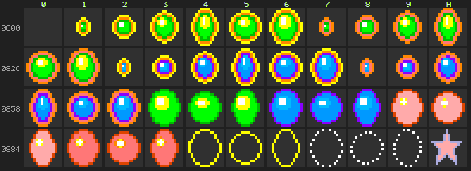

## Floating

A floating bubble does two things every frame: it bobs, and it drifts. The bob is `bubble_rise_draw`: a
six-frame counter that selects the tile from the phase's set, with the sub CPU's `[+$1B]` — 4 or 8 while a
player stands on the bubble — added to pick the squashed frames. The drift is the air:

```asm
bubble_drift:
6143  LD A,(mcu_bubble_speed)  ; $FC76: the round's speed list
6146  LD HL,$11CE
6149  CALL table_lookup_de
614C  LD A,(IX+$24)
614F  CALL de_add_a
6152  LD A,(DE)                ; this frame's number of steps
6153  OR A
6154  JP P,loc_615D
6157  LD (IX+$24),$00          ; $FF: wrap the list
615B  JR bubble_drift
loc_615D:
615D  LD (IX+$23),A
6160  INC (IX+$24)
6163  LD A,(IX+$23)
6166  OR A
6167  RET Z
6168  LD B,A
loc_6169:
6169  PUSH BC
616A  CALL obj_position_from_slot
616D  CALL bubble_current_step ; one pixel along the current
6170  POP BC
6171  DJNZ loc_6169
6173  RET

bubble_current_step:
6174  LD A,(IX+$0A)            ; the current nibble under the bubble
6177  LD HL,$61F3
617A  CALL table_lookup_de
617D  EX DE,HL
617E  JP (HL)                  ; 0, 1, 7-15: up; 2: right; 3: left; 4: down; 5, 6: hold
```

The speed list is the same table the players and enemies use (chapter 13); the round record's byte `[9]`
names it, and the bubble task keeps the number in `$FC76`, one of the MCU's shared bytes, where the MCU
mistakes it for a sequence-list selector (chapter 10). Each step is one pixel in the direction of the current
nibble the bubble last read from the collision map. The map is re-read only when the bubble is aligned to a
cell on the axis it is moving along — `AND $07` on `x` or `y` — so a bubble commits to a cell's direction until
it has crossed the cell. Nibble 0 and 1, plain air, mean *up*, which is why bubbles rise; 2 and 3 are the
horizontal currents, 4 pushes down, and 5 and 6 hold the bubble in place. Chapter 6's maps are, read this way,
diagrams of where bubbles will go: up through the open air, along the ceiling currents, down the shafts and
round the loops that bring them back to the players.

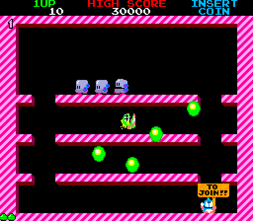

Two more things move a bubble. `bubble_apply_move` applies the displacement the sub CPU left in `[+$13]`
and `[+$14]` — a neighbour crowding it, a player pushing it — with a wall test on each axis and undoes the
axis that is blocked. And a bubble that drifts off the top or bottom edge is tested against the layout byte's
corner bits (`bubble_edge_test`): where the round's corners are open it is simply freed, which is how
bubbles leave a round with an open ceiling.

## Lifetime and ageing

```asm
bubble_random_lifetime:
6213  LD A,(mcu_bubble_speed)
6216  LD HL,$6229              ; a base per speed list: 8 periods for the slow lists down to 3
6219  CALL hl_add_a
621C  LD A,R                   ; the refresh register: a random 0-7
621E  AND $07
6220  ADD A,(HL)
6221  LD (IX+$0D),A            ; periods
6224  LD (IX+$0C),$01
6228  RET

bubble_lifetime:
60B5  DEC (IX+$0C)
60B8  JP NZ,loc_60CD
60BB  LD (IX+$0C),$3C          ; a period is 60 frames
60BF  DEC (IX+$0D)
60C2  LD A,(IX+$0D)
60C5  CP $FF
60C7  RET NZ
60C8  LD (IX+$0E),$FF          ; out of periods: pop
60CC  RET
loc_60CD:
60CD  LD A,(IX+$0D)
60D0  CP $04
60D2  RET NC                   ; more than three periods left: the owner's colour
60D3  OR A
60D4  JR Z,loc_60E1
60D6  LD HL,$60EE              ; 3, 2, 1 periods left: phases 3, 3, 2 ...
60D9  CALL hl_add_a
60DC  LD A,(HL)
60DD  LD (IX+$0E),A
60E0  RET
loc_60E1:
60E1  LD A,$02                 ; the last period: phase 2 or 3, blinking on a lifetime bit
```

A bubble lives a random eight to fifteen seconds in round 1 (the base of its speed list plus the Z80's refresh
register masked to three bits), and for its last three seconds it changes colour through the ageing phases —
green or blue to pink to red — and then bursts on its own. The refresh register is the game's second random
source (chapter 20); it makes two bubbles blown in the same frame live different lengths.

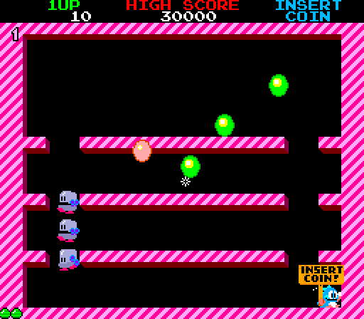

## Catching

```asm
bubble_in_flight:
5D95  LD E,(IX+$01)
5D98  LD D,(IX+$02)
5D9B  LD C,$0E
5D9D  CALL find_enemy_near     ; an enemy within 14 pixels?
5DA0  JP C,bubble_catch
      ...
bubble_catch:
5DE4  LD (IX+$15),B            ; which enemy
5DE7  LD (HL),$80              ; its record: caught
5DE9  INC HL
5DEA  INC HL
5DEB  INC HL
5DEC  LD A,(HL)
5DED  ADD A,A
5DEE  ADD A,A
5DEF  LD (IX+$19),A            ; type x 4: the tile set
5DF2  CALL bubble_phase_from_owner
5DF5  CALL obj_slot_attr_15
5DF8  CALL bubble_current_read
5DFB  LD A,(round_caught_lifetime)  ; the round record's [7], adjusted by the rank
5DFE  LD (IX+$0D),A
6001  LD (IX+$0C),$01
6005  CALL obj_anim_reset
6008  LD (IX+$1A),A
600B  LD (IX+$00),$04          ; holding an enemy
```

Only a bubble in flight catches. The test is the main CPU's own, one of the few object tests it makes: a
fourteen-pixel window over the seven enemy records, run every frame of the flight. On a catch the enemy's
record byte becomes `$80` — the enemy driver (chapter 17) sees it and stops driving — and the bubble's
lifetime is replaced by the round's hold time, thirty periods in round 1 less the rank adjustment of chapter
12. The bubble now floats like any other, drawn from the caught-enemy sets:

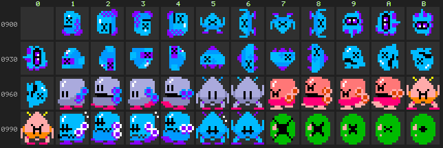

`bubble_with_enemy` watches five situations that let the enemy out unharmed — the round ending, a
release flag, a player dying, the bonus round flag, the HURRY UP release — and two that end the hold. If the
lifetime runs out, the enemy escapes: its record becomes `$20` at the bubble's position, and the driver
brings it back angry. If the sub CPU has marked the bubble as popped by a player (`[+$1A]` bit 2), the enemy
dies:

```asm
bubble_popped_with_enemy:
5E65  LD DE,$0100
5E68  CALL bubble_score        ; 1000 points to the owner
loc_5E6B:
5E6B  LD A,(IX+$15)
      ...
5E76  LD (HL),$40              ; the enemy's record: dead, falling as an item
5E78  INC HL
5E79  LD A,(IX+$01)
5E7C  LD (HL),A                ; at the bubble's x
5E7D  INC HL
5E7E  LD A,(IX+$02)
5E81  LD (HL),A                ; and y
5E82  INC HL
5E83  LD A,(IX+$22)
5E86  LD (HL),A                ; and its place in the chain: which fruit
5E87  LD HL,enemy_count
5E8A  DEC (HL)
5E8B  LD C,$25
5E8D  CALL sound_queue_push
5E90  JP bubble_start_pop
```

The enemy count is the round's exit condition (chapter 12), so this `DEC` is what ends a round. What falls is
the enemy driver's business — the tumble, the bounce off the edges, the landing as fruit and the pickup are
in the enemy's death code (chapter 17) — but the fruit is chosen here: `[+$22]` is the bubble's place in the
chain that the sub CPU counted, and the death code turns the count into the item table's entry, which is why
the second and third monsters of a chain fall as better fruit than the first.

## Popping and chains

Any bubble a player touches on the fin side, falls onto from close above or jumps into is a pop event on the
sub CPU (chapter 11); the main CPU sees the claim in `[+$1A]` and calls `bubble_start_pop`:

```asm
bubble_start_pop:
5F7A  LD HL,bubbles_active
5F7D  DEC (HL)
5F7E  SET 0,(IX+$0B)
5F82  CALL obj_anim_reset
5F85  LD (IX+$1A),A
5F88  LD (IX+$21),A
5F8B  LD (IX+$26),A
5F8E  LD (IX+$00),$80          ; popping
5F92  CALL obj_slot_attr_12
bubble_popping:
5F95  LD DE,$0408
5F98  CALL anim_step           ; four frames of the burst
5F9B  JR Z,loc_5FBB
      ...
loc_5FBB:
5FBB  LD A,(IX+$18)            ; a special kind?
5FBE  CP $01
5FC0  JP Z,pop_effect_fire
5FC3  CP $02
5FC5  JP Z,pop_effect_water
5FC8  CP $03
5FCA  JP Z,pop_effect_lightning
5FCD  LD A,(enemy_count)
5FD0  AND A
5FD1  JP NZ,bubble_free        ; enemies left: just free the record
      ...
5FDC  LD A,(special_item)      ; the last bubble of a cleared round drops the round's item
5FDF  AND A
5FE0  JP P,bubble_item_spawn
```

An empty bubble popped by a player is worth one point. The chain is the sub CPU's (chapter 11): after a pop
it bursts every other bubble within twenty pixels, one per frame, counting the ones with enemies inside, and
raises a flag when the ripple has died out. `bubble_chain_score`, which runs in the player's frame, reads
the count:

```asm
bubble_chain_score:
45F0  LD HL,chain_flag_p1      ; $F678 (player 2: $F67A)
      ...
45FC  LD A,(HL)
45FD  CP $01
45FF  JR NZ,loc_4673           ; no chain finished this frame
4601  LD (HL),$00
4603  DEC HL
4604  LD A,(HL)                ; the count of enemies in the chain
4605  LD (HL),$00
4607  CP $02
4609  RET C                    ; one enemy: no bonus
460A  LD (IX+$27),$01
460E  DEC A
460F  DEC A
4610  CP $07
4612  JR C,loc_4616
4614  LD A,$06                 ; eight or more: the top entry
loc_4616:
4616  PUSH AF
4617  PUSH AF
4618  LD HL,$46A9
461B  CALL table_lookup_de     ; 2000, 4000, 8000, 16000, 32000, 64000, 64000
461E  CALL score_add_player
4621  POP AF
4622  LD HL,$46B7
4625  CALL hl_add_a
4628  LD C,(HL)                ; sound $26 or $27
4629  CALL sound_queue_push
      ...                      ; and three "points" sprites that drift up for 90 frames
```

So a monster is a thousand points, two at once are a thousand each plus two thousand, three are three
thousand plus four thousand, and all seven of a round's monsters at once are seven thousand plus sixty-four
thousand — the bonus doubles with each link. The table has a seventh entry for eight or more that no round can
reach, and it is why the game rewards patience: herd the monsters, trap them together, and burst the cluster
with one touch.

## The round's own bubbles

When the player-request queue is empty, `bubble_free_slot` consults the round:

```asm
loc_6D9A:
6D9A  LD A,(bubble_timer)      ; $E75D: counts down from 128 frames
6D9D  AND A
6D9E  JP NZ,bubble_next
6DA1  LD A,(enemy_count)
6DA4  AND A
6DA5  JP Z,bubble_next         ; no enemies: no bubbles
6DA8  LD A,(round_layout)
6DAB  CP $AA
6DAD  JP Z,bubble_next         ; a closed layout: no sources
6DB0  LD A,(bubbles_active)
6DB3  CP $10
6DB5  JP NC,bubble_next        ; sixteen bubbles already
6DB8  LD A,(rng_hi)
6DBB  BIT 0,A                  ; a coin toss for the side
      ...                      ; x = 0 or $F0 by the layout's open corners, y from LD A,R
6E1B  CALL bubble_random_lifetime
      ...
6E2E  LD A,$25
6E30  CALL random_chance       ; 37 in 256: an EXTEND letter instead
6E33  JR NC,loc_6E70
      ...
6E3B  LD A,(rng_hi)
6E3E  AND $0F
6E40  LD DE,enemy_type_list    ; sixteen entries built from the record's [$26]-[$29]
6E43  CALL de_add_a
6E46  LD A,(DE)
6E47  LD HL,$6E4F
6E4A  CALL table_lookup_de
6E4D  EX DE,HL
6E4E  JP (HL)                  ; 0 plain, 1 lightning, 2 water, 3 fire, 4 an item bubble
```

Every 128 frames, in a round whose layout is not the closed `$AA`, one bubble enters from an open corner and
drifts on the currents like any other. Its kind is drawn from a sixteen-entry list that the round record fills
— bytes `[$26]` to `[$29]` are the counts of lightning, water, fire and item bubbles among the sixteen, the
rest plain — and with a chance of 37 in 256 it is an EXTEND letter instead, the letter taken from the MCU's
free-running counter. The special kinds get a lifetime of `$7F` periods, effectively for ever, and drift until
a player bursts them.

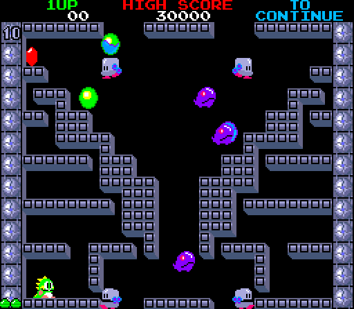

## Water, fire, lightning

The three special kinds burst into effects that are bubble records too:

* **Fire** (`pop_effect_fire`): the record becomes a falling fire (state `$40`) that drops a pixel a frame until
  it lands on an aligned cell, then files a floor-fire request at `$F624`; the bank-2 fire code spreads a line
  of flame along the platform for a while, and any enemy within eight pixels of a flame cell dies.
* **Water** (`pop_effect_water`): a water-flow request at `$F557` — `[1, x, y, direction]` — that the bank-2
  water code turns into the stream that runs down the platforms, carrying enemies and players with it; it also
  steps one of the checksum walkers and checks the MCU's `$37`.
* **Lightning** (`pop_effect_lightning`): the record becomes a bolt (state `$20`) that flies horizontally at
  three pixels a frame in the direction the player faced when it burst; an enemy it meets dies in a seven-frame
  explosion (`lightning_hit`, sound `$33`), and the RST 0 vector is checked on the way.

A bubble that holds an enemy is not special; the special kinds catch enemies only through the sub CPU's
fifteen-pixel window (chapter 11), which marks the enemy caught without a bubble to hold it. Round 100 has no
enemies, and there the special bubbles' burst is aimed at the boss (chapter 19).

## Items in bubbles

Two flag bits of `[+$21]` make a record an item rather than a bubble. Bit 6 is a floor item: the fruit an
enemy fell as, or the round's special item, dropping two pixels a frame to a floor and, when the sub CPU marks
it collected, rising for sixty frames as its points sprite. Bit 5 is the big item — the record that scores
fifty thousand, gives the collector sixteen bubbles of count 2 (the extra-life bubbles of chapter 13) and
asks the sub CPU for a chain of eight. And the last pop of a cleared round, if the round has a special item
left to give, spawns it from the item table at `$E744` where the bubble burst: the reason the round's item
appears where your last bubble popped. What the items do is chapter 18.

# 17. Enemies

Bubble Bobble's monsters are six programs in bank 0, one per enemy type, and they are more alike than the
sprites suggest. Each keeps a record per enemy, walks it through the same handful of states — enter, walk,
fall, jump, turn — with the same wall tests, the same speed lists and the same two questions to the MCU,
and differs from the others in one habit: the rock throwers stop to throw, the fire breathers to breathe,
the flyers follow scripts instead of platforms, and the whales bounce. This chapter takes the type-0 driver,
Zen-chan's, as the type specimen, and then the variations.

## The six types

| Type | Driver | Record | Round 1 name | Also known as | Habit |
| --- | --- | --- | --- | --- | --- |
| 0 | `enemy0_update`, `0:$8A17` | 25 bytes at `$ED49` | Zen-chan | Bubble Buster | The walker: platforms, jumps, chases |
| 1 | `enemy1_update`, `0:$8F4D` | 25 bytes at `$EDF8` | Banebou | Coiley | A walker with its own fall: it bounces on landing |
| 2 | `enemy2_update`, `0:$92F0` | 35 bytes at `$EEAC` | Mighta | Stoner | Stops to throw a rock when a player is level with it |
| 3 | `enemy3_update`, `0:$9694` | 27 bytes at `$EFA1` | Hidegons | Incendo | Stops to breathe fire, two shots per life |
| 4 | `enemy4_update`, `0:$98E4` | at `$F05F` | Pulpul | Hullaballoon | Flies: no floors, bounce scripts off the walls |
| 5 | `enemy5_update`, `0:$9E32` | at `$F113` | Monsta | Beluga | Flies diagonally, bouncing off everything |

Two more monsters are variants selected by the round record's flag byte `[$C]` (chapter 6). Bit 0 replaces
the type-0 walkers with **Invader** (Super Socket), who hops and fires missiles from a separate driver
(`enemy0_alt_update`, `0:$B149`, with `missiles_update` behind it); bit 4 replaces the type-2 rock throwers
with **Drunk** (Willy Whistle), who throws bottles from the same driver with a different sprite set. And the
ninth, Skel-Monsta (Baron von Blubba), is not an enemy record at all but a *chaser*, kept in two records of its
own and driven by `chasers_update`; he arrives when a round has gone on too long.

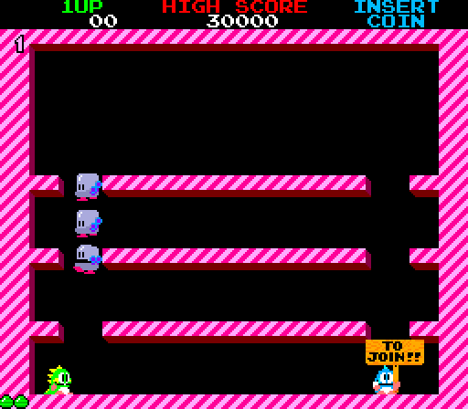

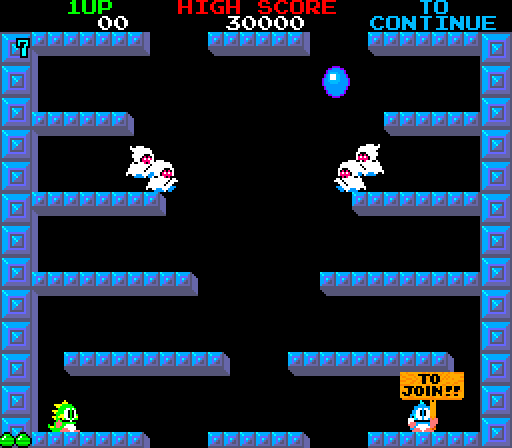

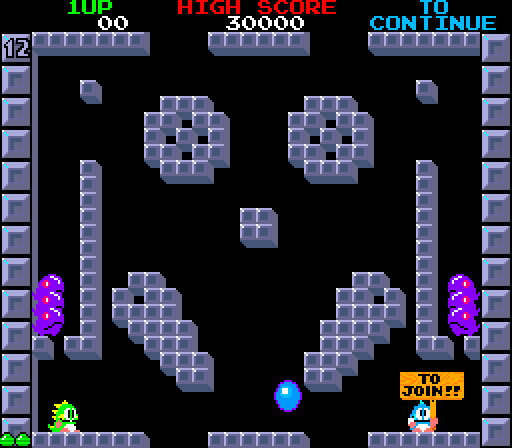

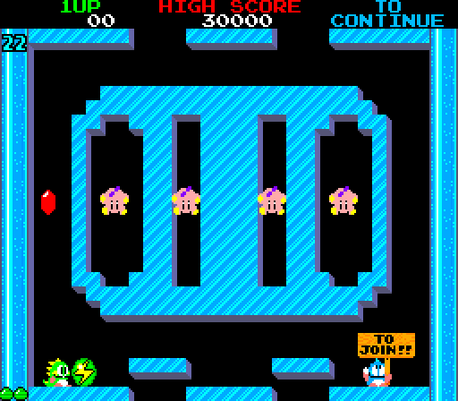

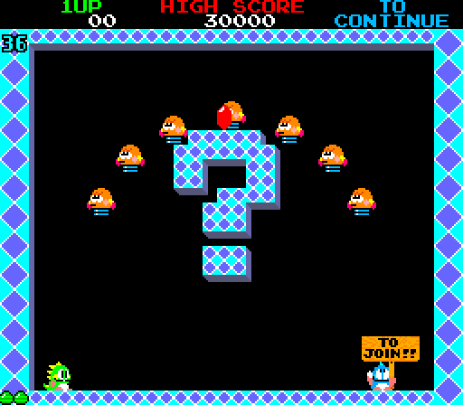

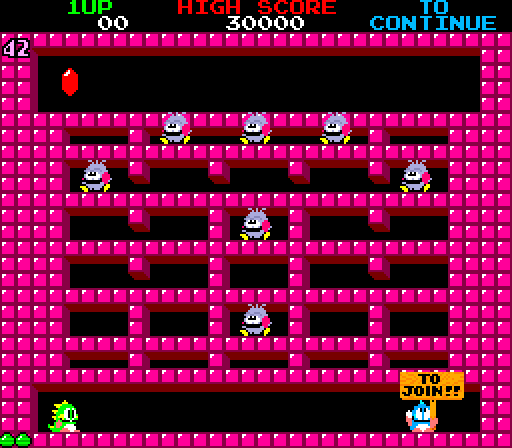

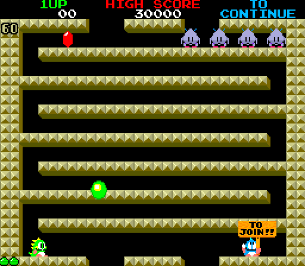

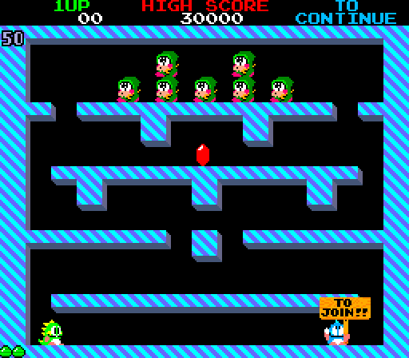

## The record

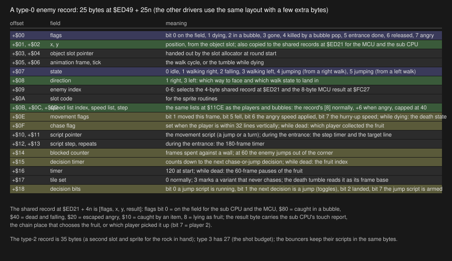

Two other structures belong to every enemy. The shared record at `$ED21 + 4n` — `[flags, x, y, result]` — is
what task 4 shows to the other processors: the MCU reads it for the geometry, the sub CPU tests it for
touches and writes the result byte, and the bubble task writes its flags when a bubble catches, pops or
releases the enemy (chapters 10, 11, 16). And the MCU's eight bytes at `$FC27 + 8n` are the enemy's eyes: for
each player, which way it is on each axis and how far.

## A frame in the life of a Zen-chan

```asm
enemy0_update:
8A17  LD A,(enemy_type_nibbles)  ; how many of this type
8A1A  AND A
8A1B  RET Z
8A1C  LD A,(round_flags)
8A1F  BIT 0,A
8A21  RET NZ                   ; an Invader round: the other driver
8A22  LD IX,enemy0_records
      ...
loc_0_8A27:
8A28  BIT 3,(IX+$00)
8A2C  JP NZ,loc_0_8E30         ; gone: skip
8A2F  LD A,(IX+$00)
8A32  BIT 2,A
8A34  JP NZ,loc_0_8A67         ; in a bubble: watch for release or escape
8A37  BIT 1,A
8A39  JP NZ,loc_0_8A73         ; dying: the death code
8A3C  CALL enemy_bubble_events ; the bubble task's verdicts in the shared record
8A3F  JP C,loc_0_8E30
8A42  CALL enemy_hurry_check   ; angry? hurried?
8A45  BIT 0,(IX+$00)
8A49  JR NZ,loc_0_8A79         ; on the field
      ...                      ; not yet: draw the drop-in sprite, set up the entrance
8A59  CALL enemy_round_init
      ...
loc_0_8A79:
8A79  CALL obj_position_from_slot
      ...
8A81  CALL enemy_caught_check  ; caught by an item?
8A84  JP C,loc_0_8E30
8A87  CALL enemy_speed_select  ; this frame's speed list
8A8A  JP NC,enemy0_draw        ; hurry-up: it fell instead
8A8D  CALL enemy_drift         ; this frame's step count from the list
8A90  LD A,(mcu_countdown_run)
8A93  AND A
8A94  JP NZ,loc_0_8E30         ; the launchers' countdown freezes them
8A97  BIT 5,(IX+$00)
8A9B  JR NZ,loc_0_8AA3
8A9D  CALL enemy_entrance      ; still walking in
8AA0  JP enemy0_draw
loc_0_8AA3:
8AA3  BIT 0,(IX+$18)
8AA7  JR Z,loc_0_8AC5          ; not in a jump script
      ...                      ; in one: the spin frames
loc_0_8AC5:
8AC5  LD A,(IX+$07)            ; the state
8AC8  LD HL,$8E5E
8ACB  CALL table_lookup_de
8ACE  EX DE,HL
8ACF  JP (HL)                  ; 0 idle, 1 walk right, 2 fall, 3 walk left, 4 jump, 5 jump
```

The order says what the enemy is. Before it moves, it learns what happened to it since last frame: the
bubble task may have caught it (flag bit 2), a player may have popped the bubble (dying), HURRY UP may have
made it angry. Only then does it take its step, and the step is a state machine that the entrance, the
walk, the fall and the jump share.

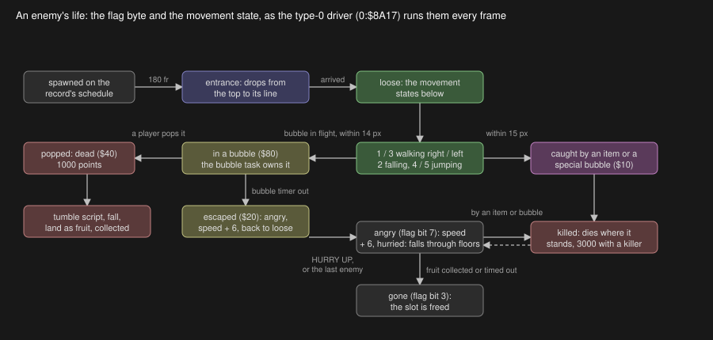

### The entrance

An enemy arrives on the round record's schedule (chapter 6): task 4's spawner activates the record at the
delay the record gives, `enemy_round_init` reads the entrance script for its index from `$E5A9`, and
`enemy_entrance` drops the sprite one line per timer tick down to its target line, then waits out a
180-frame timer before setting flag bit 5, "loose". During the entrance the monster cannot be caught and
does not chase; it is the grace period at the start of every round.

### Walking

```asm
enemy_walk_down:               ; state 1: walking right (y + 8 ahead)
8B7D  LD A,(IX+$0D)            ; this frame's pixels
8B80  OR A
8B81  RET Z
8B82  LD B,A
loc_0_8B83:
8B83  PUSH BC
8B84  CALL obj_position_from_slot
8B87  LD A,(IX+$02)
8B8A  ADD A,$08
8B8C  LD H,A
8B8D  LD A,(IX+$01)
8B90  CALL wall_test           ; the cell ahead
8B93  JR NZ,loc_0_8B9B
8B95  INC (IX+$14)             ; blocked: count it ...
8B98  JP loc_0_8BF9            ; ... and turn round
loc_0_8B9B:
8B9B  LD A,(IX+$17)
8B9E  CP $03
8BA0  JR Z,loc_0_8BB0          ; a variant that never chases
8BA2  CALL target_player_alive
8BA5  JR Z,loc_0_8BB0          ; nobody to chase
8BA7  CALL mcu_player_relation ; is the player ahead of us?
8BAA  JR Z,loc_0_8BB8
8BAC  BIT 7,(HL)
8BAE  JR NZ,loc_0_8BB8         ; level with us: also "ahead"
loc_0_8BB0:
8BB0  CALL wall_test_left3     ; the floor under the next pixel
8BB3  JP NZ,enemy_fall_start   ; none: walk off the edge
8BB6  JR loc_0_8BBD
loc_0_8BB8:
8BB8  CALL enemy_wall_down_left; the cell below and ahead
8BBB  JR NZ,loc_0_8BCE         ; a gap ahead with the player beyond it: jump or turn
loc_0_8BBD:
8BBD  SET 1,(IX+$0E)
8BC1  CALL obj_slot_ptr
8BC4  INC HL
8BC5  INC HL
8BC6  INC (HL)                 ; y + 1
8BC7  POP BC
8BC8  DJNZ loc_0_8B83
8BCA  CALL enemy_decide        ; and after the step: chase or jump?
8BCD  RET
```

A walking monster moves one pixel at a time, as many as its speed list gives this frame, and at every pixel
asks the map two things: is the cell ahead solid (then turn), and is there a floor under the next pixel
(then fall). The second question is asked only when the player is *not* ahead; when the MCU says the player
is in the direction of travel, the enemy asks a different question — is there a gap ahead, with the player
on the other side — and if so it does not walk off the edge but jumps (the script at `$9624`) or, if a wall
is in the way, turns (the script at `$8E73`). This one branch is the difference between a monster that
wanders and one that comes after you, and it hangs entirely on the MCU's byte.

The speed list is `[+$0C]`, the round record's `[8]` for the round — a number from 4 to about 20 that names
one of the lists of chapter 13 — and `enemy_drift` reads the next entry into `[+$0D]` each frame. Round 1's
list 10 is a flat `1`: one pixel every frame, a little slower than the player's 1.2. The record's
speed is what the difficulty rank raises (chapter 12), and the angry bonus of +6 lists is what makes the
last monster of a round, or every monster after HURRY UP, faster than you.

### Falling and landing

`enemy_fall` drops one pixel per frame — not the speed list's rate, a flat one — until the floor test finds
solid cells under the sprite at an aligned line, and then chooses the walk state from the direction byte
`[+$08]`, or forces one at the plane's edges. A walker that has fallen off the bottom reappears at the top
like a player. The type-1 driver, Banebou's, replaces this state with a bounce: it lands and takes off
again, which is the whole of Banebou's character.

### Deciding

```asm
enemy_decide:
8E3F  DEC (IX+$15)             ; the decision timer
8E42  JR NZ,loc_0_8E4F
8E44  CALL enemy_timer_reset
8E47  LD A,(IX+$18)
8E4A  XOR $02                  ; alternate: chase, jump, chase, jump ...
8E4C  LD (IX+$18),A
loc_0_8E4F:
8E4F  BIT 1,(IX+$18)
8E53  JP NZ,loc_0_8E5A
8E56  CALL enemy_chase
8E59  RET
loc_0_8E5A:
8E5A  CALL enemy_jump_decision
8E5D  RET

enemy_chase:
94FF  LD A,(IX+$01)
9502  CP $20
9504  RET Z                    ; on the bottom row: nothing to do
9505  CALL target_player_alive
9508  RET Z
      ...                      ; the interrupt-vector check (chapter 20)
951A  LD HL,mcu_player_distance; $FC2B + 8n: |dx| to the player
      ...
9529  LD A,(HL)
952A  CP $20
952C  RET NC                   ; more than 32 lines away: ignore
952D  LD (IX+$0F),$01
9531  CALL mcu_player_relation ; which way, vertically?
9534  JR Z,loc_0_953C
9536  XOR A
9537  BIT 7,(HL)
9539  RET Z
953A  SCF                      ; level: jump
953B  RET
loc_0_953C:
953C  CALL mcu_player_relation2; which way, horizontally?
953F  JR Z,loc_0_9547
      ...
loc_0_9547:
9547  INC HL
9548  INC HL
9549  INC HL
954A  INC HL
954B  LD A,(HL)                ; |dy| to the player
954C  CP $10
954E  JR NC,loc_0_9556
9550  SET 1,(IX+$18)           ; within 16 across: next decision is a jump
9554  XOR A
9555  RET
loc_0_9556:
9556  LD (IX+$07),$01          ; further: turn towards the player
955A  LD (IX+$08),$01
955E  XOR A
955F  RET
```

The decision timer runs every step; when it expires the enemy alternates between two questions. *Chase*: if
the player is within thirty-two lines vertically, face towards it horizontally, and if it is within sixteen
pixels across, arm a jump. *Jump*: if the player is above and a wall is not in the way, run the jump script
towards it. Both questions are answered from the MCU's bytes, and both fail safely when the MCU is absent:
`mcu_player_relation` returns "not that way" for a zero byte, `enemy_chase` finds a distance of zero and
returns before deciding. A board without the MCU has monsters that patrol their platforms for ever.

### Jumping

The jump states run a **movement script**: a list of `[direction byte, repeats]` steps from a table at
`$10A2`, where each step's byte says which way to move the slot one pixel — bit 0 vertical, bit 3 its sign,
bit 4 horizontal, bit 7 its sign — so that a jump arc, a hop or a turn is a short string of bytes. `$9624`
is the standard jump up, `$9627` its mirror, `$8E73` the turn-round, and `enemy_script_step` executes one
byte per pixel of the frame's speed, with `$88` ending a script and `$99` pausing it. During a jump the
side cells are tested exactly as for the player (chapter 14), a solid cell above ends the rise, and landing
goes through the same floor test. The same script machine, with different tables, moves Pulpul and Monsta,
who never touch a floor: their "walk" states are bounce scripts chosen by which wall they met.

### Angry, hurried, stuck

`enemy_hurry_check` runs every frame before the movement. If HURRY UP has been declared (`$F44E`) the
monster is *hurried*: `enemy_speed_select` drops it through the floors instead of walking, so that the whole
round collapses to the bottom where the players are. If the last-enemy flag is up, or the monster's own flag
bit 7 is set because it escaped from a bubble, it is *angry*: six is added to its speed list, capped at 40,
and its sprite changes to the angry frames — the recolouring the player sees. A monster pressed against a
wall for sixty frames (`[+$14]`) jumps out with `enemy_stuck_jump`, which is why a Zen-chan trapped in a
corner eventually leaps free.

## Rocks and fire

Mighta and Hidegons walk like Zen-chan and interrupt the walk with an attack. The decision is the aim check
at `$7B93`, shared by both:

```asm
7B93  BIT 1,(IX+$0E)
7B97  RET Z                    ; only after a step
7B98  CALL target_player_alive
7B9B  RET Z
7B9C  LD HL,mcu_player_distance
      ...
7BAC  LD A,(HL)                ; |dx|: the player must be within 8 lines
7BAD  CP $08
      ...                      ; and at least $40 across; two free cells ahead
```

On the floor, with a live player on the same level and at least sixty-four pixels away in the facing
direction, and nothing solid in the two cells ahead, the throw starts: the wind-up animation plays on the
enemy and on a second sprite in its second slot — the rock in its hands, six frames of five — and the rock
is launched as a record of its own in `rocks_update` (`$EC29`, one per thrower), flying horizontally at the
thrower's speed plus four until it meets a wall and bursts. Hidegons's shots are the same idea with a budget
of two per life, spawned from the fire-shot table at `$EB99`, flying at speed plus ten. Both are objects the
sub CPU tests against the players (chapter 11): a rock or a shot within eight pixels burns the dragon.

Drunk's bottles are Mighta's rocks in a different tile set; Invader's missiles have their own driver,
`missiles_update`, and a launch timer that the MCU counts down for them (chapter 10) — six hundred frames,
which is why a round of Invaders fires in volleys.

## Death

When a player pops a bubble with a monster in it, the bubble task writes `$40` into the shared record with
the bubble's position and the chain place (chapter 16), and the driver's next frame finds flag bit 1 and
calls `enemy_death_update` (`$7BFC`), a routine in the fixed ROM that reads its tables from bank 0:

1. **The tumble.** A script from the table at `$80C8`, chosen by enemy type (with alternatives for a monster
   killed while hurried, released, or during the invincibility item), throws the corpse along a trajectory;
   it bounces off the top and bottom of the plane and, when the script ends, falls with the floor test until
   it lands. The frames come from `$801E` by type.
2. **The fruit.** On landing the record becomes an item (shared record state 8): the tile and attribute from
   the eleven-entry table at `$8008`, chosen by the chain place — a banana for a single monster, and better
   fruit for the second, third and later members of a chain — drawn by `death_draw_item`.
3. **The pickup.** The sub CPU's touch byte says which player walked into it; `death_draw` reads it, scores
   from the table at `$8031`, sound `$11`, and the fruit bounces four times and vanishes, or vanishes unpicked
   after the timer.

| Chain place | 1st | 2nd | 3rd | 4th | 5th | 6th | 7th | 8th | 9th | 10th | 11th |
| --- | --- | --- | --- | --- | --- | --- | --- | --- | --- | --- | --- |
| Points | 500 | 1000 | 2000 | 3000 | 4000 | 5000 | 6000 | 7000 | 8000 | 9000 | 10000 |

The eleven fruits are more than a round can produce — seven monsters make a chain of seven — so the last
entries are reachable only through the chain the big item asks for (chapter 16). A monster caught by an
item, a special bubble or the water dies through the same code from state `$10`, and a monster whose bubble
timed out goes back on the field through `enemy_escaped_check` with its flags set to `$A1`: on the field,
loose, and angry.

## Skel-Monsta

The chasers are two records at `$F1C2`, driven by `chasers_update` while the angry-done flag `$E343` is set —
that is, once the last-enemy timer has run out, or the HURRY UP sequence has passed and the round still has
enemies. A chaser appears in a puff near the player it is assigned to (the sprite column at `$A377`, the
cloud frames), then hunts: every frame it moves its slot one pixel towards the player on each axis, ignoring
the map entirely, and the sub CPU catches the player at ten pixels. It cannot be bubbled — it has no shared
enemy record — and it leaves only when the round ends or its player dies, puffing out as it came. In a secret
room the same two records are the exits: the sub CPU's touch test on them raises the round-end flag instead
of a death (chapter 11).

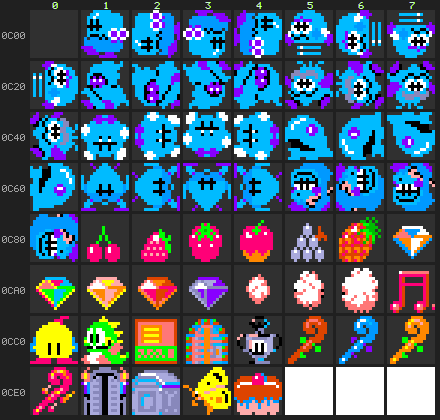

# 18. Items, bonuses and secrets

Bubble Bobble's items are the part of the game that players traded rumours about: the candy that comes
from blowing thirty-five bubbles, the shoes for walking far enough, the umbrella that skips rounds, the
doors to the secret rooms. Almost all of it is one table. This chapter decodes it, follows an item from
its counter to its effect, and then takes the bigger set pieces — the message panels, the secret rooms,
EXTEND — that the round objects of bank 2 run.

## Three kinds of item

The program distinguishes three things a player can pick up:

* **Fruit** — what a popped monster falls as. It is the enemy record itself, in its dead state, drawn from the
  fruit table by the monster's place in the chain (chapter 17). Five hundred to ten thousand points.
* **The round's food** — one item per round, spawned where the last bubble of a cleared round bursts
  (chapter 16) from the table at `$E744`. `special_item_select` chooses it at the round's end: a fixed item for
  sixteen listed rounds (`$0710`: rounds 1, 5, 10, 15 ... 50, and 85, 86, 92, 93, 94), an item by the shared
  digit when both players' scores end in the same digit (`$0706`), the big item's item if the big item is on,
  and otherwise a choice by the players' situation. It is collected by walking into it, fourteen pixels.
* **The bonus item** — the one that matters. One per round, chosen at the round's start by
  `bonus_item_select` from a table of fifty-four statistics, placed on the playfield after a delay
  (`bonus_item_update`), collected within fourteen pixels (`bonus_item_pickup`), scored from the table at
  `2:$B66C`, and then acted on through a table of fifty-four effect handlers at `2:$8AFF`.

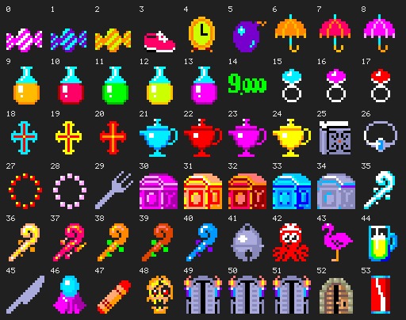

## The statistics table

```asm
bonus_item_select:             ; at round start
      ...
8611  LD B,$36                 ; 54 entries
8613  LD HL,$B4F2
loc_2_8616:
8616  LD E,(HL)                ; the counter's address
8617  INC HL
8618  LD D,(HL)
8619  INC HL
861A  PUSH HL
861B  PUSH HL
861C  LD A,(difficulty_rank)
861F  LD HL,$8667              ; rank -> which of the four thresholds
8622  CALL hl_add_a
8625  LD A,(HL)
8626  POP HL
8627  CALL hl_add_a
862A  LD A,(DE)                ; the counter
862B  CP (HL)                  ; against the threshold
862C  POP HL
      ...
8631  JR NC,loc_2_863D         ; reached: this is the item
      ...
8635  JR NZ,loc_2_8616         ; else the next entry
      ...
loc_2_863D:
863D  LD A,(HL)
863E  LD (bonus_item_value),A
8641  LD A,B
8642  DEC A
8643  LD (bonus_item_number),A ; item number = 54 - entry
8646  XOR A
8647  LD (DE),A                ; and the counter starts again
```

Each of the fifty-four entries is seven bytes: the address of a counter in work RAM, four thresholds, and
a value. The rank table at `$8667` picks the threshold column: ranks 0-4 use the third, 5-7 the fourth,
8-11 the second, 12 and above the first — so the same statistic asks for more in an easy game than in a
hard one, on the theory that a good player does not need the help. The first entry whose counter has
reached its threshold wins, its counter is reset, and the search stops; the entries are scanned from the
top, and the item number is the entry's distance from the bottom, so the rarest conditions are checked
first. With the counters named from the code that increments them:

| Item | Counter | Threshold (rank 12+ / 8-11 / 0-4 / 5-7) | Picture | Effect |
| --- | --- | --- | --- | --- |
| 0 | `$E5DF` bubbles blown | 35 | pink candy | bubble parameter (`2:$87B1`) |
| 1 | `$E5E0` bubbles popped | 35 | blue candy | faster bubbles: range parameter 6 |
| 2 | `$E5E4` jumps | 35 | yellow candy | rapid fire: cooldown 5 |
| 3 | `$E5E6` distance walked | 12 x 256 pixels | shoes | faster walking: speed list 13 |
| 4 | `$E5E1` lightning bubbles burst | 12 | clock | the enemies freeze (`$E341`) |
| 5 | `$E5E2` fire bubbles burst | 19 / 16 / 10 / 13 | bomb | the `$F59E` sequence: every enemy dies |
| 6, 7, 8 | `$E5E3` water bubbles burst | 15, 20, 25 | umbrellas | skip 3, 5 or 7 rounds |
| 9-13 | `$E5E7` fell through the bottom | 15, 16, 17, 18, 19 | potions | the showers of items |
| 14 | `$E5E8` items collected | 65 / 60 / 50 / 55 | (points sprite) | `2:$88D2` |
| 15, 16, 17 | `$E5E9`, `$E5EA`, `$E5EB` candies eaten | 3 | rings | points for walking, jumping, blowing |
| 18, 19 | `$E5EF`, `$E5F0` | 5 | crosses | the `$F590` and `$F595` sequences |
| 20 | `$E5EE` enemies killed | 7 / 6 / 4 / 5 | cross | sixteen bubbles of count 2 |
| 21 | `$E5F6` | 13 / 12 / 10 / 11 | cup | `2:$8938` |
| 22 | `$E5F7` round foods eaten | 16 / 14 / 10 / 12 | cup | `2:$8941` |
| 23 | `$E5EC` rounds skipped | 2 / 2 / 1 / 1 | cup | the `$F5B6` sequence |
| 24 | `$E5ED` clocks used | 4 / 3 / 1 / 2 | cup | `2:$898E` |
| 25 | `$E5F3` enemies burnt by fire | 16 / 14 / 10 / 12 | book | every enemy on the field dies (`$E720`) |
| 26 | `$E5F4` enemies caught by special bubbles | 16 / 14 / 10 / 12 | necklace | the flying objects |
| 27, 28 | `$E5D9`, `$E5DA` games and rounds played | 30 / 25 / 15 / 20 | pearls | `2:$89BC`, `2:$89C2` |
| 29 | `$F457` | 1 | fork | falling items |
| 30 | `$F458` | 1 | chest | the big item, level 10 |
| 31-34 | `$E601`, `$E602`, `$E600`, `$E5FF` uses of items 25, 23, 18, 19 | 3 | chests | the big item, levels 9-6 |
| 35-40 | `$E5FD`-`$E5F8` letters of EXTEND collected | 3 each | canes | the big item, levels 5-0 |
| 41 | `$E5FE` HURRY UPs survived | 14 / 12 / 8 / 10 | bell | `2:$8A6A` |
| 42, 43, 44 | `$E606`, `$E605`, `$E604` name-entry flags | set | octopus, flamingo, mug | `$F464`: the round food forced |
| 45 | `$E607` name-entry flag | set | knife | falling items |
| 46, 47 | `$E609`, `$E60A` name-entry flags | set | lamp, dynamite | `2:$8AA3`, `2:$8AA9` |
| 48 | `$E611` last-enemy timers run out | 20 / 25 / 30 / 27 | skull | `2:$8AB1` |
| 49, 50, 51 | `$E60D`, `$E60E`, `$E60F` name-entry flags | set | doors | the secret rooms, kinds 0-2 |
| 52 | `$E610` name-entry flag | set | door | warp to round 70 |
| 53 | `$E608` a default name entered | set | can | falling items |

Most of the folklore is in the table, and so is the mechanism behind it. Thirty-five bubbles blown, popped
or jumped give the candies and the shoes; the special bubbles' counters give the clock, the bomb and the
umbrellas; falling off the bottom of the screen fifteen to nineteen times gives the potions; eating three
candies of a kind gives a ring. The four counters that the name entry sets (chapter 7) are the developers'
own: the initials `TAK`, `STR`, `KTT` and the rest do nothing but set a flag, and the flag is a threshold
of 1 for the doors to the secret rooms and the warp. The items at 42-44 and 46-48 are the same trick with
other names. And the table explains the rule that puzzled players most: the bonus item is chosen at the
*start* of the round from what was counted before it, so what you do in a round earns the item of the next.

## From pickup to effect

```asm
bonus_item_pickup:
873E  LD A,(bonus_item_state)
8741  BIT 0,A
8743  RET Z                    ; not on the field
      ...
8753  CALL proximity_test      ; a player within 14 pixels?
8756  RET NC
8757  LD A,(bonus_item_number)
875A  LD B,$05
875C  CALL mul8x8
875F  LD DE,$B66E              ; the record's points sprite and points
      ...
877F  CALL score_add_player
      ...
878F  LD C,$16
8791  CALL sound_queue_push
8794  LD HL,bonus_items_collected
8797  INC (HL)
8798  LD HL,($0B2E)            ; the interrupt vector ...
879B  LD BC,$044D
879E  LD A,H
879F  SUB B
87A0  JR Z,loc_2_87A6
87A2  LD A,R                   ; ... or the I register is scrambled (chapter 20)
87A4  LD I,A
loc_2_87A6:
87A6  LD A,(bonus_item_number)
87A9  LD HL,$8AFF
87AC  CALL table_lookup_de     ; the effect handler
      ...
```

The effects are fifty-four small routines. Some set a byte in the player record — the candies and the
shoes change the parameters chapter 13 listed, the rings set the scoring-mode bits so that every step, jump
or bubble is worth points — and some start a sequence in bank 2 that runs for many frames: the potions'
showers (`item_shower`: a kind byte in `$F523`, a rain of items over the whole field), the bomb's explosion,
the book's kill-all (verified by forcing the pickup: the enemy count drops to zero forty frames later), the
big item (`item_big`, eleven levels of the four-slot object that scrolls in when the round is cleared),
the falling items (`item_falling`: forks, knives and cans drop from the top and can be caught), the flying
objects (`item_flying_objects`: eight small shapes cross the screen for 25 points each). The umbrellas
(`item_skip3`) put tasks 2, 4 and 5 to sleep, flash the screen and add 3, 5 or 7 to the round counter
before waking the round loop: the shortest of the effects and the most valuable. The warp door
(`item_warp70`) sets the counter to 69 and the rank to 30.

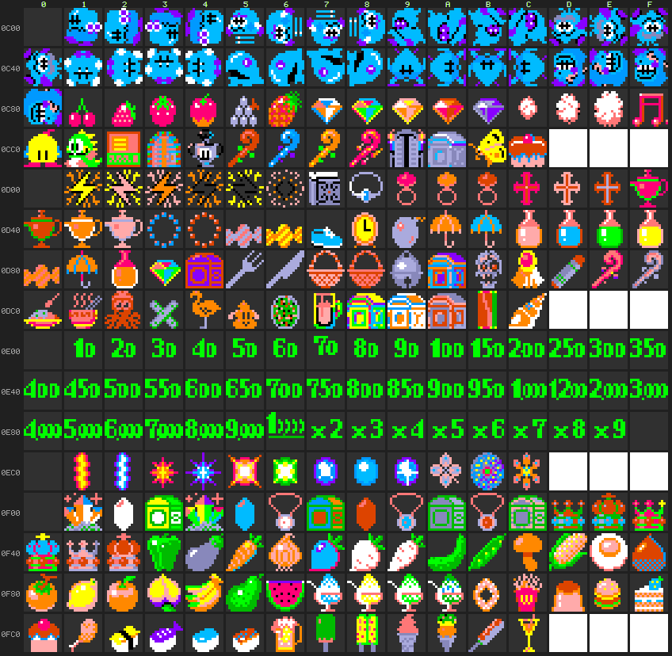

## The message panels

Rounds 16, 32, 48, 64, 80 and 96 open with a scene rather than a round: two of the round's monsters
carrying the dragons' girlfriends across the top of the screen, HELP!! in their speech bubbles. It is a
bank-2 sequence (`seq_f536_update`, `2:$9D35`) driven from `round_start_anim`: fifteen sprites per panel
from two slot groups, a letter animation of five frames, the panels slid in one pixel a frame to `x = $70`,
held 120 frames, and slid out to `$F0`; `$E5F5` counts the messages so that the next scene shows the next
picture, and `$F536` set to `$FF` releases the round. The second panel of a pair waits for a button press,
which it reads from bits 4 and 5 of the MCU's `$FC85` — an input that does not exist, so that the wait
always ends with the un-pressed path, which pushes DE and thereby makes the loop run once more for the
second panel. It is one of the stranger control-flow tricks in the program, and it works.

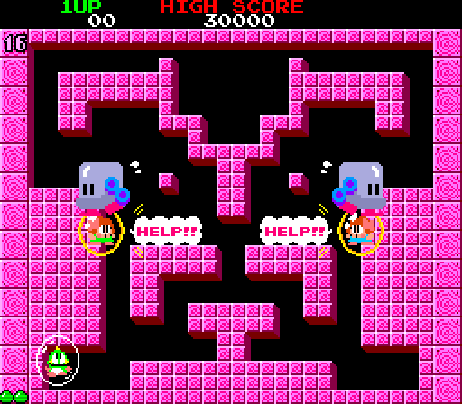

## The secret rooms

A secret door (`item_secret_door`, items 49-51) sets `$E723` to `$29` and the room kind in `$E724`; the round
loop finishes normally, and the next round is a secret room (`$504B` in the main ROM): the map of a
treasure vault, a message in the game's own alphabet, and thirty-six item records filled into the bubble
table for the players to collect. The room's entry door opens after twenty-four pickups and its exit after
thirty-six; the room times out after 2,400 frames. On leaving, the round counter jumps — the secret rooms
are the warps of the game — and in a two-player game the second player's exit is what the sub CPU's
"door" test on the chaser records is for (chapter 11). There are three room kinds, three messages, and
one player who reads the alphabet.


## The fills

Three of the effects fill the playfield. `seq_f521_update`, `seq_f52b_update` and `seq_f531_update`
(`2:$9373`, `$96EF`, `$99EB`) scan the map in 2 x 2 cell quads — eleven columns by thirteen rows of them — and
put an item tile in every quad that is air: the treasure fill drops diamonds, the two growing fills plant
items that grow through their frames. For 1,800 frames the players collect them (`treasure_pick_check`:
is the player standing on an item tile?), then the quads shrink and the map is cleared. They share the cell
quad routines with the round-clear wipe (`round_end_update`, `2:$A310`), which walks the map column by
column replacing the solid cells' tiles and finally blinks four cells' attribute bit 6 while the theme
restarts: the flash that ends every round.

## EXTEND

The six letters live in bubbles (chapter 16), each spawned by the round's bubble source with a letter from
the MCU's counter. A player who bursts one gets its bit in `$E742` or `$E743` and the letter lights in the
status row. Six bits set is `$3F`, and `extend_letters_complete` in task 5 takes the game over:

```asm
extend_start:                  ; the letters taken back, the tasks put to sleep, sound $10
      ...
extend_flash:                  ; the six status-row letters cycle through three tile sets, 5 frames a step, 7 times
      ...
extend_bonus:                  ; the bonus screen: the frame from bank 1, the flyer, six letters in four slots each, 900 frames
```

Tasks 2, 3 and 4 sleep; task 5 draws the bonus screen — a field of flowers from bank 1 — and the player's
flyer carries the six letters in along a flight script (`$79C5`, mirrored for player 2); each letter panel
glows through three tile sets and flickers when hit; then the big letters fall, the fourth lands and slides
into the lives row, and the extra life is awarded through the same routine as a score threshold. NICE 1P!
holds for the rest of the 900 frames, and `$7912` wakes the round loop, which restarts the round the letters
were collected in as the next one.

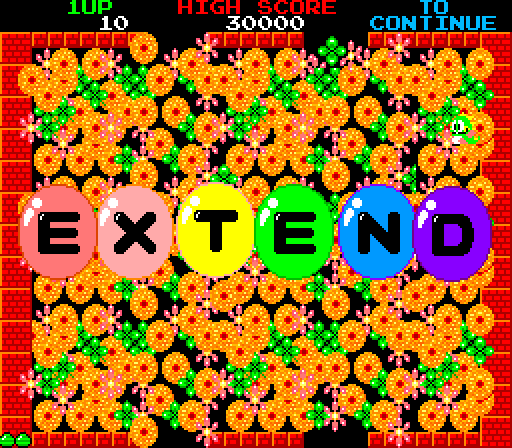

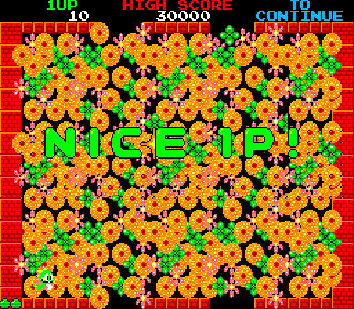

## The rest of bank 2

The remaining round objects are smaller: the power item (`power_item_pickup`, `$F514`) gives both players
nine hundred frames of the invincibility that chapter 13's `[+$13]` flags and 3,000 points; the flyer
(`$F595`) and the bouncing object (`$F5AC`) are two more things that cross the field catching enemies
(chapter 11); the water flows (`water_flows_update`) carry the head of a burst water bubble down the platforms
with a trail of ten flowing tiles, taking players, enemies and rocks with it; the floor fires
(`floor_fires_update`) spread sixteen cells of flame from a landed fire. Each has its flag byte in
`$F44C-$F62F`, cleared by `clear_round_vars` at the start of a round, and each is a line in task 3's frame
list (chapter 9). None of them knows about the others; the round is what happens when they all run.

# 19. Round 100 and the endings

Round 100 is the only round that is not a round. Its map is empty air with a few solid specks (chapter 6),
its record's enemy counts are ignored, and the round loop, the enemy task and the bubble task each take a
special path for it. What lives there is Super Drunk, a boss the size of sixteen ordinary sprites, and the
only way to hurt him is with the one weapon the rest of the game never needs: lightning. This chapter is
the fight, and the three things that can happen after it.

## Setting the stage

`round_setup` skips the difficulty adjustment for round 100; `init_object_list2` lays out a different object
list; `bubble_init` links eighteen bubble records instead of twenty-four, because the boss needs the object
slots. Task 4's spawner runs `boss_init_a846` and `boss_init_b938` — the boss record at `$F296` with its
sixteen slots from `$E275`, and the eight-record *ring* at `$F367` — instead of the enemy drivers, and its
frame loop is the short one at the end of the type drivers: `boss_update`, `boss_ring_update`. Task 5 adds
`boss_round_update` for the two figures at `$EB36` and `$EB46`, the captives in their bubbles at the top
corners, and the bank-2 subsystem `boss_lightning_update` places two potions (`$F611`) that give the
player who touches them the *lightning charge* — `lightning_bubbles_p1` at `$F60F` — that turns every
bubble they blow into a lightning bubble (chapter 16).

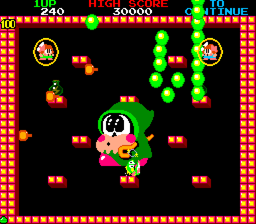

## The boss

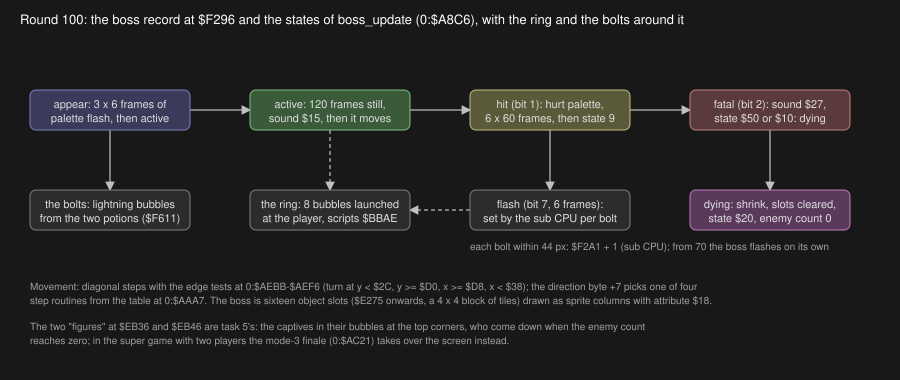

`boss_update` (`0:$A8C6`) dispatches on the flag byte of the record: appearing, active, hit, dying. The
appearance is three cycles of a palette flash written straight into the palette RAM (`$F9DE`, `$F9FE`); the
active state waits 120 frames with sound `$15`, then moves. The movement is a diagonal bounce like Monsta's:
a direction byte selects one of four step routines from the table at `$AAA7`, and the edge tests turn it at
the walls. Every step also moves the sixteen object slots that make up the sprite, four columns of four
tiles drawn with `draw_sprite_column`, so that the boss is one record with sixteen shadows.

The ring is the boss's attack. `boss_ring_update` keeps eight bubble records of its own at `$F367`; while
the boss is active it launches idle ones from the boss's position towards the player — the direction is
chosen from which side of `x = $80` the player is on — and flies them along four scripts at `$BBAE`, one per
quadrant, until they leave the screen. When all eight are gone the ring resets. They are the records the sub
CPU tests against the players with an eight-pixel window (chapter 11, the `$F367` objects): a touch is a
death.

## Hurting him

The lightning bolts are ordinary bubble records in the bolt state (chapter 16), flying at three pixels a
frame. On round 100 the sub CPU's special-bubble test does something it does nowhere else:

```
; the sub CPU, special_bubble on round 100
057D  LD HL,$F296              ; the boss record
      BIT 0,(HL)
      JP Z,next                ; no boss: nothing
      ...                      ; |dx| < 44 and |dy| < 44 from the boss
      SET 7,(HL)               ; flash
      LD HL,$F2A1
      INC (HL)                 ; one more hit
      LD (IX+$1A),$20          ; and the bolt is spent
```

Every bolt that comes within forty-four pixels of the boss counts once in `$F2A1` and sets the flash bit,
which `boss_flash` clears again after six frames: the sparkle the player sees on a hit. From the seventieth
hit the boss flashes on its own, the visible sign that it is nearly done, and the fatal hit sets bit 2, which
`boss_hit` turns into sound `$27` and the dying state. The dying state is a shrink animation in
`boss_dying`; when the sprite is small enough the sixteen slots are cleared, the record's state becomes
`$20`, and — this is the line that ends the round — the enemy count at `$ED3D` is set to zero. The round
loop sees no enemies left and treats round 100 like any other cleared round.

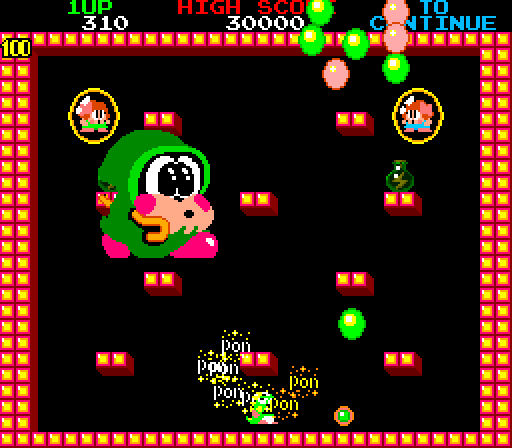

## Three endings

Task 0 wakes with the round counter at 100 and, instead of a new round, runs `ending` (`$1E64`). What
happens next depends on how many players there are and which game mode was chosen at the start.

**One player.** The walls dissolve row by row (the wipe at `0:$BEA8`), the captive comes down from her
corner and joins the dragon, and the message from bank 2 (`not_true_ending_screen`, `2:$B77A`) is printed
line by line:

> CONGRATULATIONS! BUT THIS IS NOT A TRUE ENDING! COME HERE WITH YOUR FRIENDS! YOU WILL BE IMPRESSED BY THE
> TRUTH OF THIS STORY!! NEVER FORGET YOUR FRIEND! TRY AGAIN!!

Then `ending_zapped`: YOU ZAPPED TO ..., and the game continues in a round chosen by the refresh register
from a table of eight — rounds 50, 55, 60, 65, 70, 75, 80 or 85 — with the difficulty rank forced to 30.
A solo player cannot finish the game; the program says so, and sends them back to play more.

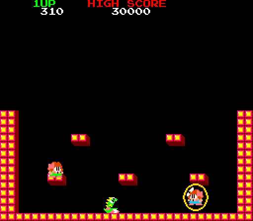

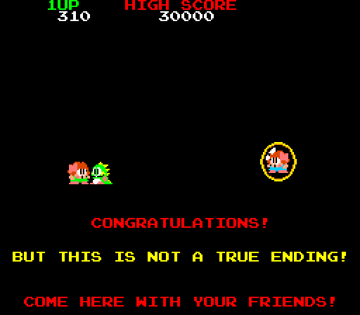

**Two players.** With both players alive at the boss's death (`players_alive = 3`), `ending_true` runs the
scene the game was made for. The boss's death sequence has already awarded a hundred bonuses of ten
thousand — the 1,000,000 PTS!! of the screen — and the couples meet under a heart that alternates between
the two players' colours over HAPPY END!!. Then the message: NOW, YOU FOUND THE MOST IMPORTANT MAGIC IN THE
WORLD. IT'S "LOVE" & "FRIENDSHIP"! and the credits roll (`$563E`, text lists in bank 1): MTJ/MITSUJI for game
design and character, ICH/FUJISUE and NSO/NISHIYORI for the software, KIM/KIMIJIMA for the sound,
YSH/YOSHIDA, KTU/FUJIMOTO, SAK/SAKAMOTO, the special thanks, and the cast — BUBBLUN, BOBBLUN, ZEN-CHAN,
MONSTA, SKEL-MONSTA, MIGHTA, PULPUL, BANEBOU, INVADER, HIDEGONS, DRUNK, SUPER DRUNK — the same names the
name-entry table's initials belong to (chapter 7). In the normal game the bank-2 message BUT IT WAS NOT A
TRUE ENDING follows for 2,400 frames, and the results screen.

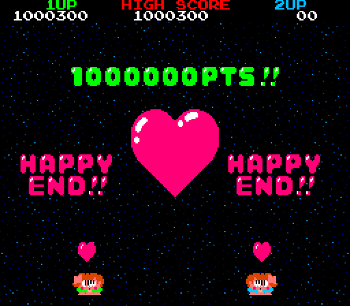

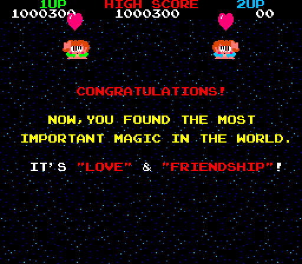

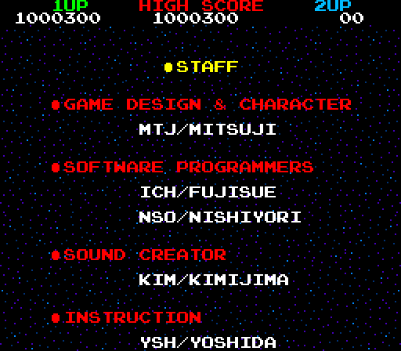

**The super game.** With two players in the super game — `$E5DB`, chosen on the mode-select screen or by the
title code (chapter 12) — `boss_dying` takes the branch at `0:$AC21`, the *mode-3 finale*: the players'
sprites are placed at the sides, a different animation plays through the four-slot figures, and task 5's
`boss_round_update` draws the finale's tile blocks and cycles the palette. The message about the true ending
is skipped. It is the ending the two-player super game earns, and the one almost nobody saw in an arcade: it
needs two players, the harder game, and a hundred rounds.

## What the boss is made of

Nothing in round 100 is new code so much as old code used differently. The boss is an enemy record with
sixteen slots; its ring is eight bubble-like records flown by the movement scripts of chapter 17; its
weakness is the bubble task's lightning state and one extra case in the sub CPU's special-bubble test; its
death is a decrement of the enemy count; the endings are the round loop's normal exit with a new screen.
Even the captives are task 5's business, two records in the space where the bubble table would have been.
The last round of the game is the whole engine, pointed at one monster.

# 20. Randomness, secrets and protection

Three subjects that the previous chapters kept pointing forward to, and that belong together because they
are all about what the program hides: where its chance comes from, what it does when nobody is meant to be
looking, and what it does to anyone who copies it.

## Where the randomness comes from

Bubble Bobble has two random sources, and neither is very random.

The first is a sixteen-bit register at `$E37F`, stepped every frame by the interrupt handler:

```asm
rng_pre:                       ; irq_frame_start: the low byte counts up
0E79  LD HL,rng_seed
0E7C  INC (HL)
0E7D  RET

rng_step:                      ; irq_essentials: the high byte counts down ...
0E7E  LD HL,rng_hi
0E81  DEC (HL)
0E82  JP rng_lfsr              ; ... and the pair is shifted

rng_lfsr:
0E5E  LD HL,(rng_seed)
0E61  ADD HL,HL                ; shift left; the old bit 15 into the carry
0E62  CCF
0E63  RLA
0E64  AND $01
0E66  LD C,A                   ; C = NOT old bit 15
0E67  LD A,L
0E68  RRCA
0E69  RRCA
0E6A  RRCA
0E6B  RRCA
0E6C  AND $01                  ; bit 4 of the shifted low byte
0E6E  XOR C
0E6F  LD C,A
0E70  LD A,L
0E71  AND $FE
0E73  OR C                     ; into bit 0
0E74  LD L,A
0E75  LD (rng_seed),HL
0E78  RET
```

It is a feedback shift register with the counters folded in, and the game reads it from `rng_hi` in a
handful of places: the side a source bubble enters from, the enemy-type list entry that decides its kind,
and the `random_chance` helper (`$0E22`) that compares the pair against a threshold from a table at `$0E30`
to answer "does this happen?" — the 37-in-256 test for an EXTEND bubble is one of its entries. Because the
register is stepped once per frame and only per frame, two decisions made in the same frame see the same
value, and a decision made a frame later sees a value that anyone with the ROM can predict.

The second source is the Z80's refresh register, read with `LD A,R` at twelve places:

| Where | What it decides |
| --- | --- |
| `bubble_random_lifetime` (twice) | How many seconds a bubble lives: the base plus `R AND 7` |
| `bubble_free_slot` (twice) | Where along the wall a source bubble appears |
| `special_item_choose` (three times) | The round's food when no rule applies |
| `bonus_item_pickup` | The I register, when the vector check fails (below) |
| `flying_objects_update`, `seq_f595_update` | The heights of the flying objects and the flyer |
| `ending_zapped` | Which of eight rounds the solo player is zapped to |

The refresh register counts instruction fetches, so its value at any moment depends on exactly how many
instructions the CPU has executed since power-on — which is the same on every board for the same inputs,
frame for frame, cycle for cycle. This is why the emulator of chapter 1 had to be exact to the cycle, and
why the port had to be verified to the cycle: a bubble that lives a second longer in one implementation
than in another is not a bug in the bubble code but a slip in the instruction count somewhere before it.
Bubble Bobble is deterministic in a way that few games are; the randomness is entirely a function of the
player's inputs and their timing.

What is *not* random is worth listing too, because players assumed it was. The enemies never roll a die:
every turn, jump and chase is a function of the MCU's geometry bytes and the map. The bonus item is chosen
from the statistics table (chapter 18). The EXTEND letter is the MCU's counter at the moment the bubble is
spawned — random in effect, deterministic in fact. And the special items of the listed rounds are fixed.

## Secrets

The secrets are scattered through the earlier chapters; here they are in one place.

* **The title-screen codes** (chapter 12): eight joystick and button moves while the logo cycles. Original
  game, POWER UP!, and the super game.
* **The name entry** (chapter 7): ten three-letter names. Six are the team's initials and set one flag; four
  set flags of their own; `SEX` is refused and counted. The flags are thresholds in the bonus-item table
  (chapter 18), so entering `KTT` at a game over changes which item the next game offers — the door to a
  secret room, or the warp to round 70.
* **The demo recorder** (chapter 7): the routine that recorded the attract-mode demos is still in the ROM,
  behind an `LD A,0 / JR NZ` that can never jump.
* **The MCU's spare services** (chapter 10): lives counters, a round-number mirror, forty sequence lists, a
  credits cheat that a genuine board never triggers, and a table-copy service that would copy fragments of
  another program's Z80 code.
* **The unreached code**: a fifth checksum walker that nothing calls (`rom_check_walker5_unused`); a
  watcher routine in the MCU that nothing reaches; the sound CPU's echo mode and its second command table;
  the main CPU's own copy of the enemy touch test (`find_enemy_near_8`), never called because the sub CPU
  does it. Each is a piece of a design that was larger than the game that shipped.

## Protection

The MCU is the protection's foundation (chapter 10): without it there are no inputs and no frame interrupt,
and without its geometry the monsters do not hunt. Everything else is built to make replacing it, or
patching the program around it, fail in ways that are hard to find.

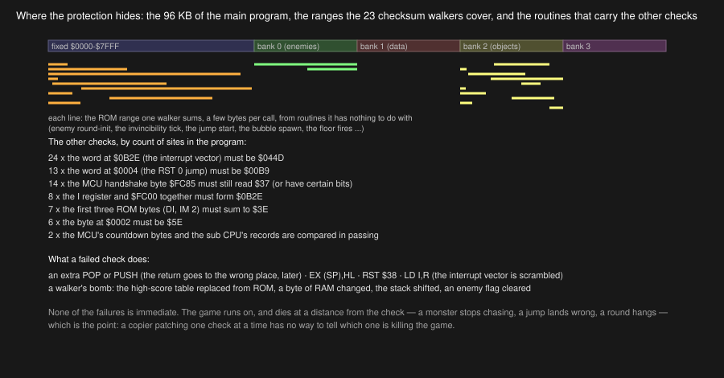

### The checksum walkers

Twenty-three routines, in the fixed ROM and in banks 0 and 2, each sum a range of the program a few bytes
at a time. They are *incremental*: a call adds one, two, four or eight bytes to a running sum kept in work
RAM and advances a pointer; when the pointer reaches the end of the range the sum is compared with the
expected value stored next to it, and the walk starts again. Because each step is a dozen instructions, a
walker costs nothing, and because the steps are spread over thousands of frames the checksum of the whole
program is complete only after minutes of play.

| Walker | Range | Step | Stepped by |
| --- | --- | --- | --- |
| `rom_check_walker_0ae3` | `$0004-$0C08` | 4 | the enemies' escape, the lightning objects, the fall state |
| `rom_check_walker1` | `$0030-$314E` | 1 | the invincibility tick, the enemies' round init |
| `rom_check_walker2` | `$0000-$7781` | 2 | the jump start, the title screen |
| `rom_check_walker3` | `$0020-$0600` | 1 | the chain score, the HURRY UP sequence |
| `rom_check_walker_340a` | `$028E-$757B` | 3 | scoring; its bomb rewrites the high-score table |
| `rom_check_walker4` | `$147E-$7ACD` | 1 | the death animation, the enemy draw |
| `rom_check_walker_482b` | `$0001-$0EDD` | 1 | a floor item rising, the title |
| `rom_check_walker_6064` | `$2642-$731C` | 2 | the round scroll, the bubble spawn |
| `rom_check_walker6` | `$0038-$142C` | 1 | the bubble spawn, a bank-2 sequence |
| `rom_check_walker_9240`, `_9d95` | bank 0, `$8000-$C000` | 1 | the type-5 and type-4 enemy drivers |
| `rom_check_walker_b8fc` | bank 0, `$A103-$BFFF` | 1 | the boss |
| `rom_check_walker_85ae`, `_8b6b`, `_8d64`, `_8f17`, `_909a`, `_932d`, `_96a9`, `_a2c0`, `_a7e3`, `_b4b5` | bank 2 ranges | 1-8 | the item effects, the sequences, the floor fires, the message panels |

The walkers are called from the routines they have nothing to do with — a walker steps when an enemy is
initialised, when the player blinks, when a jump starts, when the floor fire spreads — and their state
lives among the ordinary variables of those routines, so that neither the code nor the RAM gives them away.
The one at `$340A` has the most pointed bomb: when the sum is wrong it copies the default high-score table
from ROM over the live one, quietly, every time. A patched board would work, and would never keep a score.

### The vector and the handshake

The other checks are inline and repeated. Twenty-four places compare the interrupt vector's target
`$0B2E` with `$044D`; eight rebuild the vector from the I register and `$FC00` and compare it with `$0B2E`;
thirteen check that the `RST $00` jump at `$0004` still goes to the boot at `$00B9`; seven sum the first three
bytes of the ROM and compare with `$3E`; six check that the byte at `$0002` is `$5E`; fourteen read the MCU's
handshake byte and expect `$37` or some of its bits. They sit at the start of task 4, in the round loop, in
the chase decision of every enemy driver, in the bubble blow, in the bonus item pickup, in the water burst,
in the lightning bolt, in the boss's every frame. A copier who patched the interrupt to come from the
video circuit instead of the MCU — the obvious change on a board without the chip — would have to find all
twenty-four.

What a failed check does is never to stop. The instrument is the Z80 stack: an extra `POP AF`, a `PUSH IX`
left in place, an `EX (SP),HL`, so that a `RET` somewhere later goes to the wrong address; or `RST $38`,
which jumps into the vector page; or, in the bonus item pickup, `LD I,R`, which moves the interrupt vector
page to wherever the refresh register happens to point. The bubble blow's check pushes BC; the mode select's
swaps the return address; task 3's start pushes DE if the ROM's first bytes have changed. The game runs on,
and dies somewhere else, later, in a way that does not point back at the check. Bootleg Bubble Bobble
boards exist — the copiers replaced the MCU with a 68705 that reproduces its services — and the effort that
took is the measure of how well this worked.

### The honeypot

And one check that rewards the copier. The ORIGINAL GAME code of chapter 12 runs five of the tests above
after the eight-move sequence; on a genuine board it prints ORIGINAL GAME and sets a flag, and on a board
that fails any test it prints DEAD COPY GAME !!! and gives 100 credits. A pirate testing a bootleg with the
cheat everyone knew would see the credits arrive. The message was for the operator.

# 21. A frame, exactly

Everything in this article happens inside a sixtieth of a second, and this chapter is that sixtieth of a
second laid end to end. The frame is number 1,500 of the traced one-player game — round 1, twenty-five
seconds in, one dragon on the floor, three Zen-chans, a cluster of bubbles under the ceiling — and the
listing is the order in which the routines of chapters 9 to 18 actually ran, taken from the emulator with
every named routine's entry logged. Nine hundred and four routine entries; the helpers (the wall tests,
the table lookups, the sprite writers, the scheduler's own code and the checksum walkers) are omitted here,
which leaves the ones that decide something.

## Before the interrupt: the tail of the previous frame

The picture that the hardware shows during frame 1,500 was composed during frame 1,499. At the start of
frame 1,500's VBLANK the main CPU is idle, the sub CPU is beginning its collision pass, and the MCU is
reading the joystick. The sub CPU's pass, for this frame, takes about seven milliseconds (chapter 11).

## 0 us: VBLANK

| Time (us) | Processor | What happens |
| --- | --- | --- |
| 0 | video | Line 240: blanking begins. The last picture is complete on the screen |
| 0 | sub Z80 | Interrupt: `frame_handler`. The collision map request is idle; the doors idle; the round is running, so the sixteen tests begin, `players_caught` first |
| 0 | MCU | IRQ1: `svc_main_irq` reads the key at `$FF98` |
| ~100 | MCU | The pulse on port 1 bit 6 |
| 115 | main Z80 | `irq_vblank`: watchdog kicked, DIP switch A read (not a test mode), `frame_done` was 1: a normal frame |
| 115-1395 | main Z80 | `irq_frame_start`: 360 bytes of object list to `$DD00`; `sound_queue_pump` (the queue is empty this frame); `rng_pre` (`$E37F` + 1); `irq_essentials`: `coin_handling` with `coin_sound` and three `edge_detect` calls on the coin switches, `tilt_check`, `rng_step` and `rng_lfsr`, `timer_chain` (the frames byte reaches 60 and the seconds byte steps), `sub_cpu_watchdog` (the heartbeat moved), the frame counter |
| 1395 | main Z80 | `frame_done = 0`, `EI`, `scheduler_run` |
| ~400-1400 | MCU | `svc_inputs`, `svc_coins`, the idle services; the geometry for one active enemy record; the 2.6 ms delay loop |

## 1632 us: task 2, the round loop

The first runnable slot is task 2. Its one frame, in order:

```
join_update                 the INSERT COIN / TO CONTINUE blink in player 2's corner
join_update_p2              player 2's start button: not pressed
round_ready_display         the READY banner is long gone: nothing
read_inputs                 $FC22, $FC23 -> $E33F, $E340
game_over_check             no request
play_time_tick              the round clock: 25 seconds and a fraction
hurry_up_logic              25 is not 27 and not 30: nothing
last_enemy_angry_timer      three enemies left: nothing
last_enemy_check            nothing
                            RST $20
```

Five hundred and thirty-five microseconds, most of them in the prompts.

## 2302 us: task 3, the players and the round objects

```
round_start_anim            the round has started: returns at once
special_item_update         the round's food: timer not yet expired
bonus_item_update           the bonus item: on the field, waiting
seq_f59e_update             the bomb sequence: idle
seq_f595_update             the flyer: idle
round_end_update            the round-clear wipe: idle
seq_f521_update             the treasure fill: idle
seq_f531_update             the growing fill: idle
seq_f52b_update             the second growing fill: idle
hurry_seq_update            the bonus-item spawner's timer, counting
flying_objects_update       idle
falling_items_update        idle
seq_f5ac_update             the bouncing object: idle
bonus_sequence_check
water_flows_update          idle
floor_fires_update          idle
seq_f519_update             the palette flash: idle
big_item_update             idle
boss_lightning_update       not round 100: returns
player_death_check          $E720 is 0
f448_object                 idle
player_life_cycle           player 1: state 1
  player_alive_update
    player_pos_to_mcu       x, y -> $FC60, $FC61
    walk_anim_frame         the speed list's next byte -> [+$20]
    invincible_tick         not invincible
    jump_control            the button is up; not jumping
    bubble_blow             the button is up; the cooldown counts
    walk_move               no push from the sub CPU
    ground_control          the stick is held right: set_anim 8, and the pixels of the step, each with wall_test and wall_test_left3
    bubble_anim_timer       not burnt
    sprite_anim_draw        the walk frame into the object slot
    special_item_pickup     proximity_test: not within 14
    bonus_item_pickup       proximity_test: not within 14
    power_item_pickup       no power item
    big_item_pickup         no big item
    power_effect_update     no effect
    bubble_chain_score      no chain finished
  player 2: state $80 (not in the game): player_death_anim, which returns
                            RST $20
```

One thousand four hundred and thirty-eight microseconds. Two-thirds of the bank-2 subsystems return in
their first ten instructions; the player's own frame is about a third of the task.

## 3817 us: task 4, the enemies

```
enemy0_update               three Zen-chan records
  record 0: flag bit 1: enemy_death_update -> death_draw   (a monster popped moments ago, tumbling)
  record 1: enemy_bubble_events, enemy_hurry_check, enemy_caught_check,
            enemy_speed_select, enemy_drift, enemy_walk_down:
              enemy_stuck_jump (not stuck), then per pixel: wall_test ahead,
              target_player_alive, mcu_player_relation (the MCU's byte: the player is that way),
              enemy_wall_down_left (no gap), y + 1;
            enemy_decide -> enemy_chase (|dx| from $FC2B: too far to jump);
            enemy0_draw -> enemy_draw_walk
  record 2: enemy_death_update -> death_script_step -> death_draw   (another one tumbling)
enemy0_alt_update           not an Invader round: returns
enemy1_update .. enemy5_update   no enemies of those types: each returns
chasers_update              no chasers
subsystem_a5fe
rocks_update                no rocks
falling_objects_update
subsystem_bc14
missiles_update             the MCU countdown is not running
                            RST $20
```

Two thousand one hundred and eleven microseconds. Of the three monsters, one is walking and two are dying:
the player has just popped a pair, and the tumbling corpses cost about as much as the walker.

## 6006 us: task 5, the bubbles

```
secret_door_transition      no door
bubble_update
  bubble_spawn_gate
  records 0-6: floating bubbles, each: bubble_just_blown -> bubble_spawn_allowed,
     bubble_drift (one or two steps: bubble_current_step, and bubble_current_read on a cell boundary),
     bubble_rise_draw (bubble_lifetime inside), bubble_apply_move, bubble_edge_test
  record 7: in flight: bubble_in_flight -> find_enemy_near (nothing within 14), bubble_float
  record 8: floating, as above
  records 9-23: free: bubble_free_slot -> bubble_spawn_from_request (no request) x 15
extend_letters_complete     not all six
                            RST $20
```

Four thousand three hundred and ten microseconds: nine live bubbles at about three hundred microseconds
each, fifteen free records at a hundred each just to find out that nobody asked for a bubble. The bubble
task is the most expensive thing on the main CPU in an ordinary frame, and the reason is in this list: every
free record still walks the spawn path.

## 10358 us: done

`scheduler_run` returns to `irq_after_scheduler`: `frame_done = 1`, the interrupted address is checked
against `$C000`, `RETI`, and the main CPU is back in its two-byte loop with 6.5 milliseconds to spare. The
sub CPU finished its pass at about 4 milliseconds and has been idle since; the MCU finished its handler at
about 7.3 milliseconds. The object list built during the tasks is in the shadow at `$E1CD`; it will be
copied to the hardware at the next VBLANK, and drawn during the frame after that.


## What a frame costs

| Where the cycles go, frame 1,500 | Cycles | Share |
| --- | --- | --- |
| Interrupt handler and essentials | 7,680 | 7.6% |
| Scheduler and task switches | ~2,000 | 2% |
| Task 2 | 3,210 | 3.2% |
| Task 3 | 8,628 | 8.5% |
| Task 4 | 12,666 | 12.5% |
| Task 5 | 25,860 | 25.5% |
| Idle | ~41,000 | 40.7% |

Over the whole traced game the picture is the one chapter 9 charted: half the frame in round 1, the
spikes to 100% only at the screen transitions, and never a slowdown in play.


## What a frame is, then

Read as a whole, the frame has a shape that none of its routines knows about. The interrupt handler
commits last frame's picture and reads the world's inputs. Task 2 keeps time. Task 3 moves the players on
those inputs and runs the things the players touch. Task 4 moves the monsters against where the players
now are, using what the MCU worked out from where they were last frame. Task 5 moves the bubbles against
both, using what the sub CPU worked out during the blanking. Then the CPU rests, and while it rests the two
helpers read what it wrote and prepare the next frame's verdicts. Four processors, six tasks, one frame,
and the same order every time: that regularity is what makes the game feel the way it does, and it is what
made it possible to take the program apart routine by routine and put it back together in another
language, exact to the cycle.

# 22. Afterword: how this article was made

The article you have read is the by-product of a stranger project. Its aim was not to describe Bubble Bobble
but to *rewrite* it: to take the four programs on the board — the main Z80's 96 KB, the sub Z80's 8 KB, the
sound Z80's 16 KB and the 6801's 4 KB — and turn every routine into TypeScript, in a form that behaves
identically to the original down to the clock cycle. The description came afterwards, because once a
routine has been rewritten so exactly that an emulator cannot tell the difference, there is nothing left
about it that is not understood. This chapter is about how that was done, what made it hard, and what is
still not known.

## The emulator

The first tool was an emulator of the board, written from the schematic and the MAME driver's memory maps:
two Z80 cores, a third for the sound board, a 6801 core, the YM2203 and YM3526 register models, the video
circuit as described in chapter 4, and the shared-RAM arbitration. It runs the four programs in lockstep,
cycle for cycle, and it is the machine that rendered every screenshot in this article — `tools/book/shot.ts`
loads a scenario (a scripted sequence of inputs: coin at frame 60, start at 100, right from 910 ...), runs to
a frame number, and writes the frame buffer as a PNG. The scenarios are also what made the game
*reproducible*: the same inputs give the same game, every time, because the program has no other source
of randomness (chapter 20). "Frame 1,500 of the play scenario" is a precise address.

## Hook and lockstep

A program cannot be ported all at once. The method was to replace it one routine at a time, in place:

1. Pick a routine from the disassembly — the annotated listings in `docs/disasm/`, generated from the
   symbol tables in `docs/symbols/`, which grew from a few hundred names to several thousand.
2. Write its TypeScript equivalent as a **hook** keyed by the routine's physical ROM address. When the
   emulated CPU reaches that address, the hook runs instead of the machine code: it reads and writes the
   same RAM, produces the same register and flag results, and *charges the same number of cycles* —
   because the sub CPU and the MCU are running alongside, and a hook that finished a cycle early would
   read a shared byte before the other processor had written it.
3. Run the **lockstep**: two machines side by side, one running the original ROM natively, one with the
   hooks installed, compared at every frame boundary (all of RAM, every register) and at every routine
   end. The first divergence names the routine and the frame.
4. Run the **census**: a coverage tool that lists which addresses still execute natively. When it lists
   nothing but the reset vector and the idle loop, the port of that CPU is complete.

The census mattered more than expected. A passing lockstep proves that the hooked routines behave; it does
not prove that everything is hooked. The sound program's music modulation code, the enemy drivers for types
that appear only after round 40, the ending, the test mode: each was found by the census, not by the
lockstep, and each needed its own scenario (a warp to round 42; a game with the round counter poked to 99;
DIP switch A set to the test position) to reach it at all. The `POKE` mechanism — write a byte into both
machines' RAM at a given frame — is how the rare states in this article were produced: the secret rooms, the
forced item pickups of chapter 18, the boss's death by fiat in chapter 19.

## What was hard

**Timing of shared memory.** The main CPU writes a bubble's position; the sub CPU reads it during blanking;
the main CPU reads back the sub CPU's verdict a frame later. A hook that wrote the position fifty cycles
early — a whole routine done in one step instead of instruction by instruction — changed which frame the sub
CPU saw it in, and the game diverged a thousand frames later. The rule that emerged is stated in chapter 9:
every write to shared RAM has to land in the same scheduler slice as the original instruction. The hooks
became generators that pause before each shared access, charged to the cycle, and the framework grew a set of
checkers for the ways a hook could be wrong: a block boundary off by an instruction, a CALL's cost omitted, a
generator called without being awaited, a branch's fall-through paused where its target should have been.

**The refresh register.** `LD A,R` returns a count of instruction fetches. To reproduce it the emulator must
count fetches exactly, through every interrupt and every wait state, and the hooks must charge exactly the
fetches the replaced code would have made. Twelve instructions in the ROM made the whole project exact by
necessity.

**Names.** The disassembly was made before the program was understood, and its names encode early guesses.
The most consequential was the axis: the record's first coordinate is vertical, the second horizontal, and a
family of wall tests, enemy states and bubble routines had been named for the other convention. `wall_test_left3`
is the floor test; `enemy_walk_down` walks right; `bubble_push_down` pushes right. Every such name was checked
against what the routine does before it appears in this article, and where a name survives from the listings
it is because it happens to be right or because it is a neutral label.

**Which axis is which** turned out to matter for the maps too. The current arrows of chapter 6 were drawn
wrongly in the first version of this article, with rightward and leftward exchanged, and the error was found
by watching a bubble on round 20 drift the way the arrows said it should not. The corrected figures are the
ones printed.

**Four programs, one frame.** Nothing in the main program's listing says when the MCU's geometry byte is
valid or how long the sub CPU's pass takes. Chapters 9 to 11 exist because those numbers had to be measured:
the MCU's handler was timed at 7.3 milliseconds only after an emulated 6801 replaced the ported one for
the measurement, and the sub CPU's cost per bubble was found by counting.

## What is still not known

* **The intent behind the unused MCU services.** Lives counters, a round mirror, forty sequence lists, a
  credit-adding service: the MCU has the outline of a program that would have owned more of the game. Whether
  this was a plan abandoned, a protection scheme half built, or code shared with another Taito board of the
  year, the ROMs do not say.
* **The seventh chain score.** The table at `$460A` has an entry for seven enemies popped at once that the
  count can never reach in a normal round. Either a feature was cut, or it was a guard.
* **Several bank-2 sequences** are described in this article by what they do on screen — the growing fill, the
  bouncing object, the palette flash — and not by what the designers called them. Their names in the
  listings (`seq_f521_update` and its neighbours) are addresses, and they stay addresses here.
* **The Japanese and export differences.** The text language is a DIP switch and the ROM set is the
  export one; the earlier Japanese sets differ in the round data and in details of the enemies' speed that
  this article does not cover.
* **The sound driver's echo mode and second command table**, present and never triggered.

## The tools of this article

The figures were rendered by a handful of scripts in `tools/book/`: `shot.ts` for screenshots, `sheet.ts`
for the contact sheets of frames and the cropped strips, `gfx.ts`, `sprites.ts`, `itemsheet.ts` and `wallsets.ts` for the
graphics sheets, `maps.ts` for the hundred rounds with their current arrows, `busychart.ts` and `jumparc.ts` for the
measured plots, and `build.ts`, which joins the chapters into one Markdown file and one HTML file with every
image embedded. The measurements came from throwaway scripts on the same emulator: a per-frame trace of
which routine the main CPU was in, the sub CPU's cycles per handler run, the MCU's per-service costs. The
text was written chapter by chapter against the listings and the running machine, and every claim about
what a routine does that could be tested was tested, usually by forcing the state and watching.

## Why it was worth doing

Bubble Bobble is forty years old and has been played by more people than most books have readers. What is
inside it is neither large nor mysterious once it has been laid out — six tasks, a hundred maps, a few
tables of numbers — and yet the thing those parts produce is still unmistakable the moment the theme starts.
Understanding the program does not diminish that. It shows where it came from: from a bubble that lives a
random number of seconds because someone read the refresh register, from a monster that turns towards you
because a chip meant to guard against copying also does the arithmetic, from a frame that runs the same
order of routines sixty times a second and never slips. The people who made it are named in the credits at
the end of round 100. This article is for the machine they built.

# Appendix A. Work RAM map

The named bytes of the main CPU's RAM, as recovered during the disassembly. The names are the ones used in the listings and in this article; unnamed bytes are omitted. `$E000-$F7FF` is the RAM the sub CPU shares (chapter 11), `$FC00-$FFFF` the MCU's (chapter 10).

| Address | Name |
| --- | --- |
| `$E000` | `task_state` |
| `$E006` | `task_sp` |
| `$E192` | `cur_task_ptr` |
| `$E194` | `frame_done` |
| `$E1C5` | `sched_sp` |
| `$E1C7` | `irq_saved_sp` |
| `$E1C9` | `tmp_sp` |
| `$E1CB` | `bank_ctrl_shadow` |
| `$E1CD` | `objram_shadow` |
| `$E2D5` | `object_list_a` |
| `$E2F5` | `object_list_b` |
| `$E335` | `timer_frames` |
| `$E336` | `timer_seconds` |
| `$E337` | `timer_minutes` |
| `$E338` | `frame_counter` |
| `$E339` | `subwd_last` |
| `$E33A` | `subwd_stall` |
| `$E33B` | `ready_state` |
| `$E33C` | `ready_timer` |
| `$E33F` | `input_p1` |
| `$E340` | `input_p2` |
| `$E341` | `time_paused` |
| `$E342` | `game_over_flag` |
| `$E343` | `angry_done` |
| `$E344` | `play_frames` |
| `$E345` | `play_seconds` |
| `$E346` | `play_minutes` |
| `$E347` | `angry_frames` |
| `$E348` | `angry_seconds` |
| `$E349` | `last_enemy_flag` |
| `$E34A` | `hurry_up_flag` |
| `$E34B` | `hurry_state` |
| `$E34C` | `hurry_tick` |
| `$E34D` | `hurry_phase` |
| `$E34E` | `hurry_wait` |
| `$E34F` | `game_over_request` |
| `$E350` | `player_count` |
| `$E351` | `intro_active` |
| `$E352` | `playfield_half` |
| `$E353` | `demo_ptr_p1` |
| `$E355` | `demo_ptr_p2` |
| `$E357` | `skip_round_intro` |
| `$E358` | `extend_collected` |
| `$E35E` | `coin_edge` |
| `$E366` | `credits` |
| `$E367` | `coin_sound_queue` |
| `$E368` | `coin_sound_busy` |
| `$E369` | `coin_sound_timer` |
| `$E36A` | `coinage_a` |
| `$E372` | `coinage_b` |
| `$E37F` | `rng_seed` |
| `$E381` | `sound_queue` |
| `$E391` | `sound_queue_len` |
| `$E598` | `round_record` |
| `$E5A5` | `round_time_limit` |
| `$E5A7` | `angry_time_limit` |
| `$E5C3` | `anim_active` |
| `$E5C4` | `anim_counter` |
| `$E5D3` | `demo_flag` |
| `$E5D7` | `players_alive` |
| `$E5DB` | `alt_round_mode` |
| `$E5DC` | `difficulty_rank` |
| `$E641` | `score_p1` |
| `$E64B` | `round_number` |
| `$E6FF` | `round_start` |
| `$E737` | `bonus_flag` |
| `$E744` | `special_item` |
| `$E76A` | `round_clear` |
| `$ED21` | `enemy_recs_for_mcu` |
| `$ED3D` | `enemy_count` |
| `$F455` | `time_frames` |
| `$F456` | `time_seconds` |
| `$F66E` | `sub_heartbeat` |
| `$FA00` | `IO_sound_latch` |
| `$FA03` | `IO_sound_reset` |
| `$FA80` | `IO_watchdog` |
| `$FB40` | `IO_bank_ctrl` |
| `$FC00` | `mcu_irq_vector` |
| `$FC01` | `mcu_enemy_recs` |
| `$FC1E` | `mcu_credits` |
| `$FC1F` | `mcu_port1_copy` |
| `$FC20` | `mcu_dswa` |
| `$FC21` | `mcu_dswb` |
| `$FC22` | `mcu_in1` |
| `$FC23` | `mcu_in2` |
| `$FC24` | `mcu_counter_p1` |
| `$FC25` | `mcu_counter_p2` |
| `$FC26` | `mcu_value_0C26` |
| `$FC27` | `mcu_enemy_results` |
| `$FC5F` | `mcu_p1_active` |
| `$FC60` | `mcu_p1_x` |
| `$FC61` | `mcu_p1_y` |
| `$FC62` | `mcu_p1_hit` |
| `$FC63` | `mcu_p1_hit_index` |
| `$FC67` | `mcu_p2_active` |
| `$FC68` | `mcu_p2_x` |
| `$FC69` | `mcu_p2_y` |
| `$FC6A` | `mcu_p2_hit` |
| `$FC6B` | `mcu_p2_hit_index` |
| `$FC6F` | `mcu_cmd_counter_p1` |
| `$FC70` | `mcu_cmd_counter_p2` |
| `$FC71` | `mcu_cheat_key` |
| `$FC72` | `mcu_seq_list_a` |
| `$FC73` | `mcu_seq_value_a` |
| `$FC74` | `mcu_seq_list_b` |
| `$FC75` | `mcu_seq_value_b` |
| `$FC76` | `mcu_seq_list_c` |
| `$FC77` | `mcu_seq_value_c` |
| `$FC78` | `mcu_countdown_hi` |
| `$FC79` | `mcu_countdown_lo` |
| `$FC7A` | `mcu_countdown_run` |
| `$FC7B` | `mcu_countdown_done` |
| `$FC7C` | `mcu_extend_letter` |
| `$FC7D` | `mcu_coin_at_boot` |
| `$FC7E` | `mcu_cmd_value_0C26` |
| `$FC80` | `mcu_seq_list_d` |
| `$FC81` | `mcu_seq_value_d` |
| `$FC82` | `mcu_checksum` |
| `$FC85` | `mcu_ready` |
| `$FC88` | `mcu_table_a` |
| `$FF94` | `mcu_lockout_cmd` |
| `$FF98` | `mcu_enable_key` |

# Appendix B. Record layouts

The program keeps every moving thing in a fixed-size record, and the records share a convention: byte 0 is a
state or flag byte, bytes 1 and 2 are the position (x vertical, counted upwards; y horizontal), bytes 3 and 4
point at the object entry that draws it. What follows byte 4 differs per kind. These tables gather the layouts
that the chapters use; offsets are hexadecimal and relative to the record's first byte, as the code writes them
(`IX+$nn`).

## The object entry (4 bytes, 90 at `$E1CD`; hardware copy at `$DD00`)

| Byte | Meaning |
| --- | --- |
| 0 | `256 - y`: the vertical position, negated |
| 1 | Bits 7-5 the shape (a line of the video PROM); bits 4-0 the column of video RAM that holds the tiles |
| 2 | x: the horizontal position |
| 3 | Bits 3-0 the tile bank (× 1024); bit 6: x is negative |

Four zero bytes are skipped. Entries 0-15 are the playfield columns, 16-65 the sprites (24 bubbles first), 66-89 the
panels and text objects.

## The video cell (2 bytes, in the 128-byte columns of `$C000-$DCFF`)

| Byte | Meaning |
| --- | --- |
| 0 | Tile number, low eight bits |
| 1 | Bits 1-0 tile number bits 9-8; bits 5-2 colour group; bit 6 flip x; bit 7 flip y |

Sprites for bubbles, players and enemies are object bank 2, so the full tile number is `low + 256 × (attr & 3) +
2048`; items, fruit and captured enemies are bank 3 (`+ 3072`).

## The player record (50 bytes: `$E691` player 1, `$E6C3` player 2)

| Offset | Field | Values |
| --- | --- | --- |
| `+$00` | State | 0 waiting, 1 alive, `$10` caught (set by the sub CPU), 2 dying, 4 and `$80` dead |
| `+$01`, `+$02` | x, y | Copied from the object slot each frame |
| `+$03`, `+$04` | Object slot pointer | `$E2C5` (player 1), `$E2B5` (player 2) |
| `+$05`, `+$06` | Animation frame, tick | Against the table at `$4583` |
| `+$07` | Colour attribute | `$18` Bub, `$19` Bob |
| `+$08` | Facing | 1 right, 0 left; read by the sub CPU |
| `+$09` | Player index | 0 or 1 |
| `+$0A` | Bubble button flags | Bit 0 blowing, bit 1 held, bit 2 blow animation running |
| `+$0B` | Falling | Bit 0: airborne without a jump |
| `+$0C` | Jump flags | Bit 0 jumping, 1 held, 3 right, 4 left, 5 straight up, 6 sideways blocked |
| `+$0D`-`+$11` | Jump arc | Pointer into the table at `$4AEC`, dy, steps left, step index |
| `+$12` | Animation | 0 stand, 8 walk, `$18` fall, `$20` jump, `$30` pushed, `$38` burnt, `$40`-`$58` blowing, `$FF` none |
| `+$13`-`+$16` | Item invincibility | Flag and 900-frame timer |
| `+$18` | Air-control counter | 1 px every third frame while airborne |
| `+$19`, `+$1A` | Death variant, score colour | Bit 0 of `+$19`: burnt |
| `+$1B`, `+$1C` | Burnt, burn timer | 30 frames without control |
| `+$1F`, `+$20` | Speed pattern index, step | Next entry of the speed list: pixels this frame |
| `+$21`, `+$22` | Pushed by a bubble | Written by the sub CPU; `+$22` signed pixels |
| `+$23` | Pose | 0 standing, 1 rising, 2 walking right, 3 falling, 4 walking left |
| `+$24` | Bounce request | Bit 0 set by the sub CPU on landing on a bubble |
| `+$25` | Invincibility frames | 180 after a respawn |
| `+$26`, `+$27`, `+$28` | Blow cooldown, chain timer, bubbles left | `+$26` reloaded from `+$2E`; `+$27` counts 90 |
| `+$2A` | Extra lives pending | One per respawn |
| `+$2C` | Tick-rate index | One of four animation rates |
| `+$2D` | Mode bits | Bit 0 walking scores, 1 jumping scores, 2 blowing scores, 6 extra-life bubbles |
| `+$2E`, `+$2F` | Blow reload, bubble range | 20 and 3; 5 and 6 for the fast player |
| `+$30` | Speed list | 12 normally, 20 fast, 22 invincible |
| `+$31` | Bubble speed parameter | `$40`, copied into the blow request |

## The blow request (6 bytes: `$E75E` player 1, `$E764` player 2)

| Byte | Meaning |
| --- | --- |
| 0 | Pending flag |
| 1, 2 | x, y of the mouth |
| 3 | Facing |
| 4 | Range (`+$2F` of the player) |
| 5 | Speed parameter (`+$31`) |

## The bubble record (40 bytes, 24 at `$E76C`)

| Offset | Field | Values |
| --- | --- | --- |
| `+$00` | State | 0 free, 1 floating, 2 in flight, 4 holding an enemy, 8 EXTEND letter, `$10` special, `$20` lightning bolt, `$40` falling fire, `$80` popping |
| `+$01`, `+$02` | x, y | From the object slot |
| `+$03`, `+$04` | Object slot | `$E20D + 4n` |
| `+$07` | Slot code | For the sprite routines |
| `+$0A` | Current nibble | The last one read from the map |
| `+$0B` | Counted | Bit 0: already counted out of `bubbles_active` |
| `+$0C`, `+$0D` | Lifetime | 60-frame tick, periods left |
| `+$0E` | Phase | 0, 1 owner's colour; 2, 3 ageing; `$FF` pop now |
| `+$0F` | Direction | 1 right, 3 left, 0 up, 2 down; also the sub CPU's push mode |
| `+$10`-`+$12` | Flight | Range left in `+$12` |
| `+$13`, `+$14` | Pending displacement | Vertical, horizontal; written by the sub CPU (crowding, pushing) |
| `+$15` | Caught enemy | Record index |
| `+$16` | Owner | Player 0 or 1; the sub CPU writes it when a player claims the bubble |
| `+$17` | EXTEND letter | 0-5 |
| `+$18` | Special kind | 1 fire, 2 water, 3 lightning |
| `+$19` | Caught enemy's tile set | Type × 4 |
| `+$1A` | The sub CPU's claim | Touch state; bit 2 popped by a player |
| `+$1B` | Bob offset | 4 or 8 while a player stands on it |
| `+$1D` | Group | Record index for the chain pop |
| `+$1F` | Flight speed | Pixels per frame |
| `+$20`, `+$21` | Animation flags | `+$21` bit 7 killer bubble, bits 5 and 6 the two kinds of item |
| `+$22` | Chain place | From the sub CPU; chooses the fruit |
| `+$23`, `+$24` | Drift | This frame's step count, speed-list index |
| `+$25`, `+$26` | Animation counters | `+$26` bits 5 and 6: the sub CPU's "collected" flags for items |

## The enemy record (type 0: 25 bytes at `$ED49 + 25n`; type 2: 35; type 3: 27)

| Offset | Field | Values |
| --- | --- | --- |
| `+$00` | Flags | Bit 0 on the field, 1 dying, 2 in a bubble, 3 gone, 4 killed by a pop, 5 entrance done, 6 released, 7 angry |
| `+$01`, `+$02` | x, y | Also copied to the shared record at `$ED21` |
| `+$03`, `+$04` | Object slot pointer | From the slot allocator |
| `+$05`, `+$06` | Animation frame, tick | Walk cycle or tumble |
| `+$07` | State | 0 idle, 1 walking right, 2 falling, 3 walking left, 4 and 5 jumping |
| `+$08` | Direction | 1 right, 3 left |
| `+$09` | Enemy index | 0-6: selects the shared record and the MCU result at `$FC27 + 8n` |
| `+$0A` | Slot code | |
| `+$0B`-`+$0D` | Speed list index, list, step | Lists at `$11CE`; +6 when angry, capped at 40 |
| `+$0E` | Movement flags | Bit 1 moved, 5 fell, 6 angry speed applied, 7 hurry-up speed; while dying: the death state |
| `+$0F` | Chase flag | Player within 32 lines; while dead: which player collected the fruit |
| `+$10`, `+$11` | Script pointer | Jump or turn script; during the entrance: step timer and target line |
| `+$12`, `+$13` | Script step, repeats | During the entrance: the 180-frame timer |
| `+$14` | Blocked counter | At 60 the enemy jumps out |
| `+$15` | Decision timer | While dead: the fruit index |
| `+$16` | Timer | 120 at start; while dead: the 60-frame fruit pauses |
| `+$17` | Tile set | 3 marks the variant that never chases |
| `+$18` | Decision bits | Bit 0 jump script running, 1 next decision is a jump, 2 landed, 7 jump script armed |
| `+$19`-`+$22` | Type 2 only | The second slot and sprite for the rock in hand, the throw timer |
| `+$19`, `+$1A` | Type 3 only | The shot budget (two per life) and its timer |

The round's type-list byte at `[$C]` of the round record adds the variants: bit 0 Invader instead of type 0, bit 4
Drunk instead of type 2.

## The shared enemy record (4 bytes, 7 at `$ED21`; read by the sub CPU and the MCU)

| Byte | Meaning |
| --- | --- |
| 0 | Flags: bit 0 on the field; `$80` caught in a bubble, `$40` dead and falling, `$20` escaped angry, `$10` caught by an item, 8 lying as fruit |
| 1, 2 | x, y |
| 3 | Result: the sub CPU's touch report, the chain place, or which player picked the fruit up (bit 7 = player 2) |

## The MCU geometry record (8 bytes, 7 at `$FC27`; written by the MCU from the `$FC01` records)

Player 1's values are in the even bytes, player 2's in the odd ones.

| Byte | Meaning |
| --- | --- |
| 0, 1 | Horizontal direction code: `$00` the player is one way, `$80` the other, as `mcu_player_relation` tests it |
| 2, 3 | Vertical direction code, the same way |
| 4, 5 | \|dx\| |
| 6, 7 | \|dy\|, the value `enemy_chase` compares with 20 |

When both distances are under eight the MCU also writes a touch report to `$FC62`/`$FC63`, which the main
program never reads.

## Rocks, shots, chasers, the ring

| Record | Where | Layout |
| --- | --- | --- |
| Rock | `$EC29`, 16 bytes, one per type-2 enemy | `+0` flags (bit 0 live, bit 2 bursting), `+1`/`+2` x y, `+3`/`+4` object slot (the thrower's second slot), `+7` slot code, `+$0A` the thrower's direction, `+$0C` speed: the thrower's speed + 4, capped at 30 |
| Fire shot | `$EB99`, two per type-3 enemy | The same shape; speed the breather's + 10 |
| Missile | `$ECAA`, Invader's | The same shape; launched on the MCU's 600-frame countdown |
| Chaser | `$F1C2`, `$F1D4`, 18 bytes each | `+0` flags (bit 0 live, 1 hunting, 2 puffing out, 7 done), `+1`/`+2` x y, `+3`/`+4` slot, `+9` phase bits, `+$0E` movement bits; exist while `$E343` is set — Skel-Monsta in a round, the exits in a secret room |
| Boss ring bubble | `$F367`, eight records | `+0` flags (bit 0 live, bit 1 launched), `+3`/`+4` slot, `+7` quadrant and script bits selecting one of the four scripts at `$BBAE`; `$F3C9` counts the ring |

## The sound channel record (sound CPU RAM `$8000-$89DF`)

The record size depends on the chip: 112 bytes for an SSG channel, 288 for a YM2203 FM channel (the primary
voice and the alternate voice share it), 80 for a YM3526 voice. The bytes the YM3526 interpreter touches:

| Offset | Meaning |
| --- | --- |
| `[0]` | State bits: bit 3 a note has been set, bits 4 and 7 request key-on, bit 2 sustain, bit 5 tested on return from a command |
| `[$0F]` and following | Dirty bits per register group; the tick writer clears them as it writes the chip |
| `[$18]`-`[$4D]` | The instrument: the operator registers as the loader copied them from the header's instrument list |
| `[$1A]`, `[$1B]` | Frequency number, low byte, from the note table at `$0840` (current and pending) |
| `[$1C]`-`[$1E]` | Frequency number high bits with the octave from the pattern byte's bits 6-4, and the key-on form of the same |

The pattern pointer itself lives in `BC` while the interpreter runs and is saved back to the record between
ticks; the step pointer, loop counts and priority are kept in the first sixteen bytes.

## The kernel's task table (`$E000-$E011`, stacks at `$E020 + 64n`)

| Address | Meaning |
| --- | --- |
| `$E000`-`$E005` | State of task n: 0 running or runnable now, k = runs in k frames, `$FF` stopped |
| `$E006`-`$E011` | Saved stack pointer of task n |
| `$E020 + 64n` | Task n's 64-byte stack |
| `$0B22` | Entry table: the start address of each task |
| `$0B2E` | The interrupt vector word, `$044D`, checked twenty-four times |

# Appendix C. Sound commands

The fifty-three commands of the sound program (chapter 8): the table entry at $329C + 2n, the number of channel headers it requests, the first header's record and priority, its follow-up command, and where the game uses it (from the traced sessions; a blank means the tracing did not hear it).

| Command | Headers | First record (kind) | Priority | Follow-up | Used for |
| --- | --- | --- | --- | --- | --- |
| `$00` | 26 | `$8440` (`$98`) | 0 | none | silence everything (sent at boot and when a round ends) |
| `$01` | 9 | `$8440` (`$98`) | 0 | none | silence the nine YM3526 first voices |
| `$02` | 9 | `$8490` (`$9A`) | 0 | none | silence the nine YM3526 second voices (the theme) |
| `$03` | 3 | `$80E0` (`$8C`) | 0 | none | silence the three YM2203 primary voices |
| `$04` | 3 | `$8170` (`$8E`) | 0 | none | silence the three YM2203 alternate voices |
| `$05` | 1 | `$8000` (`$84`) | 0 | none | silence SSG channel A |
| `$06` | 1 | `$8070` (`$86`) | 0 | none | silence SSG channel B |
| `$07` | 9 | `$8490` (`$9A`) | 8 | `$30` | the main theme (started by the story intro) |
| `$08` | 9 | `$8440` (`$98`) | 8 | none | the game-over jingle |
| `$09` | 3 | ? | ? | ? |  |
| `$0A` | 9 | `$8490` (`$9A`) | 8 | none |  |
| `$0B` | 9 | `$8440` (`$98`) | 8 | none | GAME OVER music |
| `$0C` | 1 | `$8200` (`$90`) | 1 | none |  |
| `$0D` | 1 | `$8200` (`$90`) | 7 | none | the player is hit |
| `$0E` | 1 | `$8200` (`$90`) | 7 | none | a rock bursts |
| `$0F` | 9 | ? | ? | ? |  |
| `$10` | 9 | `$8490` (`$9A`) | 8 | `$32` | the results / ending music |
| `$11` | 1 | `$8200` (`$90`) | 8 | none | an item is collected |
| `$12` | 3 | `$80E0` (`$8C`) | 8 | none |  |
| `$13` | 9 | `$8440` (`$98`) | 8 | none | the secret room |
| `$14` | 9 | `$8440` (`$98`) | 8 | none | EXTEND |
| `$15` | 1 | `$8200` (`$90`) | 6 | none | the boss starts moving |
| `$16` | 1 | `$8200` (`$90`) | 8 | none | a bonus item is taken |
| `$17` | 1 | `$8320` (`$94`) | 7 | none | an EXTEND letter |
| `$18` | 3 | ? | ? | ? | HURRY UP |
| `$19` | 9 | `$8440` (`$98`) | 8 | none | the ending |
| `$1A` | 1 | `$8200` (`$90`) | 8 | none |  |
| `$1B` | 2 | `$80E0` (`$8C`) | 7 | none |  |
| `$1C` | 3 | `$8170` (`$8E`) | 8 | none |  |
| `$1D` | 1 | `$8200` (`$90`) | 8 | none |  |
| `$1E` | 1 | `$8200` (`$90`) | 6 | none |  |
| `$1F` | 1 | `$8200` (`$90`) | 6 | none |  |
| `$20` | 1 | `$8200` (`$90`) | 8 | none | the round food is taken |
| `$21` | 1 | `$8200` (`$90`) | 6 | none |  |
| `$22` | 1 | `$8200` (`$90`) | 6 | none | a fire shot |
| `$23` | 2 | `$8200` (`$90`) | 8 | none |  |
| `$24` | 2 | `$8200` (`$90`) | 8 | none |  |
| `$25` | 1 | `$80E0` (`$8C`) | 7 | none | an enemy dies (bubble popped, fire) |
| `$26` | 2 | `$80E0` (`$8C`) | 7 | none | chain of 2-4 |
| `$27` | 3 | `$80E0` (`$8C`) | 7 | none | chain of 5-7 (and the fatal boss hit) |
| `$28` | 2 | `$8200` (`$90`) | 8 | none |  |
| `$29` | 9 | `$8490` (`$9A`) | 8 | none |  |
| `$2A` | 9 | `$8440` (`$98`) | 8 | none |  |
| `$2B` | 9 | `$8440` (`$98`) | 8 | none |  |
| `$2C` | 1 | `$80E0` (`$8C`) | 8 | none | the jump |
| `$2D` | 3 | `$80E0` (`$8C`) | 2 | none |  |
| `$2E` | 1 | ? | ? | ? |  |
| `$2F` | 1 | `$80E0` (`$8C`) | 7 | none |  |
| `$30` | 9 | `$8490` (`$9A`) | 8 | `$30` | round clear with EXTEND collected |
| `$31` | 1 | `$80E0` (`$8C`) | 8 | none | the bubble blow |
| `$32` | 9 | ? | ? | ? |  |
| `$33` | 1 | `$80E0` (`$8C`) | 8 | none | a lightning bolt hits |
| `$34` | 1 | `$80E0` (`$8C`) | 1 | none | a coin |

# Appendix D. The round table

The 43-byte round records of bank 1 ($A73A + 43 x round), decoded as in chapter 6: the palette scheme, the layout byte, the enemy counts by type (0 Zen-chan, 1 Banebou, 2 Mighta, 3 Hidegons, 4 Pulpul, 5 Monsta; the Invader and Drunk variants by the flag byte), the bubble hold time, the enemy speed list, the time limit and the angry time in seconds, and the flags.

| Round | Palette | Layout | T0 | T1 | T2 | T3 | T4 | T5 | Hold | Speed | Time | Angry | Flags |
| --- | --- | --- | --- | --- | --- | --- | --- | --- | --- | --- | --- | --- | --- |
| 1 | 5 | `$AA` | 3 |  |  |  |  |  | 30 | 10 | 30 | 10 | `$00` |
| 2 | 4 | `$AA` | 4 |  |  |  |  |  | 30 | 10 | 30 | 10 | `$00` |
| 3 | 4 | `$00` | 4 |  |  |  |  |  | 30 | 10 | 30 | 10 | `$00` |
| 4 | 1 | `$50` | 6 |  |  |  |  |  | 30 | 10 | 30 | 10 | `$00` |
| 5 | 6 | `$55` | 4 |  |  |  |  |  | 20 | 10 | 30 | 10 | `$00` |
| 6 | 0 | `$55` | 2 |  | 2 |  |  |  | 20 | 10 | 30 | 10 | `$00` |
| 7 | 2 | `$55` |  |  | 4 |  |  |  | 20 | 10 | 30 | 10 | `$00` |
| 8 | 3 | `$5A` | 2 |  | 2 |  |  |  | 20 | 10 | 30 | 10 | `$00` |
| 9 | 0 | `$5A` |  |  | 5 |  |  |  | 20 | 10 | 30 | 10 | `$00` |
| 10 | 1 | `$55` | 4 |  |  |  |  | 3 | 10 | 10 | 30 | 10 | `$00` |
| 11 | 3 | `$55` | 3 |  |  |  |  | 4 | 12 | 10 | 30 | 10 | `$00` |
| 12 | 1 | `$00` |  |  |  |  |  | 6 | 30 | 10 | 30 | 10 | `$01` |
| 13 | 5 | `$00` |  |  |  |  |  | 7 | 12 | 10 | 30 | 10 | `$01` |
| 14 | 2 | `$00` |  |  | 2 |  |  | 5 | 12 | 10 | 30 | 10 | `$00` |
| 15 | 1 | `$19` | 5 |  | 2 |  |  |  | 10 | 10 | 30 | 10 | `$00` |
| 16 | 5 | `$AA` |  |  |  |  |  | 7 | 12 | 11 | 30 | 10 | `$00` |
| 17 | 7 | `$55` |  |  | 2 |  |  | 5 | 10 | 10 | 30 | 10 | `$01` |
| 18 | 0 | `$55` | 6 |  |  |  |  |  | 12 | 10 | 30 | 10 | `$00` |
| 19 | 5 | `$00` |  |  |  |  |  | 7 | 12 | 10 | 30 | 10 | `$01` |
| 20 | 1 | `$00` |  |  | 2 |  | 3 |  | 12 | 10 | 30 | 10 | `$00` |
| 21 | 3 | `$4A` | 4 |  | 3 |  |  |  | 12 | 10 | 30 | 10 | `$00` |
| 22 | 2 | `$00` |  |  |  |  | 4 |  | 12 | 10 | 30 | 10 | `$01` |
| 23 | 7 | `$55` |  |  |  |  | 5 |  | 40 | 10 | 30 | 10 | `$01` |
| 24 | 1 | `$AA` |  |  |  |  | 7 |  | 50 | 10 | 30 | 10 | `$01` |
| 25 | 4 | `$5A` |  |  |  |  |  | 6 | 12 | 10 | 30 | 10 | `$01` |
| 26 | 3 | `$5A` |  |  | 7 |  |  |  | 12 | 10 | 30 | 10 | `$00` |
| 27 | 0 | `$00` |  |  |  |  | 3 | 4 | 30 | 10 | 30 | 10 | `$01` |
| 28 | 5 | `$5A` |  |  | 7 |  |  |  | 25 | 10 | 30 | 10 | `$00` |
| 29 | 2 | `$50` |  |  | 1 |  |  | 6 | 12 | 10 | 30 | 10 | `$01` |
| 30 | 3 | `$00` |  | 5 |  |  | 2 |  | 30 | 14 | 30 | 10 | `$00` |
| 31 | 0 | `$AA` |  |  | 7 |  |  |  | 25 | 10 | 30 | 10 | `$01` |
| 32 | 2 | `$AA` |  |  |  |  | 7 |  | 40 | 11 | 30 | 10 | `$01` |
| 33 | 5 | `$00` | 7 |  |  |  |  |  | 12 | 11 | 30 | 10 | `$00` |
| 34 | 5 | `$5A` |  |  | 7 |  |  |  | 12 | 10 | 30 | 10 | `$00` |
| 35 | 7 | `$5A` | 7 |  |  |  |  |  | 10 | 11 | 30 | 10 | `$00` |
| 36 | 2 | `$AA` |  | 7 |  |  |  |  | 17 | 11 | 30 | 10 | `$00` |
| 37 | 3 | `$6A` | 7 |  |  |  |  |  | 15 | 11 | 30 | 10 | `$00` |
| 38 | 4 | `$A0` |  | 7 |  |  |  |  | 12 | 6 | 30 | 10 | `$00` |
| 39 | 0 | `$00` | 7 |  |  |  |  |  | 12 | 11 | 30 | 10 | `$00` |
| 40 | 4 | `$50` |  |  | 2 | 5 |  |  | 14 | 13 | 30 | 10 | `$00` |
| 41 | 2 | `$AA` |  |  |  |  | 7 |  | 1 | 10 | 30 | 10 | `$00` |
| 42 | 5 | `$AA` |  |  |  | 7 |  |  | 8 | 11 | 28 | 10 | `$01` |
| 43 | 4 | `$22` |  | 1 | 2 | 2 |  | 2 | 20 | 11 | 28 | 10 | `$00` |
| 44 | 5 | `$AA` |  |  |  | 7 |  |  | 4 | 11 | 28 | 10 | `$01` |
| 45 | 4 | `$AA` | 7 |  |  |  |  |  | 30 | 11 | 20 | 10 | `$00` |
| 46 | 4 | `$AA` |  | 7 |  |  |  |  | 2 | 11 | 27 | 10 | `$00` |
| 47 | 3 | `$00` |  | 4 |  | 3 |  |  | 12 | 11 | 27 | 10 | `$01` |
| 48 | 1 | `$AA` |  |  | 2 | 4 |  |  | 10 | 10 | 25 | 10 | `$01` |
| 49 | 3 | `$00` |  |  |  |  | 6 |  | 8 | 11 | 25 | 10 | `$10` |
| 50 | 1 | `$AA` |  |  | 7 |  |  |  | 12 | 13 | 25 | 10 | `$11` |
| 51 | 0 | `$AA` |  |  | 7 |  |  |  | 20 | 13 | 23 | 10 | `$10` |
| 52 | 1 | `$AA` |  |  | 7 |  |  |  | 5 | 13 | 23 | 10 | `$11` |
| 53 | 1 | `$00` |  |  |  |  | 7 |  | 6 | 13 | 23 | 10 | `$10` |
| 54 | 1 | `$AA` |  |  | 5 | 2 |  |  | 16 | 11 | 23 | 10 | `$10` |
| 55 | 5 | `$00` | 4 |  | 3 |  |  |  | 5 | 13 | 23 | 10 | `$00` |
| 56 | 3 | `$00` | 1 | 1 | 1 | 1 | 1 | 2 | 8 | 13 | 8 | 5 | `$00` |
| 57 | 5 | `$55` |  |  | 7 |  |  |  | 9 | 13 | 22 | 10 | `$11` |
| 58 | 2 | `$88` | 4 |  | 3 |  |  |  | 9 | 13 | 22 | 10 | `$00` |
| 59 | 3 | `$00` | 2 |  | 1 | 1 | 2 | 1 | 20 | 13 | 22 | 10 | `$00` |
| 60 | 6 | `$00` | 4 |  |  |  |  |  | 8 | 26 | 22 | 10 | `$01` |
| 61 | 4 | `$55` | 7 |  |  |  |  |  | 8 | 14 | 30 | 10 | `$01` |
| 62 | 2 | `$15` | 3 |  | 4 |  |  |  | 9 | 13 | 22 | 10 | `$11` |
| 63 | 3 | `$5A` | 7 |  |  |  |  |  | 7 | 12 | 40 | 20 | `$11` |
| 64 | 2 | `$99` | 6 |  |  |  |  |  | 8 | 13 | 22 | 10 | `$01` |
| 65 | 1 | `$55` | 2 |  | 3 | 2 |  |  | 5 | 13 | 20 | 10 | `$11` |
| 66 | 6 | `$00` |  |  |  | 3 | 4 |  | 4 | 13 | 20 | 10 | `$01` |
| 67 | 6 | `$55` | 3 | 2 | 2 |  |  |  | 1 | 20 | 20 | 10 | `$01` |
| 68 | 6 | `$00` | 1 |  | 2 | 4 |  |  | 2 | 14 | 20 | 10 | `$11` |
| 69 | 0 | `$AA` |  | 4 | 3 |  |  |  | 6 | 15 | 20 | 10 | `$01` |
| 70 | 4 | `$55` |  | 7 |  |  |  |  | 2 | 6 | 20 | 10 | `$00` |
| 71 | 5 | `$50` | 2 | 3 |  |  | 2 |  | 17 | 16 | 20 | 10 | `$00` |
| 72 | 1 | `$AA` |  | 5 |  |  | 2 |  | 4 | 13 | 40 | 20 | `$01` |
| 73 | 4 | `$04` |  | 2 |  | 3 | 2 |  | 6 | 15 | 20 | 10 | `$10` |
| 74 | 4 | `$AA` |  |  | 7 |  |  |  | 30 | 16 | 30 | 10 | `$01` |
| 75 | 4 | `$AA` |  |  | 7 |  |  |  | 8 | 12 | 30 | 20 | `$11` |
| 76 | 4 | `$00` | 5 | 1 | 1 |  |  |  | 13 | 13 | 30 | 20 | `$01` |
| 77 | 1 | `$00` | 2 |  |  |  | 3 | 2 | 4 | 14 | 30 | 10 | `$01` |
| 78 | 5 | `$55` | 7 |  |  |  |  |  | 4 | 15 | 18 | 40 | `$01` |
| 79 | 4 | `$AA` |  |  |  |  |  | 7 | 4 | 11 | 40 | 10 | `$01` |
| 80 | 5 | `$00` | 7 |  |  |  |  |  | 3 | 15 | 30 | 20 | `$10` |
| 81 | 4 | `$AA` |  |  |  | 7 |  |  | 5 | 13 | 40 | 20 | `$01` |
| 82 | 4 | `$5A` | 1 |  | 6 |  |  |  | 2 | 16 | 30 | 10 | `$11` |
| 83 | 3 | `$00` | 1 |  | 6 |  |  |  | 1 | 14 | 40 | 20 | `$11` |
| 84 | 4 | `$00` | 7 |  |  |  |  |  | 5 | 12 | 40 | 20 | `$01` |
| 85 | 5 | `$AA` | 7 |  |  |  |  |  | 30 | 10 | 30 | 10 | `$01` |
| 86 | 4 | `$AA` |  |  |  |  |  | 7 | 12 | 15 | 30 | 10 | `$11` |
| 87 | 4 | `$00` |  |  |  |  | 7 |  | 7 | 22 | 30 | 20 | `$01` |
| 88 | 0 | `$00` | 7 |  |  |  |  |  | 1 | 8 | 40 | 20 | `$10` |
| 89 | 1 | `$00` |  |  |  | 7 |  |  | 20 | 10 | 30 | 10 | `$11` |
| 90 | 5 | `$5A` |  |  |  | 6 |  |  | 12 | 13 | 30 | 10 | `$10` |
| 91 | 1 | `$AA` |  |  |  |  | 7 |  | 3 | 21 | 30 | 20 | `$10` |
| 92 | 6 | `$AA` | 7 |  |  |  |  |  | 50 | 10 | 50 | 10 | `$00` |
| 93 | 1 | `$AA` |  |  |  |  | 7 |  | 20 | 14 | 30 | 10 | `$00` |
| 94 | 6 | `$48` | 7 |  |  |  |  |  | 35 | 14 | 40 | 20 | `$00` |
| 95 | 1 | `$00` | 3 |  | 4 |  |  |  | 12 | 16 | 40 | 20 | `$11` |
| 96 | 3 | `$00` | 7 |  |  |  |  |  | 1 | 30 | 30 | 20 | `$11` |
| 97 | 2 | `$19` | 2 |  | 2 | 2 |  | 1 | 25 | 12 | 112 | 40 | `$10` |
| 98 | 4 | `$AA` |  |  | 7 |  |  |  | 2 | 30 | 30 | 10 | `$11` |
| 99 | 4 | `$5A` |  |  | 2 |  | 1 | 4 | 1 | 30 | 40 | 20 | `$11` |
| 100 | 4 | `$AA` |  |  | 2 |  | 2 | 2 | 35 | 14 | 40 | 164 | `$01` |

# Appendix E. Glossary

**Angry.** The state of an enemy that has waited too long: after the HURRY UP freeze, or after escaping a
bubble that was not popped in time. An angry enemy uses a faster speed list and is drawn in a different
palette. Chapter 17.

**Attribute byte.** The fourth byte of an object entry: bits 1-0 select the upper part of the tile number,
bits 5-2 the colour group, bit 6 flips horizontally, bit 7 vertically. Chapter 4.

**Bank.** One of four 16 KB pages of the main program's ROM switched into `$8000-$BFFF` by the byte at
`$FA80`. Bank 0 holds the enemy drivers, bank 1 the data (maps, round records, tables), bank 2 the round
objects and messages, bank 3 the story and graphics for the intro. Chapter 3.

**Bolt, lightning.** A bubble record in the flight state that carries lightning: it kills what it touches and
is the only thing that hurts the boss. Chapters 16 and 19.

**Bubble record.** One of twenty-four forty-byte records at `$E76C`, each a bubble that is rising, holding an
enemy, flying, popping or free. Appendix B.

**Cell.** One 8 × 8 picture element of the map, addressed by column and row; the collision map is one
nibble per cell. Chapters 5 and 15.

**Chain.** Several enemies popped by one burst of bubbles within ninety frames; scored 2,000, 4,000, 8,000,
16,000, 32,000, 64,000. Chapter 16.

**Collision map.** The sub CPU's 32 × 32 nibble map of the round, built from the map data when a round
starts and consulted by the wall tests. Chapter 15.

**Current.** The air current in a cell: nibble 2 pushes a bubble right, 3 left, 4 down, 5 and 6 hold it,
anything else lets it rise. Chapter 6.

**Difficulty rank.** A number from 0 to 30 that adjusts the round's time limits and the item thresholds;
raised by clearing rounds quickly, lowered by dying. Chapter 12.

**Drift table.** The sideways movement per step of a jump, at `$4B0F`. Chapter 14.

**EXTEND.** The six letters that award an extra life when all are collected from EXTEND bubbles; the
letter is chosen by the MCU's counter. Chapters 10 and 16.

**Frame.** One sixtieth of a second, marked by the VBLANK interrupt; the unit of all timing in the program.
Chapter 9.

**Geometry.** The MCU's per-enemy computation of where the players are relative to it: direction flags and
distances in the result bytes at `$FC27`. Chapter 10.

**Handshake.** The MCU writes `$37` to `$FC85` when it has started; the main program checks it fourteen
times. Chapters 10 and 20.

**Hook.** In the port, a TypeScript routine installed at a ROM address that runs instead of the machine code
there, charging the same cycles. Chapter 22.

**HURRY UP.** The message and the freeze when a round's time limit runs out; the enemies then turn angry.
Chapter 12.

**Invader.** The Space Invaders enemy that replaces Zen-chan from round 60; a flag in the type-0 driver, not
a type. Chapter 17.

**Lockstep.** Running the original and the ported program side by side and comparing them every frame.
Chapter 22.

**MCU.** The Motorola 6801U4 microcontroller: inputs, the frame interrupt pulse, the geometry, a countdown,
and the protection. Chapter 10.

**Object entry.** Four bytes in the object list: line, shape or column, x, attribute. Ninety entries at
`$E1CD` are copied to the hardware every VBLANK. Chapter 5.

**Object list.** The hardware's whole picture: there is no tile map, only objects. Chapter 5.

**Pose.** The player record's byte that names the animation family: standing, rising, walking, falling.
Read by the sub CPU for the landing test. Chapter 13.

**Refresh register.** The Z80's `R` register, a count of instruction fetches, read as a random number at
twelve places. Chapter 20.

**Round record.** Forty-three bytes per round in bank 1 at `$A73A`: enemy list, time limits, item rules,
palette, layout. Appendix D.

**RST.** The Z80's one-byte call to a low address; the kernel uses `RST $08` to `RST $30` as its system
calls: yield, sleep, start a task, and so on. Chapter 9.

**Scheduler.** The kernel's loop that runs each of the six tasks whose state has counted down to zero,
once per frame. Chapter 9.

**Shared RAM.** The 2 KB at `$E000-$E7FF` and the records beyond it that the main and sub CPUs both address,
and the 1 KB at `$FC00-$FFFF` that the main CPU and the MCU share. Chapters 10 and 11.

**Slot.** A position code that names a sprite's place in the object list and the cells it draws into; each
record carries one. Chapter 5.

**Source bubble.** A bubble that enters from the side of the screen on its own, every 128 frames, carrying
water, fire, lightning or an EXTEND letter. Chapter 16.

**Speed list.** A short repeating list of pixels-per-frame at `$11CE` shared by players, enemies and
bubbles; list 12 is 1, 1, 1, 1, 2. Chapter 13.

**Sub CPU.** The second Z80: builds the collision map, tests every bubble, enemy and item against the
players during blanking, and writes verdicts into the records. Chapter 11.

**Task.** One of six cooperative threads of the kernel, each with a state byte, a stack pointer and a
64-byte stack. Chapter 9.

**Walker.** A checksum routine that sums a range of ROM a few bytes at a time across many frames and
sabotages the game when the sum is wrong. Chapter 20.

**Window.** The distance within which the sub CPU counts a touch: ten pixels to catch an enemy, sixteen to
touch a player, eight for the boss's ring, forty-four for a bolt near the boss. Chapter 11.

**Zapped.** The one-player ending's return to play: YOU ZAPPED TO one of eight rounds between 50 and 85 at
difficulty rank 30. Chapter 19.
